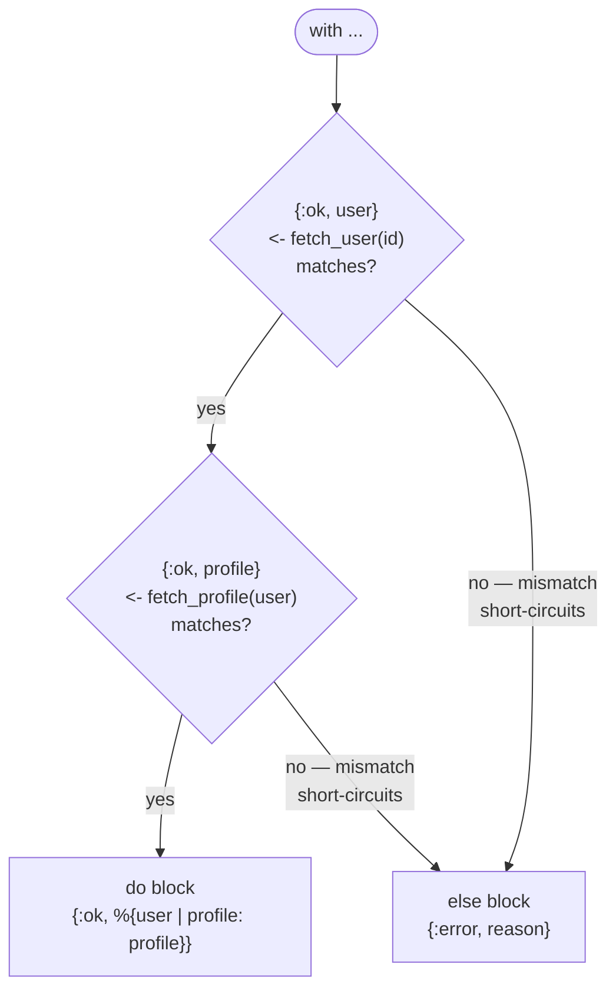
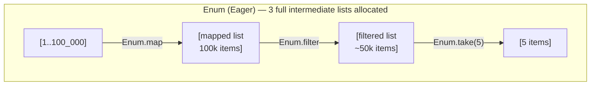
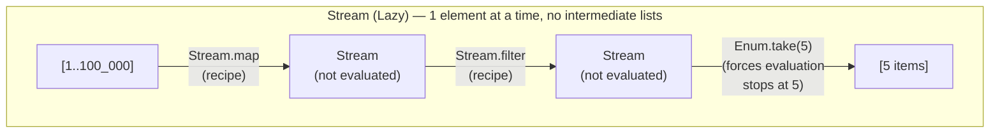
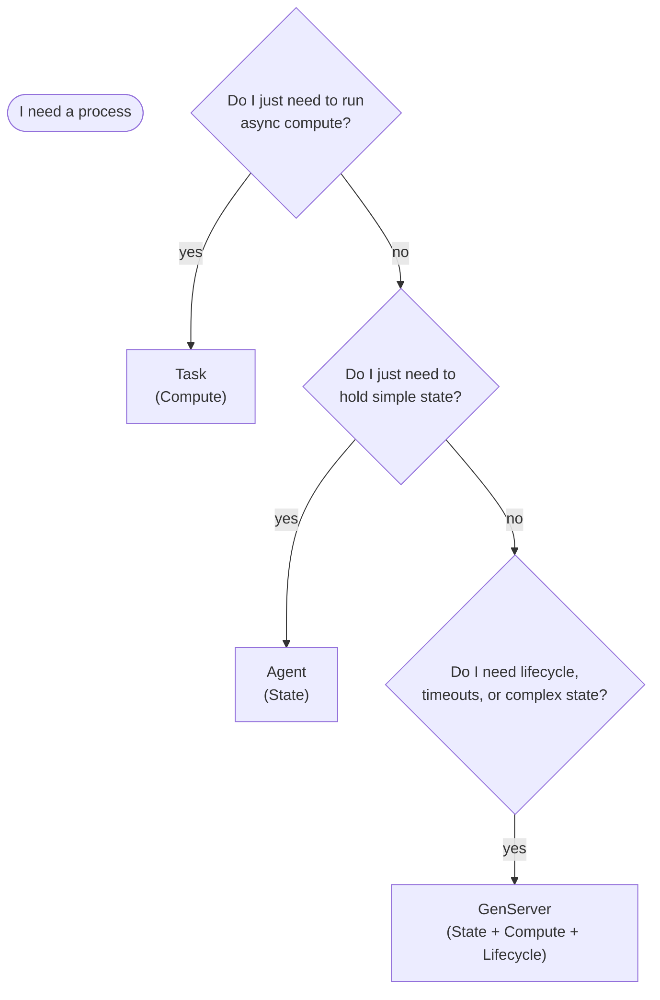
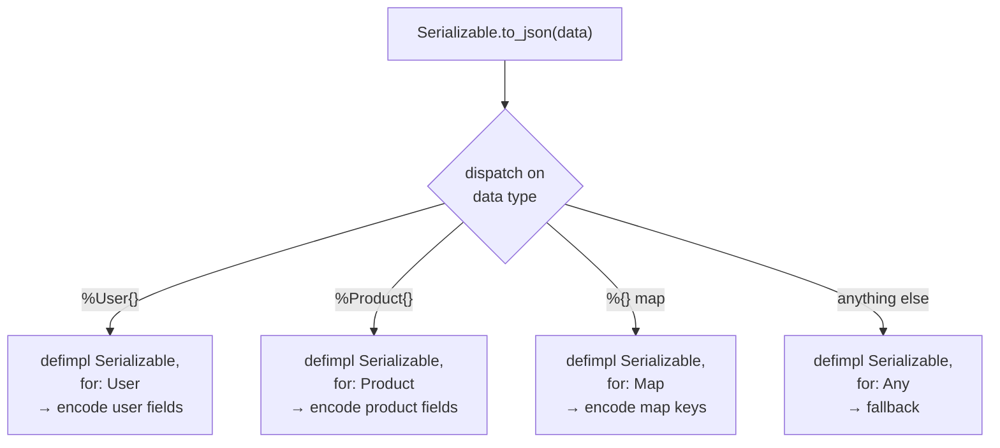

# Elixir on the BEAM

## 0. Orientation — Elixir on top of BEAM

Elixir is not a new runtime. It is a language, standard library, and ecosystem layer built entirely on top of the Erlang Virtual Machine (BEAM).

> [!TIP]
> **SOURCE OF TRUTH**
>
> This document focuses strictly on Elixir syntax, idioms, and abstractions.
> For the conceptual foundation of the BEAM—including processes, message passing, failure domains, and OTP philosophy—refer to the [Erlang/OTP document](otp.md).

<div class="cols-2">
<div class="col">

**What stays the same**

- The concurrency model (isolated processes)
- The failure model (let it crash, supervision)
- The scheduler and memory model
- The underlying OTP behaviours (`gen_server`, etc.)

</div>
<div class="col">

**What Elixir adds**

- A Ruby-inspired, expression-oriented syntax
- A unified standard library (`Enum`, `String`)
- Polymorphism via Protocols
- Metaprogramming via Macros and DSLs
- First-class build and dependency tooling (`mix`)

</div>
</div>

Elixir does not change how the BEAM executes code. It changes how you organize, compose, and abstract that code.

## 1. Syntax and Data Model

The underlying data types are identical to Erlang, but Elixir changes how they are expressed and commonly used.

### 1.1 Strings vs Charlists

This is the most common friction point for Erlang developers moving to Elixir.

<div class="cols-2">
<div class="col">

**Elixir Strings (`"..."`)**

- Enclosed in double quotes
- Stored as UTF-8 encoded **binaries**
- Fast, memory-efficient for text
- The default for all text in Elixir

</div>
<div class="col">

**Erlang Strings (`'...'`)**

- Enclosed in single quotes
- Stored as **charlists** (lists of integers)
- Memory-heavy (one list cell per character)
- Used mostly for Erlang interop in Elixir

</div>
</div>

> [!WARNING]
> **COMMON MISTAKE**
>
> Passing an Elixir string (`"hello"`) to an Erlang function that expects a charlist (`'hello'`) will fail. Use `String.to_charlist/1` when crossing the boundary to older Erlang APIs.

### 1.2 Keyword Lists

A keyword list is simply a list of 2-tuples where the first element is an atom. Elixir provides syntax sugar for this, making them the standard way to pass optional arguments.

```elixir
# Elixir syntax sugar
[status: 200, body: "ok"]

# What it actually is under the hood
[{:status, 200}, {:body, "ok"}]
```

Because they are lists, lookups are `O(n)` and keys can be duplicated. For `O(1)` lookups and unique keys, use maps (`%{status: 200}`).

### 1.3 Binaries and Pattern Matching

Elixir leans heavily on binaries. Pattern matching on binaries is highly optimized and idiomatic.

```elixir
# Extracting the first 4 bytes and the rest of the binary
<<head::binary-size(4), rest::binary>> = "BEAM magic"
```

## 2. Code Organization and Modules

Elixir code is organized into modules using `defmodule`. Functions are defined with `def` (public) and `defp` (private).

### 2.1 Multiple Clauses and Pattern Matching

Like Erlang, Elixir uses pattern matching at the function head. This replaces defensive `if/else` statements inside the function body.

```elixir
defmodule User do
  # Matches only when role is :admin
  def process(%{role: :admin} = user), do: grant_access(user)

  # Matches any other map
  def process(%{}), do: deny_access()
end
```

### 2.2 Default Arguments

Elixir supports default arguments using `\\`. Under the hood, the compiler generates multiple function heads with different arities.

```elixir
def fetch(url, retries \\ 3)
```

> [!NOTE]
> **TRADE-OFFS**
>
> Default arguments are convenient but can obscure arity. If a function has complex matching across multiple clauses, define a separate function head for the defaults to keep the logic clear.

### 2.3 Naming Conventions

- **Modules:** `CamelCase` (e.g., `MyApp.User`). Under the hood, Elixir prefixes these with `Elixir.`, so they become the atom `:"Elixir.MyApp.User"`.
- **Functions and Variables:** `snake_case`.
- **Erlang modules:** Referenced as simple atoms (e.g., `:crypto`, `:gen_server`).

## 3. Control Flow and Composition

Elixir is expression-oriented; everything returns a value.

### 3.1 `case`, `cond`, and `with`

<div class="cols-2">
<div class="col">

**`case`**

Matches a single value against multiple patterns.

```elixir
case fetch_data() do
  {:ok, data} -> process(data)
  {:error, _} -> fallback()
end
```

</div>
<div class="col">

**`cond`**

Evaluates multiple boolean conditions (like `if/else if`).

```elixir
cond do
  x > 10 -> :high
  x > 5  -> :medium
  true   -> :low
end
```

</div>
</div>

**`with`**

Used for chaining operations that might fail. It replaces deeply nested `case` statements.

```elixir
with {:ok, user} <- fetch_user(id),
     {:ok, profile} <- fetch_profile(user) do
  {:ok, %{user | profile: profile}}
else
  {:error, reason} -> {:error, reason}
end
```



> The happy path runs straight down. The first clause that does not match jumps immediately to `else` — no nested `case` required.

### 3.2 The Pipe Operator (`|>`)

The pipe operator passes the result of the left expression as the **first argument** to the right function.

```elixir
# Instead of this:
format(transform(fetch(id)))

# Write this:
id
|> fetch()
|> transform()
|> format()
```

> [!TIP]
> **DESIGN GUIDELINE: When to use pipes**
>
> Use pipes for linear data transformations where data flows cleanly from one step to the next.
>
> **When NOT to use pipes:**
>
> - When a step can fail and you need to handle the error (use `with` instead).
> - When you need the intermediate value multiple times.
> - When the pipeline becomes so long it obscures the business logic. Readability > cleverness.

## 4. Data Transformation Style

Elixir standardizes data transformation through the `Enum` and `Stream` modules.

### 4.1 `Enum` vs `Stream`

<div class="cols-2">
<div class="col">

**`Enum` (Eager)**

- Processes the entire collection at each step
- Creates an intermediate list for every operation
- Fast for small to medium collections

</div>
<div class="col">

**`Stream` (Lazy)**

- Builds a computation recipe
- Processes elements one by one only when forced (e.g., by `Enum.to_list/1`)
- Essential for large or infinite collections

</div>
</div>





> [!WARNING]
> **FAILURE SCENARIOS: The hidden cost of pipes**
>
> ```elixir
> list
> |> Enum.map(&parse/1)
> |> Enum.filter(&valid?/1)
> |> Enum.take(5)
> ```
>
> If `list` has 100,000 items, this code creates a 100,000-item list in memory for `map`, then another for `filter`, before finally taking 5.
>
> **Fix:** Replace `Enum` with `Stream` for the intermediate steps to avoid allocating massive intermediate lists.

### 4.2 Pipelines vs Intermediate Variables

While pipelines are idiomatic, forcing everything into a single pipeline is an anti-pattern.

If a transformation requires branching logic, side effects, or complex state accumulation, break the pipeline. Assign intermediate variables. Explicit code is better than a clever, unreadable pipeline.

## 5. Interacting with OTP in Elixir

Elixir uses the exact same OTP behaviours as Erlang, but provides syntactic sugar and specialized abstractions (`Task`, `Agent`) to make common concurrency patterns more ergonomic.

> [!TIP]
> **SOURCE OF TRUTH**
>
> The underlying mechanics of `gen_server` and `supervisor`—including mailboxes, synchronous vs asynchronous calls, failure domains, and restart strategies—are identical to Erlang. Refer to the [Erlang document](otp.md) for the conceptual foundation.

### 5.1 GenServer in Elixir

In Elixir, you define a GenServer by invoking `use GenServer`.

By convention, Elixir developers place both the **Client API** and the **Server Callbacks** in the same module. This encapsulates the process boundary entirely within the module.

```elixir
defmodule MyApp.Worker do
  use GenServer

  # --- Client API ---
  def start_link(init_arg) do
    GenServer.start_link(__MODULE__, init_arg, name: __MODULE__)
  end

  def do_work(pid \\ __MODULE__, data) do
    GenServer.call(pid, {:do_work, data})
  end

  # --- Server Callbacks ---
  @impl true
  def init(init_arg) do
    {:ok, init_arg}
  end

  @impl true
  def handle_call({:do_work, data}, _from, state) do
    new_state = process(data, state)
    {:reply, :ok, new_state}
  end
end
```

> [!NOTE]
> **The `@impl true` attribute**
>
> Always use `@impl true` before a callback function. It tells the compiler to verify that the function actually implements a behaviour callback. If you misspell `handle_call` as `handel_call`, the compiler will catch it.

### 5.2 Supervisor in Elixir

Supervisors in Elixir are defined using `use Supervisor`. Elixir simplifies child specification using a list of modules or tuples.

```elixir
defmodule MyApp.Supervisor do
  use Supervisor

  def start_link(init_arg) do
    Supervisor.start_link(__MODULE__, init_arg, name: __MODULE__)
  end

  @impl true
  def init(_init_arg) do
    children = [
      MyApp.Worker,
      {MyApp.OtherWorker, [arg1, arg2]}
    ]

    Supervisor.init(children, strategy: :one_for_one)
  end
end
```

#### DynamicSupervisor

Elixir introduces `DynamicSupervisor` to handle children that are started on demand. It replaces Erlang's `simple_one_for_one` strategy with a dedicated, easier-to-reason-about module.

### 5.3 Task and Agent

Elixir introduces `Task` and `Agent` as convenience layers over plain processes and GenServers. They are the idiomatic choice when you don't need the full lifecycle management of a GenServer.

<div class="cols-2">
<div class="col">

**`Task` (Compute)**

- For asynchronous, one-off background work
- `Task.async/1` and `Task.await/2`
- `Task.Supervisor` for supervised background jobs
- Replaces raw `spawn` and `spawn_monitor`

</div>
<div class="col">

**`Agent` (State)**

- A specialized GenServer for holding state
- State is updated via functions passed to the Agent
- `Agent.get/2` and `Agent.update/2`
- Replaces simple GenServers that only get/set state

</div>
</div>

#### Choosing the right abstraction



> [!WARNING]
> **COMMON MISTAKE**
>
> Do not use `Agent` if the state updates require heavy computation. The function passed to `Agent.update/2` runs _inside_ the Agent process, blocking it. If you need to compute heavily before updating state, compute it in the caller, then update the Agent.

## 6. Elixir Abstractions

Elixir provides powerful abstractions for polymorphism and metaprogramming. Use them carefully.

### 6.1 Structs

Structs are extensions built on top of maps that provide compile-time checks and default values. They take the name of the module they are defined in.

```elixir
defmodule User do
  defstruct name: "Anonymous", age: nil
end

# Compile-time guarantee: you cannot create a User with an invalid key
%User{name: "Alice", invalid_key: true} # Compile error!
```

> [!TIP]
> Use structs for domain entities. Use plain maps for unstructured data. Structs do not implement the `Access` behaviour by default, meaning you cannot use `user[:name]`; you must use `user.name`.

### 6.2 Protocols

Protocols provide polymorphism in Elixir. They allow you to define a standard API and implement it for different data types.

```elixir
defprotocol Serializable do
  def to_json(data)
end

defimpl Serializable, for: User do
  def to_json(user), do: Jason.encode!(%{name: user.name})
end
```



> [!NOTE]
> **TRADE-OFFS**
>
> Protocols dispatch based on the data type of the first argument. They are slightly slower than direct function calls but provide excellent decoupling.

### 6.3 Behaviours in Elixir syntax

While Protocols are for data polymorphism, Behaviours are for module polymorphism (defining an interface a module must implement).

```elixir
defmodule Parser do
  @callback parse(String.t()) :: {:ok, map()} | {:error, String.t()}
end

defmodule JSONParser do
  @behaviour Parser

  @impl true
  def parse(string), do: # ...
end
```

### 6.4 Macros and DSLs

Macros allow you to write code that writes code (metaprogramming). They manipulate the Abstract Syntax Tree (AST) at compile time.

Many Elixir features (like `if`, `def`, `case`) are actually macros. Libraries like Phoenix and Ecto use macros to create Domain Specific Languages (DSLs).

> [!WARNING]
> **DESIGN GUIDELINE: Macros**
>
> 1. Rule 1 of macros: **Don't write macros.**
> 2. Rule 2 of macros: If you must write a macro, do as little as possible in the macro and delegate to a normal function.
>
> Macros hide complexity, make debugging harder, and increase compile times. Plain functions are always preferred for business logic.

## 7. Tooling and Project Structure

Elixir provides a unified, first-class tooling ecosystem.

<div class="cols-2">
<div class="col">

**`mix`**

- The build tool, task runner, and project manager
- Replaces `rebar3` and `make`
- `mix new`, `mix test`, `mix compile`

</div>
<div class="col">

**`Hex`**

- The package manager for the Erlang ecosystem
- `mix deps.get` fetches dependencies defined in `mix.exs`

</div>
</div>

### 7.1 Project Layout

A standard Mix project has a predictable structure:

- `lib/` — Source code
- `test/` — Tests (ExUnit)
- `config/` — Application configuration
- `mix.exs` — Project definition and dependencies

### 7.2 IEx and Formatter

- **IEx:** The Interactive Elixir shell. Use `iex -S mix` to start a shell with your project compiled and loaded.
- **Formatter:** Elixir includes a built-in code formatter. Run `mix format` to standardize code style. Never argue about formatting; let the tool do it.

## 8. Interop with Erlang

Elixir runs on the BEAM, so calling Erlang code has zero performance penalty.

### 8.1 Calling Erlang Modules

Erlang modules are represented as atoms in Elixir.

```elixir
# Erlang: math:pi().
:math.pi()

# Erlang: crypto:strong_rand_bytes(16).
:crypto.strong_rand_bytes(16)
```

### 8.2 Common Friction Points

1. **Strings vs Charlists:** Erlang APIs often expect charlists (`'foo'`). Elixir strings are binaries (`"foo"`). Use `String.to_charlist/1` and `List.to_string/1` to convert.
2. **Records:** Erlang uses records (tuples with a defined structure). Elixir uses structs (maps). To interact with Erlang records, Elixir provides the `Record` module to extract and manipulate them as tuples.
3. **Variables:** Erlang variables start with an uppercase letter (`Var`). Elixir variables start with a lowercase letter (`var`). Elixir module names start with an uppercase letter (`Module`).

## 9. Performance Considerations in Elixir

> [!TIP]
> **SOURCE OF TRUTH**
>
> For deep performance considerations regarding the BEAM scheduler, memory model, and garbage collection, refer to the [Erlang document](otp.md).

### 9.1 Pipeline Allocation

Because Elixir data structures are immutable, every step in a pipeline `|>` creates a new copy of the data.

```elixir
# Bad: Allocates 3 intermediate lists
list |> Enum.map(&f/1) |> Enum.filter(&g/1) |> Enum.map(&h/1)

# Good: Allocates 1 intermediate list (Stream builds a recipe)
list |> Stream.map(&f/1) |> Stream.filter(&g/1) |> Enum.map(&h/1)
```

For small lists, `Enum` is faster because `Stream` has setup overhead. For large lists, `Stream` saves massive amounts of memory and garbage collection time.

### 9.2 Hidden Work Inside Abstractions

Elixir's clean syntax can hide `O(n)` operations.

- `String.length/1` is `O(n)` because Elixir strings are UTF-8 binaries, and the runtime must traverse the binary to count graphemes. Use `byte_size/1` if you only need the size in bytes (`O(1)`).
- `length(list)` is `O(n)` because lists are linked lists.
- Keyword list lookups are `O(n)`.

## 10. Design Guidelines

Elixir provides many tools, but idiomatic Elixir favors simplicity and explicitness.

- **Keep logic functional and explicit:** Push state and side-effects to the edges of your application. The core of your application should be pure functions and data transformations.
- **Avoid abstraction inflation:** Do not use macros, protocols, or GenServers when simple functions and modules will do.
- **When NOT to use GenServer:** If you don't need state, lifecycle management, or serialization, don't use a GenServer. Use plain functions.
- **When to use Task vs GenServer:** Use `Task` for concurrent compute. Use `GenServer` for long-lived state or coordinating complex workflows.
- **When Agent is sufficient:** Use `Agent` only when you need a simple bucket for state that is shared across processes, and the updates are computationally cheap.

## 11. Common Pitfalls

- **String vs charlist mistakes:** Passing an Elixir string (`"..."`) to an Erlang library that expects a charlist (`'...'`).
- **Misuse of pipes:** Creating massive, unreadable pipelines that hide error handling or allocate huge intermediate lists.
- **Overuse of GenServer:** Wrapping every module in a GenServer, turning a concurrent system into a serialized bottleneck.
- **Hidden cost of Enum chains:** Using `Enum` instead of `Stream` for multiple transformations on large datasets.
- **Macro/DSL confusion:** Writing macros to "save typing" instead of writing clear, explicit functions.
- **Assuming abstractions are free:** Forgetting that protocols, dynamic dispatch, and deep pattern matching have runtime costs.

## 12. Mapping Erlang to Elixir

| Erlang Concept / Tool  | Elixir Equivalent   | Notes                                                 |
| :--------------------- | :------------------ | :---------------------------------------------------- |
| `gen_server`           | `GenServer`         | Same behaviour, Elixir syntax.                        |
| `supervisor`           | `Supervisor`        | Elixir simplifies child specs.                        |
| `simple_one_for_one`   | `DynamicSupervisor` | Elixir provides a dedicated module.                   |
| `spawn` / `spawn_link` | `Task`              | `Task` is idiomatic for async compute.                |
| Records (`#user{}`)    | Structs (`%User{}`) | Structs are maps; records are tuples.                 |
| Parse Transforms       | Macros              | Macros manipulate AST directly.                       |
| `global` / `pg`        | `Registry` / `pg`   | Elixir provides `Registry` for local/pubsub.          |
| `rebar3`               | `mix`               | Mix is the standard build tool.                       |
| `ets`                  | `ETS` / `Agent`     | `Agent` for simple state, `ETS` for concurrent reads. |

## 13. Test Your Knowledge

<details>
<summary>When should you use a <code>Stream</code> instead of an <code>Enum</code>?</summary>

Use `Stream` when you are chaining multiple transformations on a large or potentially infinite collection. `Enum` is eager and creates an intermediate list in memory for every step in the pipeline. `Stream` is lazy; it builds a recipe of computations and only processes the elements (one by one) when forced, saving significant memory and GC overhead.

</details>

<details>
<summary>Why might a long pipeline (<code>|&gt;</code>) be considered an anti-pattern?</summary>

While pipelines are idiomatic for linear data flow, they become an anti-pattern when they obscure business logic, hide complex error handling (where `with` would be better), or require the same intermediate value multiple times. Readability and explicit branching are more important than forcing code into a single chain.

</details>

<details>
<summary>What is the difference between a Task and an Agent?</summary>

A `Task` is for asynchronous computation (doing work in the background). An `Agent` is a specialized GenServer for holding and sharing simple state. You use a Task to run a function concurrently, and an Agent to store data that multiple processes need to read or update.

</details>

<details>
<summary>Why is it dangerous to do heavy computation inside an <code>Agent.update/2</code> call?</summary>

The function passed to `Agent.update/2` executes _inside_ the Agent process, not the caller's process. If the computation is heavy, it blocks the Agent, preventing any other process from reading or updating the state until the computation finishes. Heavy computation should be done in the caller process before sending the updated state to the Agent.

</details>

<details>
<summary>How do you handle an Erlang library that expects a string but fails when you pass it an Elixir string?</summary>

Elixir strings are UTF-8 binaries (`"string"`), while Erlang strings are often charlists (lists of integers, `'string'`). You must explicitly convert the Elixir string using `String.to_charlist/1` before passing it to the Erlang API.

</details>

<details>
<summary>What is the first rule of writing Macros in Elixir?</summary>

Don't write macros. Macros hide complexity, make debugging harder, and increase compile times. They should only be used when metaprogramming is strictly necessary to create a DSL or eliminate massive boilerplate, and even then, the macro should delegate to plain functions as much as possible.

</details>
