# GenStage, Broadway & AI Pipelines

> **How to use this guide:** This document covers the architecture of production-grade AI data pipelines built on Elixir. It focuses on GenStage and Broadway for stream processing, LLM/ML integration patterns, and advanced system design decisions. For foundational OTP concepts (processes, supervisors, gen_server), refer to the [Erlang/OTP document](otp.md). For Elixir syntax and idioms, refer to the [Elixir document](elixir.md).

## 1. The Intersection: Elixir + AI Data Pipelines

### 1.1 GenStage — Demand-Driven Data Flow

GenStage is an Elixir library that provides a framework for exchanging data between processes with built-in backpressure. Unlike raw message passing where a fast producer can overwhelm a slow consumer, GenStage inverts the control: **consumers ask for data, producers supply it.**

<div class="cols-2">
<div class="col">

**Core roles**

- **Producer** — emits events when downstream demands them
- **ProducerConsumer** — receives events, transforms them, emits new events
- **Consumer** — terminal stage that receives and processes events

</div>
<div class="col">

**Why it matters**

- Backpressure is structural, not ad hoc
- No unbounded mailbox growth
- Flow control is automatic across the pipeline
- Each stage is a supervised OTP process

</div>
</div>

The key insight is **demand**. A consumer tells its upstream "I can handle N more events." That demand propagates backward through every stage until it reaches the producer, which only emits what was asked for.

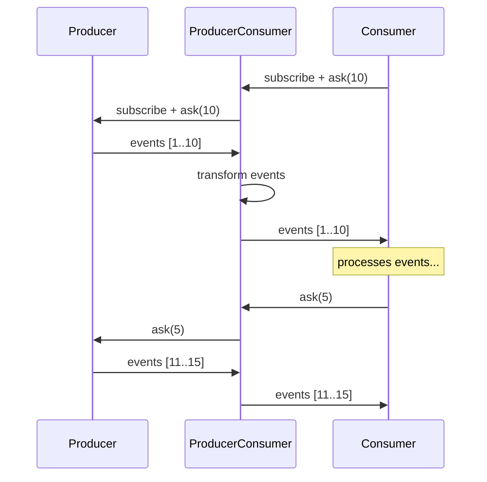

> [!TIP]
> GenStage solves the same problem as Kafka consumer groups, Akka Streams, or Java's Reactive Streams — but it does so using OTP primitives (processes, supervisors, message passing) rather than introducing a new concurrency model.

### 1.2 Tuning `max_demand` and `min_demand`

`max_demand` and `min_demand` control how aggressively a consumer pulls from its producer. They are not just knobs — they define the pipeline's throughput and latency characteristics.

<div class="cols-2">
<div class="col">

**`max_demand`**

The maximum number of events a consumer asks for in a single demand request. Higher values mean larger batches and higher throughput, but also higher per-event latency.

</div>
<div class="col">

**`min_demand`**

The threshold below which the consumer issues a new demand. When the consumer has processed enough events that its pending count drops below `min_demand`, it asks for more.

</div>
</div>

The demand cycle works as follows: the consumer starts by asking for `max_demand` events. As it processes them, the pending count decreases. When it drops below `min_demand`, the consumer asks for `max_demand - min_demand` more events.

```elixir
defmodule MyConsumer do
  use GenStage

  def init(:ok) do
    {:consumer, %{}, subscribe_to: [{MyProducer, max_demand: 50, min_demand: 10}]}
  end
end
```

> [!NOTE]
> **TRADE-OFFS**
>
> **High `max_demand`** — better throughput, higher latency, more memory per batch
>
> **Low `max_demand`** — lower latency per event, more demand round-trips, lower throughput
>
> **`min_demand` close to `max_demand`** — frequent small refills, smoother flow
>
> **`min_demand` close to 0** — bursty demand, potential idle gaps

> [!WARNING]
> **FAILURE SCENARIO**
>
> Setting `max_demand: 1` turns the pipeline into a sequential processor. Setting `max_demand: 10_000` with a slow consumer means 10,000 events are in-flight at once — if the consumer crashes, all of them must be retried or lost.

### 1.3 Broadway — Production-Grade GenStage

Broadway is built on top of GenStage and provides the production machinery that raw GenStage does not: automatic acknowledgment, batching, graceful shutdown, telemetry, and multi-stage processing with configurable concurrency.

<div class="cols-2">
<div class="col">

**What Broadway adds over raw GenStage**

- Automatic message acknowledgment (ack/fail)
- Built-in batching with size and timeout triggers
- Configurable concurrency per stage
- Graceful shutdown with drain semantics
- Telemetry hooks for observability
- First-class Kafka, SQS, RabbitMQ, and GCP Pub/Sub producers

</div>
<div class="col">

**When to use raw GenStage instead**

- Custom demand patterns not fitting Broadway's model
- Non-message-queue sources (e.g., polling a database)
- Pipelines where acknowledgment semantics don't apply
- Very simple producer-consumer chains

</div>
</div>

A Broadway pipeline is defined declaratively:

```elixir
defmodule MyApp.RoutingPipeline do
  use Broadway

  alias Broadway.Message

  def start_link(_opts) do
    Broadway.start_link(__MODULE__,
      name: __MODULE__,
      producer: [
        module: {BroadwayKafka.Producer, [
          hosts: [localhost: 9092],
          group_id: "routing_consumers",
          topics: ["shipment_events"]
        ]},
        concurrency: 1
      ],
      processors: [
        default: [concurrency: 10]
      ],
      batchers: [
        ai_routing: [concurrency: 5, batch_size: 50, batch_timeout: 2000]
      ]
    )
  end

  @impl true
  def handle_message(_processor, message, _context) do
    message
    |> Message.update_data(&decode_and_validate/1)
    |> Message.put_batcher(:ai_routing)
  end

  @impl true
  def handle_batch(:ai_routing, messages, _batch_info, _context) do
    constraints = Enum.map(messages, & &1.data)
    case AIClient.batch_route(constraints) do
      {:ok, results} -> messages
      {:error, _reason} -> Enum.map(messages, &Message.failed(&1, "ai_error"))
    end
  end

  defp decode_and_validate(data) do
    data |> Jason.decode!() |> validate_shipment()
  end
end
```

### 1.4 Kafka Partitions and Broadway Concurrency

Understanding how Kafka partitions map to Broadway producers is critical for ordering guarantees and parallelism.

<div class="cols-2">
<div class="col">

**Kafka's model**

- A topic is divided into partitions
- Each partition is an ordered, immutable log
- A consumer group assigns partitions to consumers
- Ordering is guaranteed only within a single partition
- More partitions = more parallelism

</div>
<div class="col">

**Broadway's mapping**

- Each Kafka partition becomes a Broadway producer
- `producer: [concurrency: N]` controls how many partitions are consumed in parallel
- Messages from the same partition arrive in order at the processor
- Processors and batchers run concurrently and may reorder across partitions

</div>
</div>

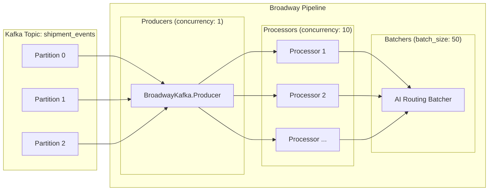

> [!WARNING]
> **FAILURE SCENARIO**
>
> If you set `processors: [concurrency: 10]` but the Kafka topic has only 3 partitions, 7 processors sit idle. Conversely, if the topic has 100 partitions but `concurrency: 1`, a single producer reads all 100 partitions sequentially — the backlog grows faster than it drains.

> [!NOTE]
> **TRADE-OFFS**
>
> **Ordering vs throughput** — increasing processor concurrency allows parallel processing but sacrifices cross-partition ordering. If ordering matters per entity (e.g., per shipment), partition by entity key in Kafka so all events for the same entity land on the same partition.

### 1.5 Batching for LLM Cost Optimization

Broadway's batching is a natural fit for LLM API calls. Instead of making one API call per event, batch N events and send them in a single prompt or API request.

<div class="cols-2">
<div class="col">

**Without batching**

- 1,000 shipment events → 1,000 API calls
- Each call has HTTP overhead, auth, and per-request token minimums
- At $0.01 per call → $10
- 1,000 round-trips × 200ms = 200 seconds serial

</div>
<div class="col">

**With Broadway batching**

- 1,000 events → 20 batches of 50
- Each batch becomes one structured prompt
- At $0.03 per batch call → $0.60
- 20 round-trips × 500ms = 10 seconds serial (parallelizable)

</div>
</div>

The `batch_size` and `batch_timeout` parameters control the trade-off:

```elixir
batchers: [
  ai_routing: [
    batch_size: 100,
    batch_timeout: 2_000
  ]
]
```

- `batch_size: 100` — accumulate up to 100 messages before flushing
- `batch_timeout: 2_000` — flush after 2 seconds even if the batch isn't full (prevents stale messages during low throughput)

> [!TIP]
> The batch handler receives all messages at once. Structure your LLM prompt to accept a JSON array of inputs and return a JSON array of outputs. This maps each result back to its source message for acknowledgment.

> [!WARNING]
> **FAILURE SCENARIO**
>
> If the LLM returns 99 results for a 100-message batch, the mapping breaks. Always validate that the response length matches the input length. On mismatch, fail the entire batch and let Broadway's acknowledgment retry it.

## 2. Supervision Trees, Fault Tolerance, and Failure Modes

### 2.1 Broadway's Supervision Architecture

Broadway does not start as a single process. It starts a supervision tree with distinct failure domains for each stage of the pipeline.

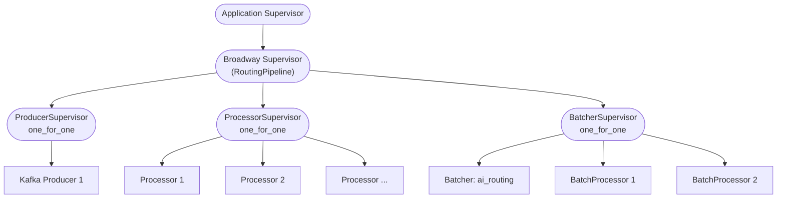

<div class="cols-2">
<div class="col">

**Why this matters**

- A crashing processor does not kill the Kafka producer
- A crashing batcher does not kill the processors
- Each supervisor has independent restart intensity
- Broadway can survive partial failures and self-heal

</div>
<div class="col">

**Failure isolation guarantees**

- Producer crash → reconnects to Kafka, processors drain
- Processor crash → restarted by supervisor, message is nacked and retried
- Batcher crash → batch is retried, processor continues feeding
- All crashes → Broadway supervisor restarts the entire tree

</div>
</div>

> [!TIP]
> Broadway's supervision tree embodies the OTP principle: structure your system so that failures stay local. A single bad AI response should not take down the Kafka connection.

### 2.2 Poison Pills and Dead Letter Queues

A **poison pill** is a message that consistently crashes the processor — malformed JSON, an unexpected schema version, or data that triggers a bug in the transformation logic. Without mitigation, it creates a crash loop: the processor crashes, the supervisor restarts it, the message is retried, the processor crashes again.

<div class="cols-2">
<div class="col">

**Detection strategies**

- Track retry count per message (via Kafka headers or metadata)
- Use `try/rescue` in the processor for known failure modes
- Monitor supervisor restart rate via telemetry
- Set a maximum retry threshold

</div>
<div class="col">

**Mitigation: Dead Letter Queue**

- After N retries, route the message to a DLQ topic
- The DLQ is a separate Kafka topic for failed messages
- Failed messages can be inspected, replayed, or discarded
- The main pipeline continues processing

</div>
</div>

```elixir
@max_retries 3

@impl true
def handle_message(_processor, message, _context) do
  retry_count = get_retry_count(message.metadata)

  if retry_count >= @max_retries do
    send_to_dlq(message)
    Message.failed(message, "max_retries_exceeded")
  else
    message
    |> Message.update_data(&decode_and_validate/1)
    |> Message.put_batcher(:ai_routing)
  end
rescue
  e ->
    Logger.error("Poison pill detected: #{inspect(e)}")
    send_to_dlq(message)
    Message.failed(message, "processing_error")
end
```

> [!WARNING]
> **FAILURE SCENARIO**
>
> A poison pill without DLQ handling blocks the partition. Since Kafka commits offsets sequentially, a stuck message prevents all subsequent messages on that partition from being processed — even if they are perfectly valid.

### 2.3 Idempotency Under At-Least-Once Delivery

Kafka provides **at-least-once delivery**: a message is guaranteed to be delivered, but may be delivered more than once (after a consumer crash, rebalance, or network partition). Broadway acknowledges messages after processing, but if the processor crashes after performing a side effect but before acknowledging, the message will be redelivered.

<div class="cols-2">
<div class="col">

**Why duplicates happen**

- Consumer crashes after processing but before ACK
- Kafka consumer group rebalance during processing
- Network timeout between Broadway and Kafka broker
- Broadway shutdown while messages are in-flight

</div>
<div class="col">

**Why it matters for AI pipelines**

- Duplicate AI API calls cost real money
- Duplicate writes create inconsistent state
- Duplicate webhook triggers confuse downstream systems
- Duplicate demand forecasts produce incorrect planning

</div>
</div>

**Idempotency strategies:**

| Strategy                 | Mechanism                                                                              | Trade-off                                                      |
| ------------------------ | -------------------------------------------------------------------------------------- | -------------------------------------------------------------- |
| **Idempotency key**      | Hash the message content or use Kafka offset as a unique key. Check before processing. | Requires a lookup (DB or cache) per message                    |
| **Upsert semantics**     | Use `INSERT ... ON CONFLICT UPDATE` in PostgreSQL                                      | Only works for DB writes, not external API calls               |
| **Deduplication window** | Track recent message IDs in an ETS table or Redis with TTL                             | Bounded memory, but duplicates outside the window slip through |
| **Idempotent API calls** | Pass an idempotency key to the LLM API (OpenAI supports this)                          | Depends on the external API supporting it                      |

```elixir
def handle_message(_processor, message, _context) do
  idempotency_key = :crypto.hash(:sha256, message.data) |> Base.encode16()

  case Cachex.get(:seen_messages, idempotency_key) do
    {:ok, nil} ->
      Cachex.put(:seen_messages, idempotency_key, true, ttl: :timer.minutes(30))
      message |> Message.update_data(&process/1) |> Message.put_batcher(:ai_routing)
    {:ok, _} ->
      Message.ack(message)
  end
end
```

> [!TIP]
> The cheapest idempotency strategy depends on the side effect. For database writes, use upserts. For expensive AI calls, use an idempotency key stored in Redis or ETS with a TTL. For webhooks, make the receiver idempotent.

## 3. Graceful Shutdown and System Boundaries

### 3.1 Shutdown Under Kubernetes

When Kubernetes sends `SIGTERM` (during a rolling deployment, scale-down, or node drain), the BEAM traps the signal and begins an orderly shutdown. Broadway cooperates with this by draining in-flight work before terminating.

The shutdown sequence:

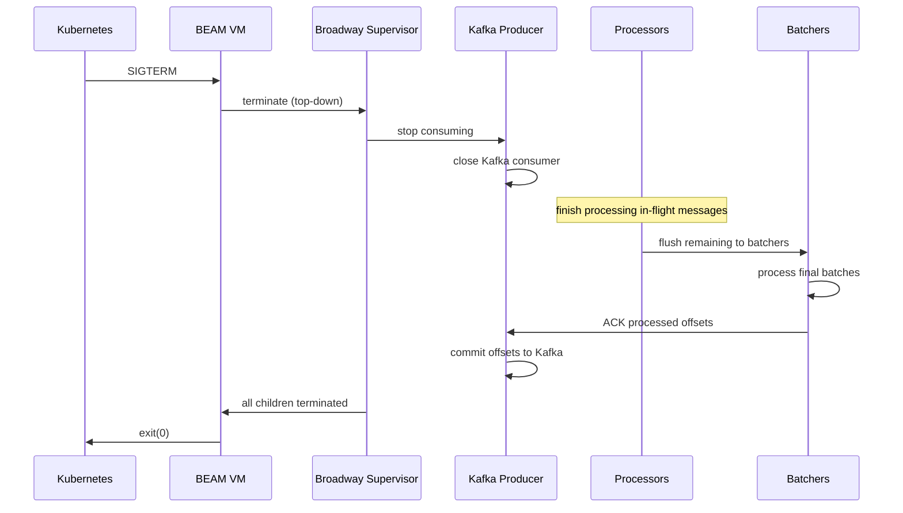

<div class="cols-2">
<div class="col">

**What Broadway does**

1. Stops the Kafka consumer (no new messages)
2. Drains all in-flight messages through processors
3. Flushes partially filled batches
4. Acknowledges (commits offsets) for completed work
5. Terminates child processes in reverse start order

</div>
<div class="col">

**What you must configure**

- Kubernetes `terminationGracePeriodSeconds` must exceed Broadway's drain time
- Set it to at least `batch_timeout + max AI latency + buffer`
- If the grace period is too short, K8s sends `SIGKILL` and in-flight work is lost
- Default K8s grace period is 30 seconds — often insufficient for AI workloads

</div>
</div>

> [!WARNING]
> **FAILURE SCENARIO**
>
> If `terminationGracePeriodSeconds: 30` but the AI API takes 15 seconds per batch and you have 5 in-flight batches, the drain needs 75 seconds. K8s will `SIGKILL` after 30 — losing all un-ACKed work. Those messages will be redelivered on the next consumer, hitting your idempotency layer.

### 3.2 Backpressure Propagation Under AI Latency Spikes

When an external AI model degrades (latency spikes from 200ms to 5,000ms), Broadway's demand-driven architecture naturally propagates backpressure without explicit intervention.

The cascade:

1. **Batchers slow down** — `handle_batch` blocks while waiting for the AI API response. Batcher processes are occupied longer.
2. **Processors back up** — processors emit events to batchers, but batchers are full. Processors stop pulling demand from producers.
3. **Producers stop fetching** — no demand from processors means no demand on Kafka. The Kafka consumer pauses, and the Kafka broker retains messages.
4. **Kafka absorbs the backlog** — Kafka is designed to hold messages for days. The backlog grows in Kafka, not in BEAM process memory.

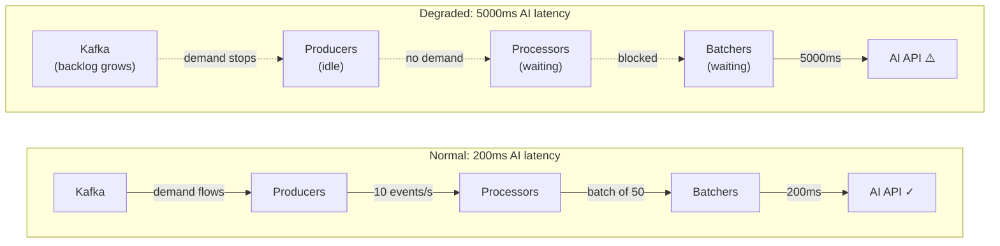

> [!TIP]
> This is the core advantage of demand-driven pipelines. In a push-based system, the Kafka consumer keeps pulling and messages accumulate in process mailboxes → memory grows → OOM. In Broadway, the consumer simply stops asking for more.

> [!NOTE]
> **TRADE-OFFS**
>
> **Throughput drops** — the pipeline processes fewer events during the degradation. This is correct behavior: the alternative is crashing.
>
> **Latency increases** — events wait longer in Kafka. For time-sensitive operations, combine with circuit breakers (Section 4) to fail fast rather than wait.
>
> **Recovery surge** — when the AI recovers, Broadway resumes demand and processes the backlog. Size the pipeline (concurrency, batch size) to handle sustained catch-up without triggering a secondary overload.

## 4. AI in Production: Moving "Beyond the Hype"

### 4.1 Integration Patterns for LLMs and ML Models

There are two fundamentally different integration shapes, and choosing wrong creates architectural problems.

<div class="cols-2">
<div class="col">

**Synchronous (request-response)**

Used for: OpenAI, Claude, Vertex AI generative endpoints

- Call an HTTP API, wait for a response
- Latency is the model's inference time + network
- Fits naturally into Broadway's `handle_batch`
- Cost scales with number of calls

</div>
<div class="col">

**Asynchronous (job-based)**

Used for: Modal.com, Vertex AI batch prediction, custom ML training

- Submit a job, receive a job ID
- Poll for completion or register a webhook callback
- Latency is minutes to hours
- Requires a separate state machine to track job lifecycle

</div>
</div>

#### Synchronous: Calling LLMs from Broadway

```elixir
def handle_batch(:ai_routing, messages, _batch_info, _context) do
  payload = messages |> Enum.map(& &1.data) |> build_prompt()

  case AIClient.call(payload, timeout: 10_000) do
    {:ok, %{results: results}} ->
      messages
      |> Enum.zip(results)
      |> Enum.map(fn {msg, result} -> Message.update_data(msg, fn _ -> result end) end)

    {:error, :timeout} ->
      Enum.map(messages, &Message.failed(&1, "ai_timeout"))

    {:error, reason} ->
      Enum.map(messages, &Message.failed(&1, reason))
  end
end
```

#### Asynchronous: Webhook vs Polling for Modal.com

For long-running ML inference (e.g., retraining a demand forecast model), the Broadway pipeline submits the job and a separate process tracks completion.

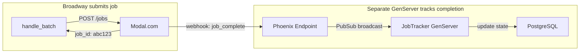

<div class="cols-2">
<div class="col">

**Webhook callbacks**

- Modal.com calls your endpoint when the job finishes
- Lower latency — notified immediately on completion
- Requires an externally reachable endpoint
- Must handle duplicate webhooks (idempotency)
- Must handle missed webhooks (timeout + polling fallback)

</div>
<div class="col">

**Polling**

- A GenServer periodically checks job status
- Higher latency — bounded by poll interval
- Works behind firewalls, no ingress needed
- Simpler to implement and reason about
- Wastes API calls when jobs take a long time

</div>
</div>

> [!NOTE]
> **TRADE-OFFS**
>
> **Webhook** — lower latency, higher operational complexity (ingress, auth, retries)
>
> **Polling** — higher latency, simpler architecture, works in restrictive network environments
>
> In practice, use webhooks as the primary path and polling as a fallback safety net.

### 4.2 Circuit Breakers

When an external AI service is degraded or down, continuing to send requests wastes time, money, and pipeline capacity. A circuit breaker stops calling the failing service and falls back to an alternative.

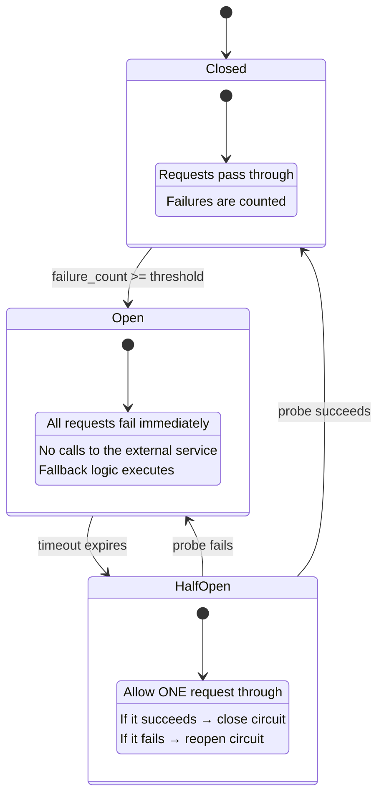

In Elixir, the `:fuse` library implements circuit breakers:

```elixir
defmodule AIClient do
  @fuse_name :ai_service_fuse

  def setup_fuse do
    :fuse.install(@fuse_name, {
      {:standard, 5, 10_000},  # 5 failures in 10 seconds → blow
      {:reset, 30_000}          # try again after 30 seconds
    })
  end

  def call(payload, opts \\ []) do
    case :fuse.ask(@fuse_name, :sync) do
      :ok ->
        case do_request(payload, opts) do
          {:ok, _} = result -> result
          {:error, _} = error ->
            :fuse.melt(@fuse_name)
            error
        end

      :blown ->
        fallback(payload)
    end
  end

  defp fallback(payload) do
    case CheaperModel.call(payload) do
      {:ok, _} = result -> result
      {:error, _} -> HeuristicRouter.calculate(payload)
    end
  end
end
```

**Fallback hierarchy:**

| Priority | Strategy                               | Trade-off                                          |
| -------- | -------------------------------------- | -------------------------------------------------- |
| 1        | Primary AI model (GPT-4o, Claude)      | Best quality, highest cost and latency             |
| 2        | Cheaper/faster model (GPT-4o-mini)     | Lower quality, lower cost, lower latency           |
| 3        | Heuristic algorithm                    | No AI cost, deterministic, potentially stale logic |
| 4        | Cached previous result                 | Zero latency, may be outdated                      |
| 5        | Graceful degradation (queue for later) | No immediate answer, but no wrong answer           |

> [!TIP]
> The fallback hierarchy is a product decision, not just an engineering one. "What does the user see when the AI is down?" must have an answer before you build the pipeline.

### 4.3 Latency Budgets

A latency budget allocates time across each step of a request. If the total budget is 5 seconds, and the AI call takes 4.5 seconds, there is only 500ms for everything else — Kafka consumption, deserialization, validation, database writes, and response formatting.

```elixir
@total_budget_ms 5_000
@ai_budget_ms 3_000
@db_budget_ms 1_000
@overhead_ms 1_000

def handle_batch(:ai_routing, messages, _batch_info, _context) do
  start = System.monotonic_time(:millisecond)

  result = AIClient.call(payload, timeout: @ai_budget_ms)

  elapsed = System.monotonic_time(:millisecond) - start
  remaining = @total_budget_ms - elapsed

  if remaining < @db_budget_ms do
    Logger.warning("Latency budget exhausted after AI call: #{elapsed}ms")
    Enum.map(messages, &Message.failed(&1, "budget_exhausted"))
  else
    persist_results(result, timeout: remaining)
  end
end
```

> [!WARNING]
> **FAILURE SCENARIO**
>
> Without latency budgets, a slow AI call cascades: the batch handler waits 15 seconds, the DB connection times out, the next batch piles up, and the pipeline falls behind. Budgets force explicit failure before cascading.

### 4.4 Human-in-the-Loop (HITL) Patterns

Not every AI decision should execute automatically. When the stakes are high enough — a wrong route dispatches a truck to the wrong city, a bad demand forecast wastes $100K of inventory — a human must be in the loop before the action takes effect. HITL is not a fallback. It is a first-class architectural pattern for high-stakes AI.

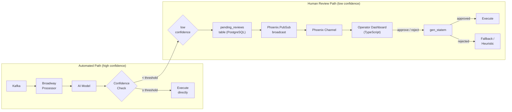

**When HITL is necessary:**

<div class="cols-2">
<div class="col">

- **High-stakes decisions** — AI-generated routes that dispatch physical trucks; demand forecasts that trigger procurement orders
- **Low-confidence outputs** — the model's confidence score is below a configured threshold
- **Novel inputs** — the input is outside the training distribution (flagged by anomaly detection or embedding distance from known examples)

</div>
<div class="col">

- **Regulated domains** — any AI decision with legal or compliance implications (hazmat routing, customs classification)
- **High-value transactions** — dollar value at stake exceeds a threshold (e.g., shipments > $50K)
- **Customer tier** — Tier 1 customers may require manual review for any AI routing change

</div>
</div>

#### The HITL State Machine

The approval lifecycle is naturally modeled as a state machine. Elixir's `gen_statem` is the right primitive — it is an OTP behaviour designed for exactly this pattern.

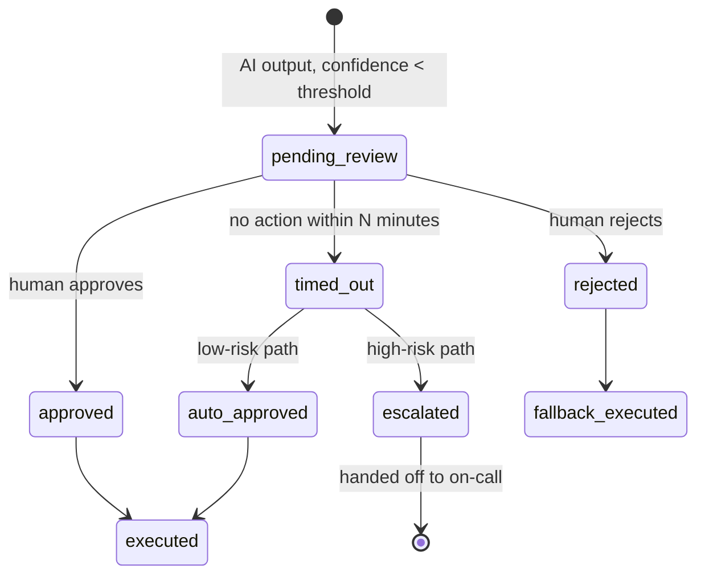

```elixir
defmodule MyApp.RouteApproval do
  @behaviour :gen_statem

  @review_timeout_ms 10 * 60 * 1000  # 10 minutes

  def child_spec(args), do: %{id: __MODULE__, start: {__MODULE__, :start_link, [args]}}

  def start_link(review_id: review_id, risk_level: risk_level, route: route) do
    :gen_statem.start_link(__MODULE__, {review_id, risk_level, route}, [])
  end

  def init({review_id, risk_level, route}) do
    {:ok, :pending_review, %{review_id: review_id, risk_level: risk_level, route: route},
     [{:state_timeout, @review_timeout_ms, :review_timeout}]}
  end

  def callback_mode, do: :state_functions

  # Human approves
  def pending_review(:cast, {:approve, operator_id}, data) do
    persist_decision(data.review_id, :approved, operator_id)
    execute_route(data.route)
    {:next_state, :executed, data}
  end

  # Human rejects
  def pending_review(:cast, {:reject, operator_id, reason}, data) do
    persist_decision(data.review_id, :rejected, operator_id, reason)
    execute_fallback(data.route)
    {:next_state, :fallback_executed, data}
  end

  # Timeout fires
  def pending_review(:state_timeout, :review_timeout, %{risk_level: :low} = data) do
    persist_decision(data.review_id, :auto_approved, :system)
    execute_route(data.route)
    {:next_state, :executed, data}
  end

  def pending_review(:state_timeout, :review_timeout, %{risk_level: :high} = data) do
    escalate_to_oncall(data.review_id)
    {:next_state, :escalated, data}
  end
end
```

#### The Approval UI Contract

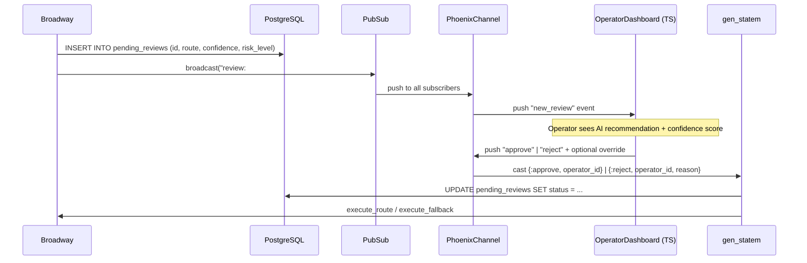

What the TypeScript dashboard receives and sends:

```typescript
// What the dashboard receives via "new_review" event
interface ReviewPayload {
  review_id: string;
  shipment_id: string;
  ai_recommendation: {
    recommended_route: string;
    estimated_minutes: number;
    confidence: number; // 0.0 – 1.0
    reasoning: string;
  };
  risk_level: "low" | "high";
  expires_at: string; // ISO timestamp — show a countdown timer
}

// What the operator sends back
interface ApprovalDecision {
  review_id: string;
  decision: "approve" | "reject";
  operator_note?: string;
  override_route?: string; // operator can provide a different route on reject
}
```

Preventing duplicate approvals — the `gen_statem` process handles this naturally. Once it has transitioned out of `pending_review`, subsequent approval messages are ignored:

```elixir
# Any state other than pending_review simply ignores late approval messages
def executed(:cast, {:approve, _operator_id}, data) do
  {:keep_state, data}  # already executed — idempotent no-op
end
```

#### Confidence Scoring and Routing Logic

```elixir
@impl true
def handle_batch(:ai_routing, messages, _batch_info, _context) do
  results = AIClient.batch_route(Enum.map(messages, & &1.data))

  messages
  |> Enum.zip(results)
  |> Enum.map(fn {msg, result} ->
    route_by_confidence(msg, result)
  end)
end

defp route_by_confidence(message, %{confidence: confidence, route: route} = result) do
  threshold = confidence_threshold(message.data)

  cond do
    confidence >= threshold ->
      Message.update_data(message, fn _ -> result end)

    true ->
      risk_level = assess_risk(message.data)
      review_id = create_pending_review!(message.data, result, risk_level)
      MyApp.RouteApproval.start_link(review_id: review_id, risk_level: risk_level, route: route)
      Phoenix.PubSub.broadcast(MyApp.PubSub, "review:#{message.data.shipment_id}",
        build_review_payload(review_id, message.data, result, risk_level))
      Message.ack(message)  # ACK now; execution happens via gen_statem
  end
end

defp confidence_threshold(%{customer_tier: :tier1}), do: 0.95
defp confidence_threshold(%{value_usd: v}) when v > 50_000, do: 0.90
defp confidence_threshold(_), do: 0.80
```

> [!TIP]
> Store confidence thresholds in a database-backed feature flag table rather than hardcoding them. As the model improves over time — more training data, better prompts — you can lower thresholds gradually without deploying new code. Design the system so HITL can be gradually removed as model confidence improves.

#### Trade-offs: Conservative vs Optimistic Execution

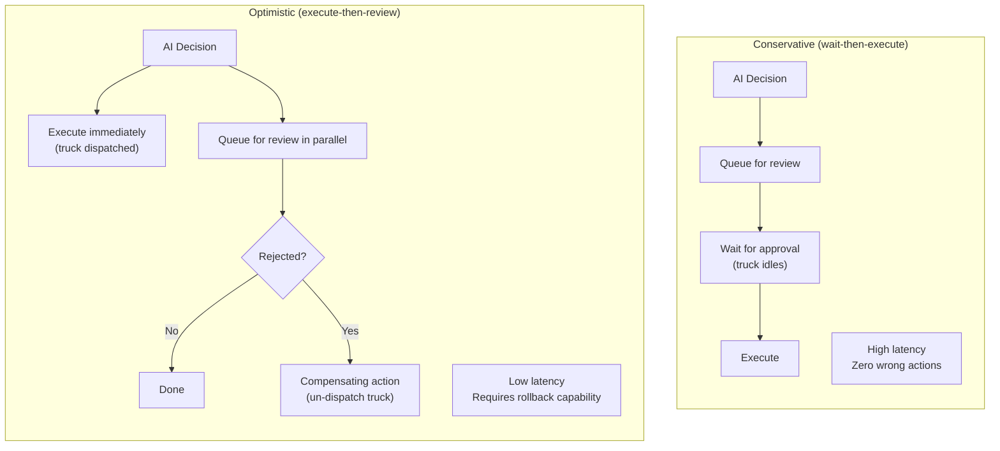

> [!WARNING]
> **FAILURE SCENARIO**
>
> Optimistic execution requires a compensating action (rollback) to be defined for every state change. If the AI booked a truck and a human rejects it 10 minutes later, the truck must be automatically un-booked. If the compensating action does not exist or fails, the system is in an inconsistent state with no recovery path. Only use optimistic execution when a reliable, automated compensating action is available for every possible downstream effect.

Every HITL decision must be stored in the event log with the human actor, timestamp, and rationale. This serves as an audit trail and as training data — human rejections and overrides are the ground truth for improving the model over time (reference Event Sourcing pattern, Section 5.2).

> [!TIP]
> **Advanced talking points on HITL:**
>
> "HITL is not a fallback — it is a first-class architectural pattern for high-stakes AI decisions."
>
> "The key design question is: what is the cost of a wrong AI decision vs. the cost of human latency? Route that analysis to determine the threshold."
>
> "Every human override is a training signal. Store them in the event log. The HITL system is not just a safety net — it is your label-generation pipeline."

## 5. Domain Context: Logistics & Supply Chain

### 5.1 The Architecture at Scale

A logistics platform processes millions of telemetry events daily: GPS pings from trucks, warehouse sensor data, shipment status updates, and delivery confirmations. The AI layer sits on top of this event stream, powering three core capabilities.

<div class="cols-2">
<div class="col">

**Demand Planning**

Predict future demand based on historical shipping patterns, seasonal trends, and external signals. Uses batch ML models retrained periodically.

**Intelligent Routing**

Real-time optimization of delivery routes given constraints: vehicle capacity, time windows, traffic, fuel cost. Uses LLMs for multi-constraint reasoning.

</div>
<div class="col">

**Predictive Analytics**

Anomaly detection on telemetry streams: predict equipment failure, identify delays before they happen, flag unusual patterns. Uses streaming ML inference.

</div>
</div>

### 5.2 Event Sourcing and CQRS

The core architectural challenge in a logistics platform is separating **high-throughput ingestion** from **complex AI queries**. These two workloads have fundamentally different characteristics.

<div class="cols-2">
<div class="col">

**Write side (Event Sourcing)**

- Append-only log of every domain event
- "Truck 42 arrived at warehouse B at 14:32"
- Optimized for throughput: millions of writes per hour
- Schema: `(entity_id, event_type, payload, timestamp)`
- Kafka is the event log; PostgreSQL is the durable store

</div>
<div class="col">

**Read side (CQRS)**

- Materialized views optimized for specific query patterns
- "What is the current location of all trucks in region X?"
- "What is the predicted demand for SKU Y next week?"
- Built by consuming the event stream and projecting into query-optimized tables
- Can be rebuilt from the event log at any time

</div>
</div>

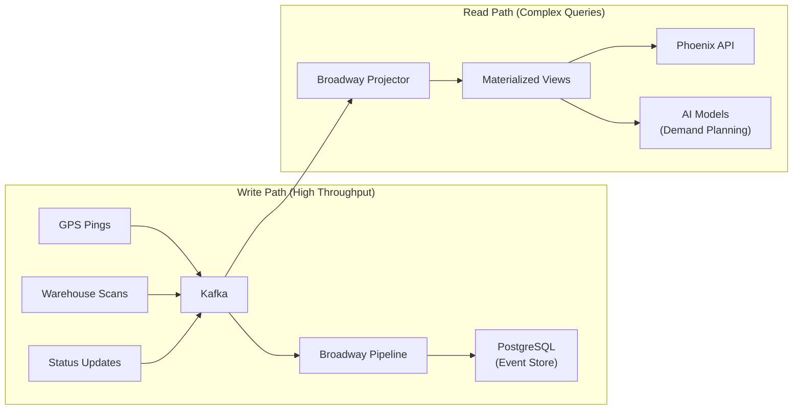

> [!NOTE]
> **TRADE-OFFS**
>
> **Event Sourcing** — full audit trail, can rebuild any view, but storage grows unbounded and replaying history is expensive
>
> **CQRS** — read and write models are independently optimized, but introduces eventual consistency between the write and read sides
>
> **Combined** — powerful but complex. Only justified when the read and write workloads are fundamentally different (they are in logistics)

> [!TIP]
> Kafka already _is_ an event log. The pattern here is not "add Kafka to get Event Sourcing" — it is "recognize that the Kafka topic is the source of truth, and everything else (PostgreSQL tables, materialized views, AI model inputs) is a projection of that log."

### 5.3 Data Persistence at Scale

For high-volume telemetry ingestion, standard row-by-row inserts are a bottleneck. Broadway's batching naturally feeds into bulk database operations.

```elixir
def handle_batch(:persist, messages, _batch_info, _context) do
  entries =
    messages
    |> Enum.map(& &1.data)
    |> Enum.map(&Map.take(&1, [:entity_id, :event_type, :payload, :timestamp]))

  Repo.insert_all(TelemetryEvent, entries,
    on_conflict: :nothing,
    conflict_target: [:entity_id, :timestamp]
  )

  messages
end
```

<div class="cols-2">
<div class="col">

**PostgreSQL strategies for telemetry**

- **Table partitioning** by time range (daily/weekly) for fast pruning and query locality
- **`insert_all`** for bulk inserts from Broadway batches
- **Upserts** (`ON CONFLICT`) for idempotent writes
- **Partial indexes** on hot query paths (e.g., active shipments only)

</div>
<div class="col">

**When to consider alternatives**

- **TimescaleDB** — PostgreSQL extension optimized for time-series with automatic partitioning, compression, and continuous aggregates
- **ClickHouse** — column-oriented analytics for heavy aggregation queries
- Avoid introducing a new database unless PostgreSQL demonstrably cannot handle the load with partitioning and indexing

</div>
</div>

## 6. Advanced Architecture Decisions

### 6.1 Languages as Tools

The JD describes a "polyglot mindset where languages are tools." In this architecture, each language is chosen for what it does best.

<div class="cols-2">
<div class="col">

**Elixir — Orchestration and plumbing**

- I/O-bound: waiting on Kafka, HTTP APIs, databases
- Concurrency: thousands of lightweight processes
- Fault tolerance: supervision trees, let-it-crash
- Real-time: Phoenix Channels/LiveView for dashboards
- Used for: Broadway pipelines, API layer, job orchestration

</div>
<div class="col">

**TypeScript — Frontend and API contracts**

- Type safety across the stack boundary
- React/Next.js for logistics dashboards
- Phoenix Channel client for real-time updates
- GraphQL/tRPC for type-safe API consumption
- Used for: UI, type-safe API clients, shared schemas

</div>
</div>

<div class="cols-2">
<div class="col">

**Python — ML model development**

- Rich ML ecosystem (PyTorch, scikit-learn, pandas)
- Model training and experimentation
- Running on Modal.com or Vertex AI
- Used for: model development, batch inference, notebooks

</div>
<div class="col">

**The boundary**

- Elixir orchestrates; Python/cloud services compute
- The AI model is a black box behind an HTTP API
- Elixir handles retries, fallbacks, circuit breaking
- The model handles inference
- This separation means models can be swapped without touching the pipeline

</div>
</div>

> [!TIP]
> The advanced answer to "why Elixir?" is not "because it's fast" — it's "because the BEAM's concurrency model is ideal for I/O-bound orchestration of many concurrent external service calls, and OTP's supervision model gives us fault tolerance for free at the architectural level."

### 6.2 The TypeScript Boundary

The TypeScript frontend connects to the Elixir backend through two channels: REST/GraphQL for request-response and Phoenix Channels for real-time updates.

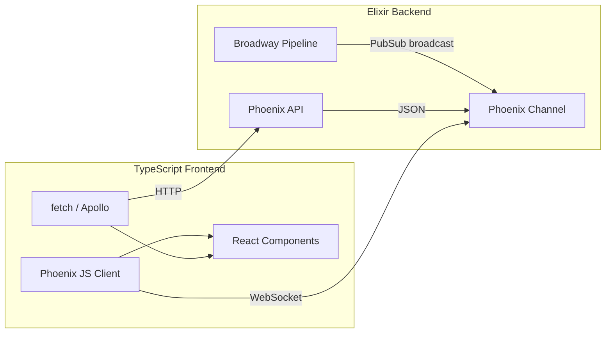

When Broadway finishes processing an AI routing result, it broadcasts via `Phoenix.PubSub`. A Phoenix Channel picks this up and pushes it to connected TypeScript clients in real time.

```elixir
def handle_batch(:ai_routing, messages, _batch_info, _context) do
  results = process_with_ai(messages)

  Enum.each(results, fn result ->
    Phoenix.PubSub.broadcast(MyApp.PubSub, "shipment:#{result.shipment_id}", %{
      event: "route_updated",
      payload: result
    })
  end)

  messages
end
```

### 6.3 Observability Across System Boundaries

In a distributed AI pipeline, a single "route this shipment" request crosses multiple system boundaries: Kafka → Broadway → AI API → PostgreSQL → Phoenix Channel → TypeScript client. Without distributed tracing, debugging latency or failures requires correlating logs across every system by timestamp — which does not scale.

**OpenTelemetry trace propagation:**

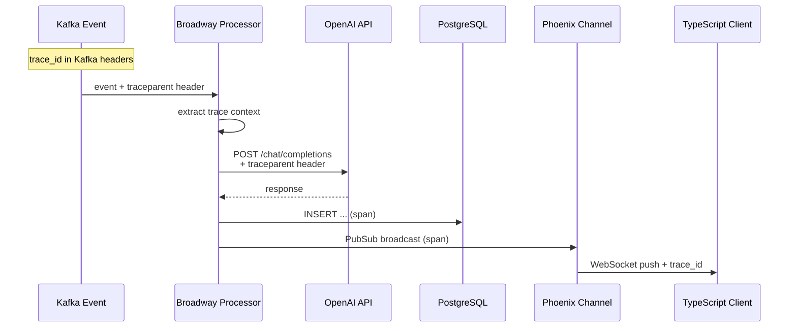

The implementation requires propagating the trace context at every boundary:

```elixir
def handle_message(_processor, message, _context) do
  trace_context = extract_trace_context(message.metadata.headers)

  OpenTelemetry.Tracer.with_span "process_shipment_event",
    attributes: %{
      "shipment.id" => message.data["shipment_id"],
      "kafka.partition" => message.metadata.partition,
      "kafka.offset" => message.metadata.offset
    } do
      message
      |> Message.update_data(&decode_and_validate/1)
      |> Message.put_batcher(:ai_routing)
  end
end

def handle_batch(:ai_routing, messages, _batch_info, _context) do
  OpenTelemetry.Tracer.with_span "ai_routing_batch",
    attributes: %{"batch.size" => length(messages)} do

    headers = OpenTelemetry.Tracer.inject_context([])

    AIClient.call(payload,
      headers: [{"traceparent", headers["traceparent"]} | default_headers()]
    )
  end
end
```

> [!TIP]
> Advanced insight: trace IDs must cross every boundary, including Kafka headers, HTTP headers to the AI API, database query comments (for pg_stat_statements correlation), and WebSocket payloads. A trace that stops at the AI call boundary is only half useful.

### 6.4 Key Metrics to Instrument

| Metric                                 | Type      | Why it matters                     |
| -------------------------------------- | --------- | ---------------------------------- |
| `broadway.message.processing_time`     | Histogram | Detect processor slowdowns         |
| `broadway.batch.processing_time`       | Histogram | Detect AI API latency spikes       |
| `broadway.message.failed`              | Counter   | Alert on rising failure rate       |
| `ai.request.duration`                  | Histogram | Track AI API latency independently |
| `ai.request.tokens_used`               | Counter   | Cost tracking and budget alerts    |
| `ai.circuit_breaker.state`             | Gauge     | Know when fallbacks are active     |
| `kafka.consumer.lag`                   | Gauge     | Detect backlog growth              |
| `kafka.consumer.offset_commit.latency` | Histogram | Detect Kafka broker issues         |

> [!WARNING]
> **FAILURE SCENARIO**
>
> Without `kafka.consumer.lag` monitoring, the pipeline can silently fall hours behind during an AI degradation. By the time anyone notices, the backlog is so large that recovery takes longer than the degradation itself.

## 8. Prompt Engineering & Cost Optimization

### 8.1 Structured Outputs

LLM output is text. Every downstream pipeline stage needs structured data. Without enforcement, a model can return a well-reasoned English sentence instead of JSON — and `Jason.decode!` crashes the batch handler.

<div class="cols-2">
<div class="col">

**Four levels of output enforcement**

1. **Free-form prompt** — ask for JSON in plain text; model may or may not comply
2. **JSON mode** (`response_format: { type: "json_object" }`) — guarantees valid JSON, does not enforce a schema
3. **Function calling / tool use** — define a JSON schema; model fills it in, but schema conformance is not hard-guaranteed
4. **Strict mode** (`strict: true`) — schema conformance is guaranteed; the model cannot generate output outside the schema

</div>
<div class="col">

**What each level prevents**

| Level            | Failure prevented                         |
| ---------------- | ----------------------------------------- |
| JSON mode        | `Jason.decode!` crashes                   |
| Function calling | Missing required fields                   |
| Strict mode      | Extra fields, wrong types, missing fields |

</div>
</div>

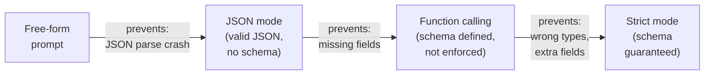

> [!TIP]
> For a production Broadway pipeline, use strict mode. The extra latency (~50ms) is worth eliminating the parsing exceptions.

> [!WARNING]
> **FAILURE SCENARIO**
>
> Without structured output enforcement, a model returns `"I recommend Route A because the highway avoids the construction zone..."` instead of JSON. `Jason.decode!` raises, the Broadway processor crashes, the supervisor restarts it, and the same message is retried indefinitely — a poison-pill loop caused entirely by prompt design.

Calling the OpenAI API from Broadway with a tool definition:

```elixir
defmodule MyApp.AIClient do
  @route_tool %{
    type: "function",
    function: %{
      name: "route_recommendation",
      strict: true,
      parameters: %{
        type: "object",
        properties: %{
          recommended_route: %{type: "string"},
          estimated_minutes: %{type: "integer"},
          confidence: %{type: "number"},
          reasoning: %{type: "string"}
        },
        required: ["recommended_route", "estimated_minutes", "confidence", "reasoning"],
        additionalProperties: false
      }
    }
  }

  def batch_route(constraints_list) do
    payload = build_prompt(constraints_list)

    case OpenAI.chat_completion(
      model: select_model(:routing),
      messages: payload,
      tools: [@route_tool],
      tool_choice: %{type: "function", function: %{name: "route_recommendation"}}
    ) do
      {:ok, %{choices: [%{message: %{tool_calls: [%{function: %{arguments: args}}]}} | _]}} ->
        {:ok, Jason.decode!(args)}

      {:error, reason} ->
        {:error, reason}
    end
  end
end
```

Decoding the structured response and mapping back to Broadway messages:

```elixir
@impl true
def handle_batch(:ai_routing, messages, _batch_info, _context) do
  constraints = Enum.map(messages, & &1.data)

  case AIClient.batch_route(constraints) do
    {:ok, results} when length(results) == length(messages) ->
      messages
      |> Enum.zip(results)
      |> Enum.map(fn {msg, result} -> Message.update_data(msg, fn _ -> result end) end)

    {:ok, results} ->
      # Length mismatch — fail entire batch for safe retry
      Logger.error("Result count mismatch: #{length(results)} vs #{length(messages)}")
      Enum.map(messages, &Message.failed(&1, "result_count_mismatch"))

    {:error, reason} ->
      Enum.map(messages, &Message.failed(&1, reason))
  end
end
```

### 8.2 Few-Shot and Chain-of-Thought Prompting

For complex logistics decisions — multi-constraint routing, demand forecasting, anomaly classification — zero-shot prompts produce lower-quality output. A few well-chosen examples dramatically improve reliability.

<div class="cols-2">
<div class="col">

**Zero-shot vs. few-shot**

- **Zero-shot** — the instruction only; the model generalizes from its training
- **Few-shot** — instruction + 2–5 examples of (input, correct output) pairs
- Few-shot helps when: the task is hard to describe but easy to demonstrate; the output format is non-standard; the domain is specialized (logistics constraints are not well represented in general training data)

</div>
<div class="col">

**Static vs. dynamic few-shot examples**

- **Static** — hardcoded in the prompt template; consistent but may not be relevant to the specific request
- **Dynamic via RAG** — embed the new request, retrieve the 3 most similar historical requests that were successfully resolved, inject them as examples
- Dynamic few-shot is more expensive (embedding + vector search on every request) but produces better output for requests that differ from the static examples

</div>
</div>

**Dynamic few-shot via RAG** makes the connection between semantic search and prompt engineering explicit:

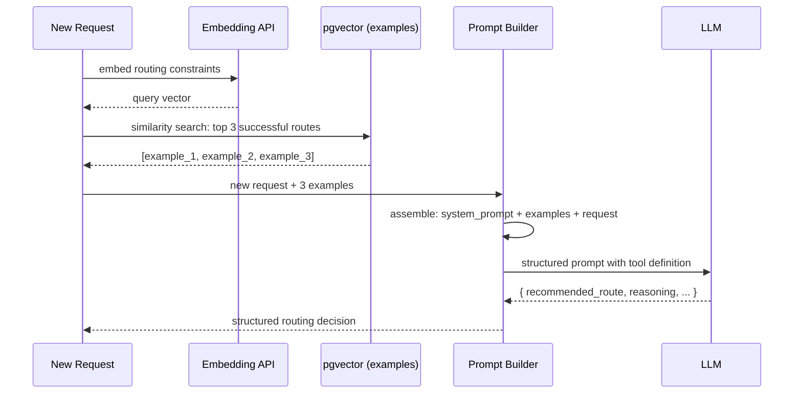

> [!TIP]
> Only retrieve examples that were marked as _successful_ (the route was completed without incident, the driver confirmed the path). Injecting failed examples as demonstrations teaches the model the wrong behavior.

**Chain-of-thought (CoT)** causes the model to reason step-by-step before producing its final answer — reducing confident-but-wrong outputs on multi-constraint problems.

```elixir
defp build_routing_prompt(constraints, examples) do
  few_shot_block =
    examples
    |> Enum.map_join("\n---\n", fn ex ->
      """
      Input: #{Jason.encode!(ex.constraints)}
      Reasoning: #{ex.reasoning}
      Output: #{Jason.encode!(ex.result)}
      """
    end)

  [
    %{role: "system", content: """
      You are a logistics routing engine. Given delivery constraints, recommend the optimal route.
      Think step by step before producing your final answer.
      Always reason through: time windows → vehicle capacity → estimated traffic → fuel cost.
      """},
    %{role: "user", content: """
      Here are successful past routings for reference:
      #{few_shot_block}

      ---
      New request:
      #{Jason.encode!(constraints)}
      """}
  ]
end
```

> [!NOTE]
> **TRADE-OFFS**
>
> **Chain-of-thought** produces a `reasoning` field in the output that consumes 300–800 extra tokens per request. At $5/M output tokens for GPT-4o, that's $0.0015–0.004 per request — negligible for a few hundred decisions, meaningful at millions.
>
> Only use CoT for genuinely complex multi-constraint reasoning tasks. For simple classification (is this shipment fragile?) or tagging (extract the SKU), CoT adds cost and latency with no quality benefit.

### 8.3 Token Budgeting

At millions of operations, uncontrolled token usage is unbounded cost. Every token in every part of the API call has a price.

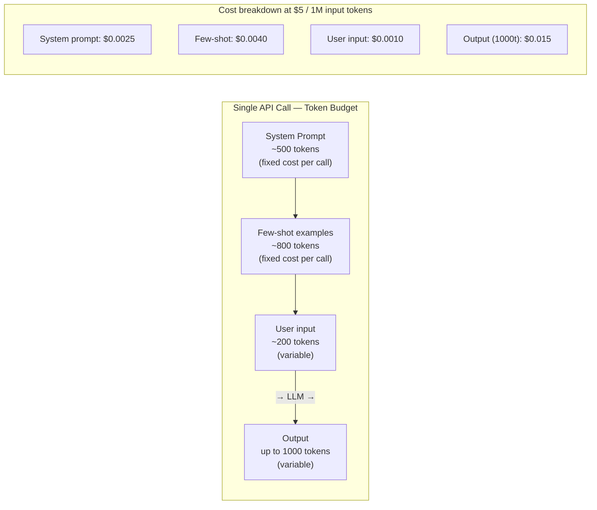

The system prompt and few-shot examples are a **fixed cost paid on every single API call**. Reducing the system prompt by 200 tokens on 1M calls saves $1.00. At 10M calls, that's $10.00. At the platform scale described in the JD, this compounds significantly.

**Counting tokens before calling the API** (Elixir with `ex_tiktoken`):

```elixir
defmodule MyApp.TokenBudget do
  @max_input_tokens 3_000
  @max_output_tokens 1_000
  @model_input_cost_per_million 5.0   # GPT-4o
  @model_output_cost_per_million 15.0 # GPT-4o

  def estimate_cost(messages) do
    input_tokens = ExTiktoken.count_tokens(messages, model: "gpt-4o")
    estimated_output = @max_output_tokens

    input_cost = input_tokens / 1_000_000 * @model_input_cost_per_million
    output_cost = estimated_output / 1_000_000 * @model_output_cost_per_million

    %{
      input_tokens: input_tokens,
      estimated_total_tokens: input_tokens + estimated_output,
      estimated_cost_usd: input_cost + output_cost
    }
  end

  def validate_budget!(messages) do
    %{input_tokens: count} = estimate_cost(messages)

    if count > @max_input_tokens do
      raise "Input token budget exceeded: #{count} > #{@max_input_tokens}"
    end

    count
  end
end
```

**Model tier selection** — the biggest cost lever is choosing the right model:

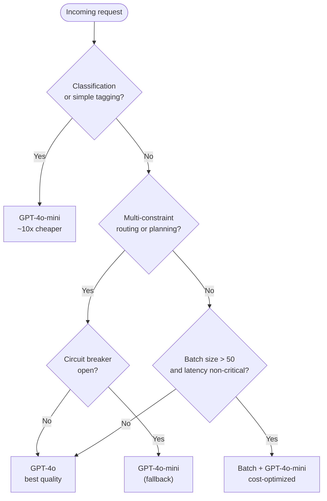

```elixir
defmodule MyApp.ModelSelector do
  def select_model(task_type, opts \\ []) do
    circuit_open? = :fuse.ask(:ai_service_fuse, :sync) == :blown
    batch_size = Keyword.get(opts, :batch_size, 1)
    latency_critical? = Keyword.get(opts, :latency_critical, true)

    cond do
      circuit_open? -> "gpt-4o-mini"
      task_type in [:classification, :tagging, :extraction] -> "gpt-4o-mini"
      batch_size > 50 and not latency_critical? -> "gpt-4o-mini"
      task_type in [:routing, :planning, :multi_constraint] -> "gpt-4o"
      true -> "gpt-4o-mini"
    end
  end
end
```

> [!WARNING]
> **FAILURE SCENARIO**
>
> Without `max_tokens` on the API call, a model generating an unexpectedly long chain-of-thought response can return 4,000 output tokens for a request budgeted at 500. At $15/M output tokens for GPT-4o, one misbehaving request costs $0.06 — not alarming alone, but a runaway prompt bug across 100K requests costs $6,000 before anyone notices. Always set `max_tokens`. Validate that the response was not truncated before decoding.

Track actual token usage after every call and emit it as a telemetry metric (see Section 6.4):

```elixir
def handle_batch(:ai_routing, messages, _batch_info, _context) do
  case AIClient.call(payload) do
    {:ok, %{usage: usage} = response} ->
      :telemetry.execute([:ai, :request, :tokens_used], %{
        prompt_tokens: usage.prompt_tokens,
        completion_tokens: usage.completion_tokens,
        total_tokens: usage.total_tokens
      }, %{model: response.model, task: :routing})

      # ... process response
  end
end
```

### 8.4 Semantic Caching

Many logistics requests are near-identical — the same route, the same constraints, different timestamps. Calling the LLM every time wastes money. Semantic caching returns a cached response for requests that are "close enough" to a previous one.

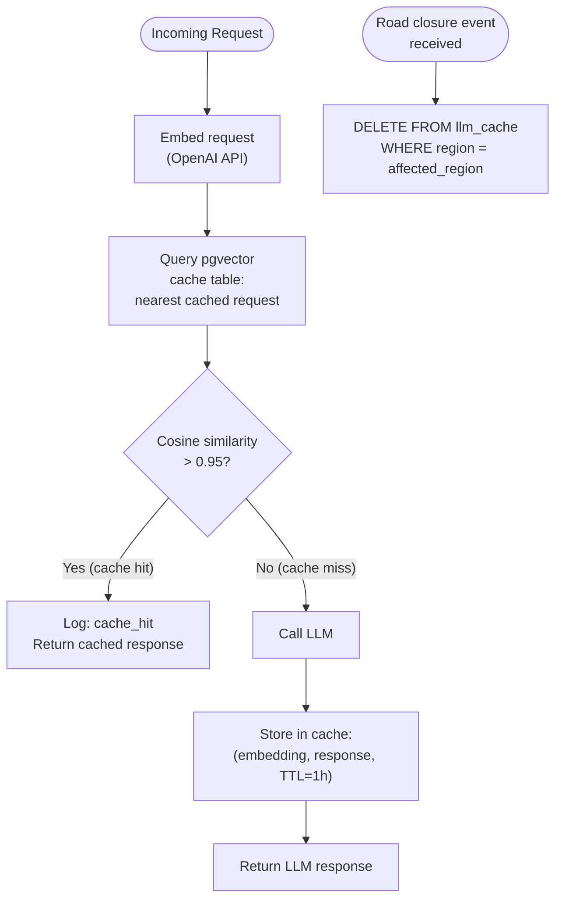

Cache schema and lookup:

```elixir
# Schema
# CREATE TABLE llm_cache (
#   id UUID PRIMARY KEY DEFAULT gen_random_uuid(),
#   request_embedding vector(1536),
#   response JSONB,
#   region TEXT,
#   expires_at TIMESTAMPTZ
# );

defmodule MyApp.SemanticCache do
  alias MyApp.Repo
  import Ecto.Query

  @similarity_threshold 0.95

  def lookup(request_embedding) do
    now = DateTime.utc_now()

    result =
      from(c in "llm_cache",
        where: c.expires_at > ^now,
        order_by: fragment("request_embedding <=> ?", ^request_embedding),
        limit: 1,
        select: %{
          response: c.response,
          similarity: fragment("1 - (request_embedding <=> ?)", ^request_embedding)
        }
      )
      |> Repo.one()

    case result do
      %{similarity: sim, response: resp} when sim >= @similarity_threshold ->
        {:hit, resp}
      _ ->
        :miss
    end
  end

  def store(request_embedding, response, region, ttl_seconds \\ 3600) do
    expires_at = DateTime.add(DateTime.utc_now(), ttl_seconds, :second)

    Repo.insert_all("llm_cache", [%{
      id: Ecto.UUID.generate(),
      request_embedding: request_embedding,
      response: response,
      region: region,
      expires_at: expires_at
    }])
  end

  def invalidate_region(region) do
    from(c in "llm_cache", where: c.region == ^region)
    |> Repo.delete_all()
  end
end
```

<div class="cols-2">
<div class="col">

**Cache invalidation strategies**

- **TTL-based** — route recommendations expire after 1 hour; traffic conditions change
- **Event-based** — a road closure event triggers `invalidate_region("northwest")`, immediately clearing stale cached routes for the affected area
- **Model-version-based** — when you change the embedding model, all cached embeddings become incompatible; flush the cache or store the model version with each entry

</div>
<div class="col">

**Threshold tuning**

- **Too high (> 0.98)** — cache misses on semantically identical requests with slightly different wording; most requests go to the LLM
- **Too low (< 0.90)** — cache hits on genuinely different requests; wrong responses returned silently
- **Start at 0.95** and tune based on production error rate and cache-hit ratio metrics

</div>
</div>

> [!WARNING]
> **FAILURE SCENARIO**
>
> A 0.88 similarity threshold sounds safe but returns the cached result for "Route from Portland to Seattle, avoid highways" when the new request is "Route from Portland to Seattle, highways only" — opposite constraints, high embedding similarity because most words overlap. Always validate cached responses against a quick constraint-compatibility check before returning them, or keep the threshold conservatively high and accept lower hit rates.

> [!NOTE]
> **TRADE-OFFS**
>
> Semantic caching adds two round-trips before the LLM call: one to embed the request and one to query pgvector. At ~200ms each, that's 400ms of overhead on every cache miss. Cache hits are fast (< 10ms query after embedding). The trade-off is worthwhile when: the LLM call costs > $0.01 and latency is non-critical, or when the cache hit rate exceeds ~20% (saving more in LLM cost than the embedding cost adds).

## 9. Cloud & Edge Deployment

### 9.1 BEAM Clustering on Kubernetes

Running a distributed Elixir cluster on Kubernetes has challenges that don't exist on bare metal: pod IPs change on every deploy, rolling updates replace nodes mid-operation, and WebSocket connections are long-lived and stateful.

**The problem: BEAM needs to find other nodes.** On bare metal, nodes are at known, static hostnames. In Kubernetes, each pod gets a new IP on every restart — there is no stable address for peers to connect to.

**libcluster** is the standard library for automatic BEAM cluster formation. It supports several discovery strategies; the recommended Kubernetes approach is `Cluster.Strategy.Kubernetes.DNS`.

```elixir
# config/runtime.exs
config :libcluster,
  topologies: [
    k8s: [
      strategy: Cluster.Strategy.Kubernetes.DNS,
      config: [
        service: "myapp-headless",
        application_name: "myapp"
      ]
    ]
  ]
```

**Headless Services** are the key. A regular Kubernetes Service load-balances traffic to one pod. A headless Service (`clusterIP: None`) returns DNS records for _all_ matching pods. libcluster resolves that DNS query and establishes BEAM connections to every returned address, forming a full-mesh cluster.

```yaml
# kubernetes/headless-service.yaml
apiVersion: v1
kind: Service
metadata:
  name: myapp-headless
spec:
  clusterIP: None
  selector:
    app: myapp
  ports:
    - port: 4369 # EPMD
      name: epmd
    - port: 9000 # Distribution port range start
      name: erlang-dist
```

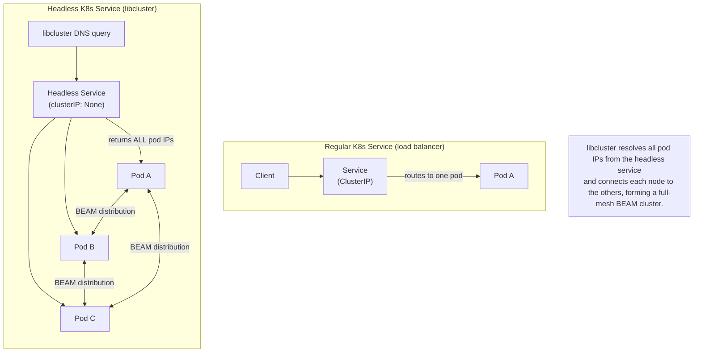

**Rolling deploy sequence** — what happens when Kubernetes replaces a pod:

```mermaid
sequenceDiagram
    participant K8s as Kubernetes
    participant OP as Old Pod
    participant BW as Broadway
    participant KF as Kafka
    participant NP as New Pod

    K8s->>OP: SIGTERM

    rect rgb(255, 243, 224)
        Note over OP,KF: terminationGracePeriodSeconds window
        OP->>BW: stop consuming
        BW->>KF: pause consumer (no new fetches)
        Note over BW: drain in-flight messages through processors
        BW->>BW: flush remaining batches
        BW->>KF: commit final offsets
        OP->>K8s: exit(0)
    end

    Note over K8s: ⚠️ SIGKILL fires here if grace period expires before drain

    K8s->>NP: start
    NP->>NP: libcluster discovers peers, joins cluster
    NP->>BW: Broadway starts consuming
    KF->>NP: Kafka reassigns partitions to new consumer
```

<div class="cols-2">
<div class="col">

**Rolling deploy checklist**

- `terminationGracePeriodSeconds` > Broadway drain time (Section 3.1 formula: `batch_timeout + max AI latency + buffer`)
- Headless Service and RBAC `list pods` permission configured before deploying libcluster
- Phoenix JS clients auto-reconnect after WebSocket drops — verify this in staging
- Kafka consumer group rebalance triggers on pod removal — normal behavior, not an error

</div>
<div class="col">

**RBAC requirement**

libcluster's DNS strategy needs permission to list pods in the namespace:

```yaml
rules:
  - apiGroups: [""]
    resources: ["pods"]
    verbs: ["get", "list", "watch"]
```

Without this, libcluster silently fails to discover peers and the node runs as a standalone singleton — no cluster, no distributed PubSub, no shared ETS.

</div>
</div>

> [!WARNING]
> **FAILURE SCENARIO: Split-brain**
>
> If pod networking degrades (a common K8s node pressure scenario), two groups of pods may lose connectivity to each other while still accepting traffic. Each partition believes it is the full cluster. Distributed state (Phoenix PubSub, global GenServers, distributed ETS) diverges silently. Mitigate with a `:pg` / `Phoenix.PubSub` architecture where messages fan out across the cluster rather than relying on single-node state.

> [!WARNING]
> **FAILURE SCENARIO: Missing RBAC**
>
> libcluster with `Cluster.Strategy.Kubernetes.DNS` must be able to call the Kubernetes API to list pods. If the ServiceAccount lacks `list pods` permission, libcluster logs a warning and falls back to a single-node configuration. The app continues to work, but Broadway pipelines on different pods do not share state, PubSub does not fan out across the cluster, and you won't know until you notice that real-time updates only reach users connected to the pod that processed the event.

### 9.2 Where to Run Inference — Edge vs Cloud

The JD calls out Cloudflare Workers AI, Modal.com, and Vertex AI. Each occupies a different point in the latency/cost/capability space.

<div class="cols-2">
<div class="col">

|                | Cloudflare Workers AI | Modal.com              | Vertex AI              |
| -------------- | --------------------- | ---------------------- | ---------------------- |
| Location       | Edge (150+ PoPs)      | Cloud (GPU servers)    | Cloud (GCP)            |
| Latency        | ~50ms globally        | ~200ms–30s             | ~200ms–minutes         |
| GPU access     | Small models only     | Any GPU (A100, H100)   | Any GPU                |
| Cold start     | None (always warm)    | ~2–5s                  | ~10–60s                |
| Cost model     | Per request           | Per second of GPU time | Per request / per hour |
| Max model size | ~8B parameters        | Unlimited              | Unlimited              |
| GCP ecosystem  | No                    | No                     | Yes                    |

</div>
<div class="col">

**When to use each**

**Cloudflare Workers AI** — fast lightweight classification at the edge: categorize a shipment event before it hits Kafka, filter 90% of GPS pings as "normal" at the source, run sub-100ms inference globally without a cloud round-trip. Models: Llama 3 8B, Mistral 7B, Whisper, image classifiers.

**Modal.com** — custom or fine-tuned models, large models requiring A100/H100 GPU, batch prediction jobs (nightly demand forecasts). Already covered in Section 4.1 (async webhook pattern).

**Vertex AI** — full GCP ecosystem commitment (BigQuery, GCS, GKE), managed MLOps pipelines (Vertex Pipelines), Gemini models via managed endpoint.

</div>
</div>

**Inference platform decision tree:**

```mermaid
flowchart TD
    START(["Where should this\ninference run?"]) --> Q1{"Model size\n> 8B parameters?"}

    Q1 -->|"Yes"| Q2{"Already on\nGCP / BigQuery?"}
    Q1 -->|"No"| Q3{"Need lowest latency\nglobally (< 100ms)?"}

    Q2 -->|"Yes"| VERTEX["Vertex AI\n(managed MLOps, Gemini)"]
    Q2 -->|"No"| Q4{"Custom or\nfine-tuned model?"}

    Q3 -->|"Yes"| CF["Cloudflare Workers AI\n(edge, always warm)"]
    Q3 -->|"No"| Q4

    Q4 -->|"Yes"| MODAL_FT["Modal.com\n(GPU on demand)"]
    Q4 -->|"No"| Q5{"Batch prediction\n(nightly runs)?"}

    Q5 -->|"Yes"| MODAL_B["Modal.com or\nVertex AI Batch"]
    Q5 -->|"No"| CF

```

**The hybrid pattern for logistics** — push cheap filtering to the edge, reserve GPU compute for the events that need it:

```mermaid
flowchart TD
    subgraph Edge["Edge (Cloudflare, ~50ms)"]
        GPS["GPS Pings\n(from trucks/sensors)"] --> CF["Cloudflare Worker\n(classify: normal / anomaly)"]
        CF -->|"normal (90%)"| KN["Kafka\n(lightweight event)"]
        CF -->|"anomaly (10%)"| KA["Kafka\n(enriched event + edge score)"]
    end

    subgraph Cloud["Cloud (Broadway + Modal, ~seconds)"]
        KA --> BW["Broadway Pipeline"]
        BW --> MODAL["Modal.com\n(deep anomaly analysis)"]
        MODAL --> PG["PostgreSQL + PubSub"]
    end

    KN -.->|"stored, no ML cost"| PG

    note["Edge filters 90% of events as normal\n→ only 10% reach cloud inference\n→ 10x cost reduction"]

```

> [!TIP]
> The edge-to-cloud handoff is via Kafka. The Cloudflare Worker enriches the Kafka message with an `edge_anomaly_score` before publishing. Broadway can then use that score as a fast-path filter — if the edge score is below a threshold, skip the Modal call entirely and write directly to PostgreSQL. This creates a multi-tier cost model: edge compute (cheapest), Kafka throughput (moderate), cloud GPU (most expensive).

### 9.3 Managed Kafka Comparisons

Broadway's backbone is a message queue. The managed Kafka service you choose affects cost, operational burden, and your Broadway producer configuration.

```mermaid
flowchart LR
    subgraph PubSub["GCP Pub/Sub"]
        PS_BW["Broadway\n(BroadwayCloudPubSub)"] --> PS_T["Pub/Sub Topic"]
        PS_T --> PS_S["Pub/Sub Subscription"]
        PS_NOTE["no offsets\nno consumer groups\nno ordering guarantees"]
    end

    subgraph Confluent["Confluent Cloud"]
        CC_BW["Broadway\n(BroadwayKafka)"] --> CC_B["Confluent Broker"]
        CC_B --> CC_SR["Schema Registry\n(Avro / Protobuf)"]
        CC_B --> CC_KS["KSQL\n(stream processing)"]
        CC_NOTE["full Kafka semantics\n+ ecosystem"]
    end

    subgraph MSK["Amazon MSK"]
        MSK_BW["Broadway\n(BroadwayKafka)"] --> MSK_B["MSK Broker"]
        MSK_B --> MSK_SR["AWS Glue\nSchema Registry"]
        MSK_NOTE["Kafka API\nAWS-native ops"]
    end

    SAME["BroadwayKafka works for\nboth Confluent and MSK\nwith no code changes"]

```

Broadway producer configuration side by side:

<div class="cols-2">
<div class="col">

**BroadwayKafka (Confluent Cloud or MSK)**

```elixir
producer: [
  module: {BroadwayKafka.Producer, [
    hosts: [{"pkc-xxx.confluent.cloud", 9092}],
    group_id: "routing_consumers",
    topics: ["shipment_events"],
    connection_config: [
      ssl: true,
      sasl: {:plain, "API_KEY", "API_SECRET"}
    ]
  ]},
  concurrency: 1
]
```

Same module for Confluent and MSK — only the `hosts` and auth config change.

</div>
<div class="col">

**BroadwayCloudPubSub (GCP Pub/Sub)**

```elixir
producer: [
  module: {BroadwayCloudPubSub.Producer, [
    subscription: "projects/my-project/subscriptions/shipment-sub",
    max_number_of_messages: 100
  ]},
  concurrency: 1
]
```

Different producer module. No `group_id`, no partition concept — Pub/Sub manages message distribution via subscriptions.

</div>
</div>

<div class="cols-2">
<div class="col">

**GCP Pub/Sub trade-offs**

- Not Kafka — different semantics entirely: no consumer groups, no offsets, no per-partition ordering
- Fully managed, zero ops overhead
- Best when: already on GCP, don't need Kafka's ordering or offset semantics, want simplicity
- Limitation: no schema registry, no KSQL, message replay requires Pub/Sub Seek (limited vs. Kafka retention)

</div>
<div class="col">

**Confluent Cloud trade-offs**

- Full Kafka API: offsets, consumer groups, partition ordering, Schema Registry, KSQL, Kafka Connect
- Most feature-complete, most expensive (CKU-based pricing scales with throughput)
- Best when: need strict schema enforcement (Avro/Protobuf), have complex streaming transforms, or are migrating from self-managed Kafka

**Amazon MSK trade-offs**

- Native Kafka API, no translation layer
- Lower overhead than self-managed Kafka, but you still manually scale brokers
- Best when: already on AWS, want Kafka semantics at moderate cost without the full Confluent ecosystem

</div>
</div>

> [!NOTE]
> **TRADE-OFFS**
>
> **GCP Pub/Sub** — simplest operations, no Kafka expertise required, scales automatically. Loses partition-level ordering and offset management. Acceptable for logistics event ingestion where strict ordering is enforced at the application level (idempotency keys + upserts) rather than the queue level.
>
> **Confluent Cloud** — most powerful but most expensive. Justified when you need Schema Registry to enforce Avro/Protobuf contracts across multiple teams producing to the same topics.
>
> **Amazon MSK** — the middle ground. Kafka semantics without Confluent's cost, but without Confluent's ecosystem either. Requires more operational knowledge than Pub/Sub.

> [!TIP]
> `BroadwayKafka` works with both Confluent Cloud and Amazon MSK with no code changes — only the `hosts`, SSL, and SASL configuration differs. Switching between the two is a config change, not a code change. Switching to or from `BroadwayCloudPubSub` requires changing the producer module and rethinking the consumer group / offset model.

## 7. Test Your Knowledge

<details>
<summary>Explain the demand-driven model in GenStage and why it prevents OOM</summary>

In GenStage, consumers request events from producers by issuing demand — "I can handle N more events." Producers only emit events when demand exists. This inverts the typical push model where producers emit freely. The benefit is structural backpressure: if a consumer slows down, it stops issuing demand, the producer stops emitting, and no unbounded queue forms. In contrast, a push-based system (raw message passing, `cast`) accumulates messages in the consumer's mailbox, growing memory until the process crashes or the node OOMs.

</details>

<details>
<summary>How do Kafka partitions map to Broadway and what are the ordering implications?</summary>

Each Kafka partition is an ordered log. Broadway assigns partitions to producer processes. Messages from the same partition arrive in order at the processor level, but once they fan out across multiple processor processes (`concurrency: N`), cross-partition ordering is not guaranteed. If ordering matters per entity (e.g., all events for shipment X must be processed in order), partition by entity key in Kafka. This ensures all events for that entity land on the same partition and are processed sequentially.

</details>

<details>
<summary>Design a Dead Letter Queue strategy for a Broadway pipeline</summary>

Track retry count per message using Kafka headers. In `handle_message`, check the retry count. If it exceeds a threshold (e.g., 3), publish the message to a separate DLQ Kafka topic with the original message, error metadata, and timestamp. Mark the message as failed so Broadway acknowledges and moves past it. The DLQ topic is consumed by a separate, lower-priority pipeline for inspection, alerting, and manual replay. Wrap the processor logic in `try/rescue` to catch unexpected crashes and route them to the DLQ as well.

</details>

<details>
<summary>How does Broadway propagate backpressure when an AI API degrades?</summary>

Broadway uses GenStage's demand-driven model. When the AI API slows down, batch handlers take longer to return. This means batcher processes are occupied longer, so they stop accepting events from processors. Processors stop issuing demand to producers. Producers stop fetching from Kafka. The backlog grows in Kafka (which is designed for this) rather than in BEAM process memory. When the AI recovers, demand resumes and the backlog drains. No special configuration is needed — this is how GenStage works by default.

</details>

<details>
<summary>Explain circuit breaker states and design a fallback hierarchy for an AI service</summary>

A circuit breaker has three states. **Closed**: requests flow normally, failures are counted. **Open**: after N failures in a time window, the circuit opens — all requests fail immediately without calling the external service. **Half-Open**: after a timeout, one probe request is allowed through. If it succeeds, the circuit closes. If it fails, it reopens. A fallback hierarchy for AI: (1) primary model (GPT-4o), (2) cheaper model (GPT-4o-mini), (3) heuristic algorithm, (4) cached previous result, (5) queue for later processing. Each level trades quality for reliability.

</details>

<details>
<summary>Why is idempotency critical in a Kafka + Broadway pipeline, and how do you implement it?</summary>

Kafka provides at-least-once delivery. If a Broadway processor crashes after performing a side effect (API call, DB write) but before acknowledging the Kafka offset, the message will be redelivered. Without idempotency, this means duplicate AI calls (wasting money), duplicate database writes (corrupting state), or duplicate notifications (confusing users). Implementation: generate an idempotency key from the message content or Kafka offset, check a deduplication store (ETS with TTL, Redis, or a PostgreSQL unique constraint) before processing, and use upsert semantics for database writes.

</details>

<details>
<summary>Design the supervision tree for a logistics AI pipeline and explain each failure domain</summary>

The application supervisor starts Broadway as a child. Broadway internally creates three supervisor subtrees: ProducerSupervisor (manages Kafka consumers), ProcessorSupervisor (manages processor workers), and BatcherSupervisor (manages batcher workers). Each uses `one_for_one` so a crashed processor doesn't affect other processors or the Kafka connection. Outside Broadway, a separate supervisor manages the CircuitBreaker (`:fuse`), the AIClient connection pool, and the JobTracker GenServer for async ML jobs. This keeps AI infrastructure failures isolated from the data pipeline.

</details>

<details>
<summary>Explain Event Sourcing and CQRS in the context of a logistics platform</summary>

Event Sourcing stores every domain event as an immutable fact: "truck arrived," "package scanned," "route calculated." The Kafka topic is the event log. CQRS separates the write model (append events to Kafka + PostgreSQL event store) from the read model (materialized views optimized for specific queries). A Broadway projector consumes the event stream and updates query-optimized tables. The AI models consume the same stream for training data. The key benefit: the high-throughput write path (millions of GPS pings) doesn't compete with the complex read path (multi-constraint routing queries). The trade-off is eventual consistency between write and read sides.

</details>

<details>
<summary>How do you trace a request across Kafka → Broadway → AI API → PostgreSQL → Phoenix Channel?</summary>

Inject an OpenTelemetry trace context (traceparent header) into the Kafka message at the producer side. In Broadway's `handle_message`, extract the trace context from Kafka headers and start a child span. When calling the AI API, inject the trace context into the HTTP headers. When writing to PostgreSQL, attach the trace ID as a query comment for `pg_stat_statements` correlation. When broadcasting via Phoenix PubSub, include the trace ID in the payload. The TypeScript client receives the trace ID and can correlate frontend timing with backend traces. This end-to-end trace lets you pinpoint exactly where latency occurred.

</details>

<details>
<summary>When would you choose Elixir vs TypeScript vs Python for a component in this architecture?</summary>

Elixir for I/O-bound orchestration: consuming Kafka, calling external APIs, managing concurrent connections, real-time WebSocket communication. The BEAM's lightweight processes and supervision make it ideal for coordinating many concurrent operations with fault tolerance. TypeScript for the frontend and API contract layer: React dashboards, type-safe API clients, shared schema validation. Python for ML model development: training, experimentation, batch inference on Modal.com or Vertex AI. The key principle is that the AI model is behind an HTTP API boundary — Elixir doesn't run inference, it orchestrates the call to the service that does.

</details>

<details>
<summary>What is the difference between JSON mode, function calling, and strict mode in the OpenAI API, and which should you use in a Broadway pipeline?</summary>

JSON mode (`response_format: { type: "json_object" }`) guarantees the model outputs valid JSON, but does not enforce any schema — fields can be missing, typed incorrectly, or extraneous. Function calling defines a JSON schema that the model is asked to fill in; conformance is better than JSON mode but not guaranteed. Strict mode (`strict: true` in the tool definition) guarantees schema conformance — the model cannot produce output that violates the schema. In a Broadway pipeline, use strict mode. The batch handler maps LLM results back to Broadway messages by position; a single malformed response breaks the entire batch. The ~50ms additional latency from strict mode is far cheaper than the debugging cost of intermittent parsing exceptions.

</details>

<details>
<summary>How do you implement semantic caching for LLM responses, and what are the risks of setting the similarity threshold too low?</summary>

Semantic caching works by embedding each incoming request and querying a pgvector cache table for the nearest stored request. If the cosine similarity exceeds a threshold (typically 0.95), return the cached response without calling the LLM. On a cache miss, call the LLM, store the result with its embedding and a TTL, and return it. The risk of a threshold that is too low: semantically different requests that share many words (e.g., "avoid highways" vs. "highways only") can have cosine similarity of 0.88–0.92 — the cache returns the wrong routing decision silently. Always keep the threshold conservatively high (≥ 0.95 for routing decisions) and add a lightweight constraint-compatibility validation before serving a cache hit.

</details>

<details>
<summary>Explain the token budget breakdown for a single LLM API call and identify which components are fixed vs. variable costs.</summary>

A single call's token budget has four components: (1) system prompt — fixed cost on every call regardless of the request (typically 300–700 tokens); (2) few-shot examples — fixed cost per call if using static examples, variable if using dynamic RAG-retrieved examples; (3) user input — variable, scales with the complexity of the routing constraints or document; (4) model output — variable, bounded by `max_tokens`. The key insight for cost optimization: the system prompt and static few-shot examples are a tax on every single API call. Trimming 200 tokens from the system prompt on 1M calls saves $1 at GPT-4o rates — modest alone, but compounds with scale. Always set `max_tokens` to cap output; a runaway chain-of-thought response can multiply output cost 4–8x without it.

</details>

<details>
<summary>When should you use chain-of-thought prompting versus a direct-answer prompt, and what is the cost trade-off?</summary>

Chain-of-thought (CoT) prompting asks the model to reason step-by-step before producing its final answer, improving accuracy on tasks with multiple interdependent constraints (e.g., routing with time windows, vehicle capacity, and fuel cost simultaneously). Use CoT when: the task has more than two competing constraints, accuracy is more important than latency/cost, and errors are expensive (a bad routing decision has real operational cost). Do not use CoT for: classification, tagging, extraction, or any task where the answer is straightforwardly derivable. The cost: a CoT `reasoning` field adds 300–800 output tokens per call. At $15/M output tokens for GPT-4o and 1M daily routing decisions, that is $4,500–12,000/day in additional output cost. Reserve it for genuinely complex decisions and route simpler tasks to GPT-4o-mini without CoT.

</details>

<details>
<summary>How does libcluster form a BEAM cluster on Kubernetes, and what happens if RBAC permissions are missing?</summary>

libcluster with `Cluster.Strategy.Kubernetes.DNS` queries a headless Kubernetes Service's DNS records. A headless Service (`clusterIP: None`) returns A records for every pod IP in the deployment, rather than routing to a single ClusterIP. libcluster resolves all returned IPs and establishes BEAM distribution connections to each one, forming a full-mesh cluster. For this to work, the pod's ServiceAccount must have `list` and `watch` permissions on the `pods` resource. If RBAC permissions are missing, libcluster cannot call the Kubernetes API, logs a warning, and the pod starts as a standalone singleton. The application continues to work but loses distributed capabilities: Phoenix PubSub broadcasts only reach users connected to the same pod, and distributed GenServer state diverges across pods silently.

</details>

<details>
<summary>What is a split-brain in a distributed Elixir cluster and how do you design against it?</summary>

Split-brain occurs when a network partition divides a BEAM cluster into two groups that can no longer communicate. Each partition continues to accept traffic believing it is the full cluster. Distributed state — Phoenix PubSub subscriptions, ETS tables replicated across nodes, global GenServers — diverges between the two halves. Users on different partitions see different data. Mitigation: (1) Design state so that individual nodes can operate independently — avoid relying on cluster-wide singletons for critical data. (2) Use `Phoenix.PubSub` as a fan-out layer rather than shared mutable state — a missed broadcast is recoverable, diverged writes are not. (3) Persist authoritative state in PostgreSQL rather than in-memory cluster state — on reconnect, nodes can reconcile from the DB.

</details>

<details>
<summary>When would you push inference to Cloudflare Workers AI vs. Modal.com vs. Vertex AI?</summary>

The decision turns on model size, latency requirements, and ecosystem. **Cloudflare Workers AI**: use for lightweight classification (≤ 8B parameter models) that must run at sub-100ms latency globally — filtering GPS events at the edge before they hit Kafka, categorizing shipment descriptions at ingestion. No cold start, per-request pricing. **Modal.com**: use for custom or fine-tuned models, large models requiring A100/H100 GPU (LLaMA 70B, custom demand forecasting), and nightly batch prediction jobs. Async job pattern (submit job → webhook on completion). **Vertex AI**: use when already committed to GCP (BigQuery, GCS, GKE) and want a managed MLOps pipeline — Vertex Pipelines for training, Vertex Endpoints for serving, Gemini models via managed API. The hybrid pattern for logistics: edge filters 90% of events cheaply; only anomalies reach cloud GPU inference, reducing cost 10x.

</details>

<details>
<summary>Compare GCP Pub/Sub, Confluent Cloud, and Amazon MSK as the Broadway message backbone, and explain what changes in the Broadway configuration for each.</summary>

All three are managed message queue services, but they differ in Kafka compatibility and semantics. **GCP Pub/Sub** is not Kafka — it uses `BroadwayCloudPubSub.Producer` instead of `BroadwayKafka.Producer`. It has no consumer groups, no partition offsets, and no ordering guarantees within a topic. Operationally simple, but you lose Kafka's replay, offset management, and schema enforcement. **Confluent Cloud** is full Kafka API and uses `BroadwayKafka.Producer` with SASL/SSL auth to Confluent's brokers. Adds Schema Registry (Avro/Protobuf enforcement), KSQL, and Kafka Connect. Most expensive, most feature-complete. **Amazon MSK** is also native Kafka and uses the same `BroadwayKafka.Producer` module — switching between Confluent and MSK is a config change (hosts + auth), not a code change. MSK is cheaper than Confluent but requires more manual operational work (broker scaling). Choice: Pub/Sub if on GCP and simplicity matters; Confluent if strict schema enforcement and ecosystem features are needed; MSK if on AWS with Kafka semantics at moderate cost.

</details>

<details>
<summary>When should you introduce a Human-in-the-Loop step in a Broadway AI pipeline, and how does the HITL state machine integrate with the pipeline?</summary>

Introduce HITL when: the AI decision has high-stakes real-world consequences (dispatching trucks, triggering procurement), the model's confidence score falls below a threshold, the input is outside the training distribution, the dollar value exceeds a risk threshold, or compliance rules require human sign-off. In the Broadway pipeline, the batch handler calls the AI model, checks the confidence score, and branches: high-confidence results execute directly; low-confidence results are written to a `pending_reviews` table and broadcast via PubSub to an operator dashboard. A `gen_statem` process manages the approval lifecycle with states `pending_review → approved/rejected/timed_out → executed/fallback_executed/escalated`. The `gen_statem` handles timeouts automatically — low-risk items auto-approve after N minutes, high-risk items escalate to on-call. Broadway ACKs the Kafka message immediately on the low-confidence path; actual execution is triggered by the `gen_statem` transition.

</details>

<details>
<summary>What is the trade-off between conservative and optimistic HITL execution, and what is the risk of optimistic execution without a compensating action?</summary>

Conservative execution queues the AI decision for human review before taking any action — the truck idles until an operator approves. Zero incorrect actions, but high latency. Optimistic execution dispatches the action immediately and queues for review in parallel — low latency, but if the human rejects it, the system must execute a compensating action (un-dispatch the truck, cancel the order). The risk of optimistic execution without a compensating action: if the rejection arrives after the downstream effect is irreversible (the truck has already loaded), there is no recovery path, leaving the system in an inconsistent state. Only use optimistic execution when a reliable, automated compensating action is defined for every possible downstream effect of the AI decision. The correct model is: "optimistic execution is acceptable only if I can fully undo it."

</details>
