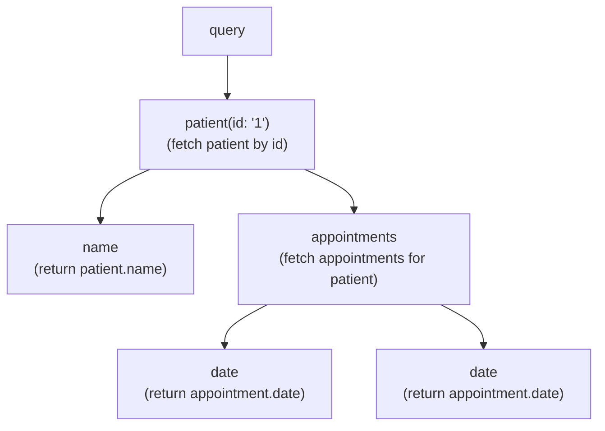
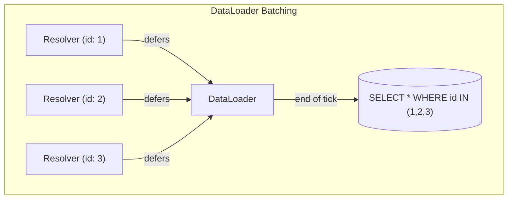
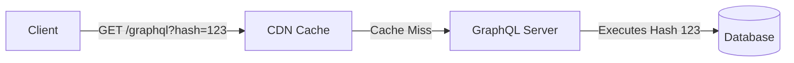
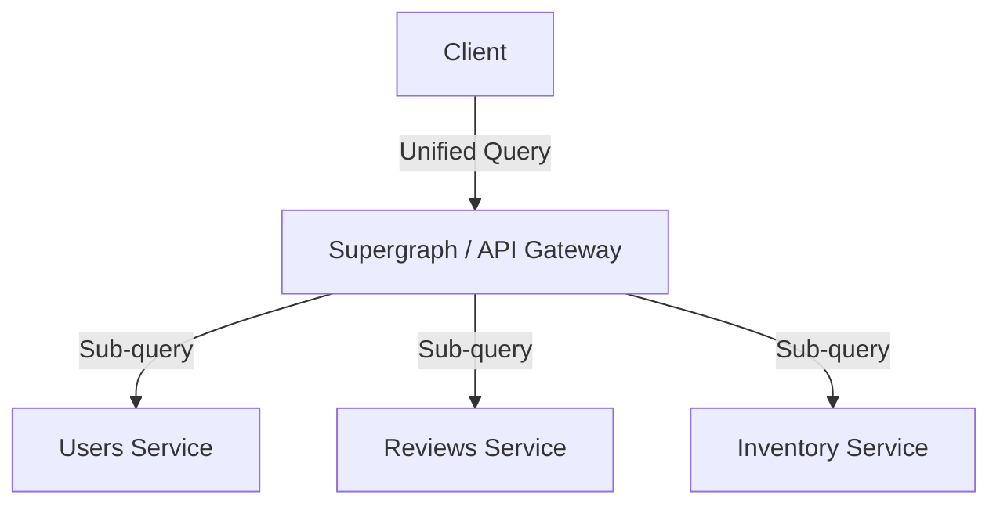

# GraphQL

## 1. Core Ideas

GraphQL is a query language and runtime for APIs. The client describes exactly what data it needs, and the server returns exactly that — nothing more, nothing less.

> [!TIP]
> **KEY PRINCIPLES**
>
>
> 1. A single endpoint handles all operations
> 2. Clients declare their data requirements in a typed query language
> 3. The schema is the contract between client and server
> 4. Every field in the response was explicitly requested

> The client is in control of the shape of the response. The server is in control of what is allowed.

### 1.1 Why GraphQL Exists

REST endpoints often return either too much data or require multiple round trips to assemble a complete view. GraphQL solves both problems at once:

<div class="cols-2">
<div class="col">

**Over-fetching**

A client requesting a user profile receives 30 fields when it only needs 3.

</div>
<div class="col">

**Under-fetching**

A client requires multiple round trips to assemble a complete view (e.g., fetch user, then fetch their appointments).

</div>
</div>

> [!NOTE]
> **TRADE-OFFS**
>
> **Precise data fetching** — but more complex server implementation
>
> **Single endpoint** — but query complexity can become unbounded
>
> **Strongly typed schema** — but schema design requires upfront thought
>
> **Self-documenting** — but caching is harder than REST

### 1.2 Operations

<div class="cols-2">
<div class="col">

**`query`**

Read data (equivalent to GET).

**`mutation`**

Write data and return the result (equivalent to POST/PUT/DELETE).

</div>
<div class="col">

**`subscription`**

Long-lived connection for real-time updates over WebSockets.

</div>
</div>

### 1.3 GraphQL over HTTP (The Transport Layer)

While GraphQL is transport-agnostic, it is almost always served over HTTP. Unlike REST, which uses different HTTP methods and URLs, GraphQL typically uses a single endpoint (e.g., `/graphql`) and `POST` requests.

```json
{
  "query": "query GetUser($id: ID!) { user(id: $id) { name } }",
  "variables": { "id": "123" },
  "operationName": "GetUser"
}
```

> [!WARNING]
> **FAILURE SCENARIO**
>
> Because all requests are `POST` to a single endpoint, standard HTTP tooling (like browser caching, CDN caching, and REST-based API monitoring) does not work out of the box.

## 2. Schema Design

### 2.1 The Schema as Contract

The schema defines every type, field, query, mutation, and subscription available in the API. It is the source of truth for what clients can request.

> The schema is the API surface. Everything in it is intentional. Everything outside it does not exist.

### 2.2 Types

- `type`: Object with named fields (Return values)
- `input`: Object type used as an argument (Not returned in responses)
- `scalar`: Leaf value (String, Int, Boolean, ID, Float, or custom)
- `enum`: Fixed set of named values

#### Interfaces vs. Unions

<div class="cols-2">
<div class="col">

**Interfaces**

Use when types share common fields.

_Example:_ A `Character` interface that guarantees an `id` and `name` for both `Human` and `Droid` types.

</div>
<div class="col">

**Unions**

Use when returning completely different types in the same list that don't necessarily share fields.

_Example:_ A `SearchResult` union that could be a `User`, `Post`, or `Comment`.

</div>
</div>

### 2.3 Nullability

In GraphQL, every field is nullable by default. Adding `!` marks a field as non-null.

```graphql
type Patient {
  id: ID! # never null
  name: String! # never null
  notes: String # may be null
}
```

> [!TIP]
> **SENIOR IMPLICATION**
>
> Nullable vs non-null is a contract with every client. Making a previously non-null field nullable is a non-breaking change; the reverse is breaking. Over-using non-null leads to null propagation errors that can blank out large parts of a UI.

### 2.4 Directives

Directives are annotations that attach metadata or alter the execution behavior of a GraphQL document. They are preceded by the `@` symbol.

- **Built-in directives:** `@skip(if: Boolean)`, `@include(if: Boolean)`, and `@deprecated(reason: String)`.
- **Custom directives:** Define your own (e.g., `@auth(role: "ADMIN")`) to encapsulate reusable logic at the schema level.

### 2.5 Schema Design Principles

- Model your domain, not your database tables
- Use descriptive names that match the business domain
- Prefer specific types over generic ones (avoid generic `metadata: JSON` fields)
- Design for the client's use case, not the server's data model

> [!WARNING]
> **FAILURE SCENARIO**
>
> **Mirroring the database exactly**
>
> Forces the client to know about server implementation details. Any database refactor breaks the API contract.

### 2.6 Schema Evolution & Versioning

GraphQL APIs typically don't use `/v1` or `/v2` URLs. Instead, they evolve continuously in a single endpoint.

- Use the `@deprecated(reason: "...")` directive to mark fields that should no longer be used.
- **Senior Rule:** Never remove a field until telemetry proves no clients are querying it.
- Add new fields and types alongside old ones, deprecate the old ones, and eventually remove them once usage drops to zero.

### 2.7 Mutation Design Best Practices

A senior practice is that mutations should return a specific Payload type rather than just the mutated object.

```graphql
type UpdateUserPayload {
  user: User
  userErrors: [UserError!]!
}
```

This payload should include the mutated object _and_ user-facing validation errors. This keeps top-level GraphQL `errors` reserved for actual system/developer failures, while business logic errors are handled as data.

## 3. Resolvers

### 3.1 What a Resolver Does

A resolver is a function that returns the value for a specific field in the schema.

> A resolver is a function that answers the question "what is the value of this field for this parent object?"

### 3.2 Resolver Chain

GraphQL executes resolvers in a tree, following the shape of the query. Each level in the query triggers the resolvers at that level. The parent's resolved value is passed as the first argument to child resolvers.



### 3.3 The N+1 Problem

The most important performance concern in GraphQL. Because resolvers execute per-field, list fields naturally trigger N+1 database queries.

<div class="cols-2">
<div class="col">

**Naive Execution**

- 1 query to fetch 10 patients
- 10 queries to fetch appointments
- **Total: 11 queries**

</div>
<div class="col">

**DataLoader Execution**

- 1 query to fetch 10 patients
- 1 batched query for all appointments
- **Total: 2 queries**

</div>
</div>



> [!TIP]
> DataLoader defers individual data requests until the end of the current tick, then batches them into one. It is strictly a **per-request** cache.

## 4. Authorization & Security

### 4.1 Where Authorization Belongs

Authorization is not a GraphQL concern by default — it belongs in your application logic, not the schema.

<div class="cols-2">
<div class="col">

**Resolver-level**

Inside each resolver. Explicit but repetitive.

**Context injection**

Attach current user to context, check in resolvers. Clean but requires discipline.

</div>
<div class="col">

**Middleware / directive**

In a shared processing layer (e.g., `@auth`). Reusable, applied consistently.

</div>
</div>

> [!WARNING]
> **FAILURE SCENARIO**
>
> Enforcing authorization in the UI only, not the server → any client that bypasses the UI has full API access.

### 4.2 Field-Level Authorization

Some fields should only be visible to certain users. Authorization should be enforced on the server regardless of what the client sends.

> Field-level authorization keeps sensitive data inaccessible even if a client constructs a query that explicitly requests it.

### 4.3 Security, Rate Limiting & Query Complexity

GraphQL introduces unique security challenges compared to REST:

- **Introspection:** Disable introspection in production. If left enabled, attackers can download your entire schema and understand your exact API surface.
- **Denial of Service (DoS):** Without limits, clients can construct queries of arbitrary depth and breadth.
- **Rate Limiting:** Rate limiting by HTTP requests is insufficient because a single GraphQL request can ask for thousands of records. You must rate-limit based on the query's actual cost.

#### Solutions for DoS and Rate Limiting

- **Complexity Analysis (Cost):** Assign a point value to each field (e.g., scalar = 1, database fetch = 10). Reject queries that exceed a maximum point threshold.
- **Depth Limiting:** Reject queries nested deeper than _N_ levels.
- **Query Whitelisting (Persisted Queries):** Only allow pre-registered, known queries to execute in production.

## 5. Error Handling

### 5.1 GraphQL Error Model

A GraphQL response always returns HTTP 200. Errors are communicated through the `errors` array in the response body alongside partial data.

```json
{
  "data": { "patient": null },
  "errors": [{ "message": "Patient not found", "locations": [...], "path": [...] }]
}
```

> [!TIP]
> A request can partially succeed — some fields resolve, others fail. The client must handle both `data` and `errors` in every response.

### 5.2 Error vs Null

When a resolver returns an error, the field gets an entry in the errors array. When it returns null, the field is null with no error. Decide intentionally: is "not found" an error or a valid empty state?

### 5.3 User Errors vs System Errors

<div class="cols-2">
<div class="col">

**System Errors**

Database down, internal server error. Should go into the top-level `errors` array.

</div>
<div class="col">

**User Errors**

"Email already taken", "Password too short". Should be returned as part of the `data` payload (e.g., `UserError` type in a mutation payload).

</div>
</div>

## 6. Performance and Caching

### 6.1 Caching Challenges

REST's HTTP caching model does not apply to GraphQL directly because all requests go to one endpoint via POST.

<div class="cols-2">
<div class="col">

**DataLoader Caching**

Within a single request, DataLoader memoizes results so the same ID is never fetched twice. _Strictly a per-request cache._

</div>
<div class="col">

**Application-Level Caching**

Cache resolved data in a shared cache layer (Redis, Memcached, ETS) inside your resolver logic.

</div>
</div>

### 6.2 Persisted Queries (CDN Caching)

Persisted queries solve both the payload size problem and the HTTP caching problem.



1. During the frontend build step, GraphQL queries are hashed.
2. The client sends a `GET` request with the hash.
3. The server looks up the hash. If recognized, it executes the query.

> [!TIP]
> **SENIOR IMPLICATION**
>
> Because the request is now a standard HTTP `GET` with a unique URL, you can cache GraphQL responses at the CDN edge (Cloudflare, Fastly) exactly like REST endpoints.

## 7. Advanced Patterns

### 7.1 Pagination (Cursor vs Offset)

GraphQL APIs should prefer **Cursor-based pagination** (often following the Relay specification: `edges`, `node`, `pageInfo`, `cursor`) over Offset/Limit pagination.

<div class="cols-2">
<div class="col">

**Offset Pagination**

Uses `limit` and `offset`. Breaks when data is inserted or deleted during pagination (items can be skipped or duplicated).

</div>
<div class="col">

**Cursor Pagination**

Provides a pointer (`cursor`) to a specific record, ensuring stable pagination regardless of underlying data changes.

</div>
</div>

### 7.2 Global Object Identification (The Node Interface)

A core architectural pattern (originating from Relay) is ensuring every object in your graph can be uniquely identified and refetched.

```graphql
interface Node {
  id: ID!
}
```

> [!TIP]
> This allows client-side caches (like Apollo or Relay) to automatically normalize and update data. If a mutation returns a `Node` with an `id` that already exists in the cache, the client knows exactly how to update the UI without manual intervention.

### 7.3 Scaling / Microservices (Federation)

When scaling to dozens of microservices, you don't want clients querying 50 different GraphQL endpoints.



**Apollo Federation / Schema Stitching:** Expose a single "Supergraph" to the client. The gateway routes sub-queries to the underlying domain-specific microservices and stitches the response back together.

### 7.4 Fragments

Fragments are reusable pieces of a query. They let you define a component's data requirements once and use them across multiple queries.

```graphql
fragment PatientFields on Patient {
  id
  name
  species
}
```

<div class="cols-2">
<div class="col">

**Why they matter**

- A component declares its own data dependencies
- The parent query assembles them
- The component does not need to know the full query structure

</div>
<div class="col">

**Co-located fragments**

This is the foundation of modern GraphQL UI development: each component owns its data requirements.

</div>
</div>

> A fragment is a component's data contract. It says "to render me correctly, I need these fields."

## 8. Subscriptions

Subscriptions provide real-time updates through a long-lived connection (typically WebSockets).

1. Client subscribes and opens a persistent connection
2. When a triggering event occurs on the server, the server pushes the update to all relevant subscribers

> [!NOTE]
> **TRADE-OFFS**
>
> **True real-time updates** — but stateful connections add infrastructure complexity
>
> **Natural fit for live data** — but reconnection, backpressure, and scaling must be designed for

> [!WARNING]
> Subscriptions add stateful long-lived connections to your system. Not every real-time update needs a subscription; polling may be simpler and sufficient.

## 9. Testing

Most GraphQL testing frameworks allow you to run queries directly against the schema in-process, without going through HTTP. This gives fast, isolated tests.

**The Pattern:**

1. Build a context (authenticated user, test data)
2. Execute a query string against the schema
3. Assert on the returned data or errors

**What to Test:**

- Schema correctness (types and nullability)
- Resolver behavior
- Error behavior (invalid inputs, unauthorized access)
- N+1 behavior (confirm batching is working)

## 10. Test your Knowledge

<details>
<summary>Explain the difference between queries, mutations, and subscriptions</summary>

**Queries** are for reading data (like GET), **mutations** are for writing data and returning the result (like POST/PUT/DELETE), and **subscriptions** are long-lived connections (usually WebSockets) for receiving real-time updates pushed from the server.

</details>

<details>
<summary>Explain how GraphQL is sent over HTTP and why that breaks traditional caching</summary>

GraphQL is typically sent as a `POST` request to a single `/graphql` endpoint with a JSON body containing the query string and variables. Because it uses POST and a single URL, traditional HTTP caching mechanisms (like browser caches or CDNs) cannot cache the responses based on the URL.

</details>

<details>
<summary>Explain the difference between Interfaces and Unions</summary>

Use an **Interface** when types share common fields (e.g., a `Character` interface that guarantees `id` and `name` for `Human` and `Droid`). Use a **Union** when returning completely different types in the same list that don't necessarily share fields (e.g., a `SearchResult` union of `User`, `Post`, or `Comment`).

</details>

<details>
<summary>Identify and fix an N+1 problem in a GraphQL API</summary>

An N+1 problem occurs when a list of parent objects each trigger a separate database query for their child objects (e.g., 10 users trigger 10 queries for their avatars). The fix is to use **DataLoader**, which defers the individual requests until the end of the tick, collects all the IDs, and fires a single batched query (e.g., `WHERE user_id IN (...)`).

</details>

<details>
<summary>Explain GraphQL's error model and why responses can partially succeed</summary>

GraphQL always returns HTTP 200. The response body contains `data` and `errors` objects. Because resolvers execute independently, one field can fail (returning null and adding an error to the `errors` array) while the rest of the query succeeds and returns valid `data`. Clients must handle partial success.

</details>

<details>
<summary>Explain the nullability contract and its client implications</summary>

By default, all fields are nullable. Adding `!` makes a field non-null. Making a non-null field nullable is safe, but making a nullable field non-null is a breaking change. Over-using non-null can be dangerous: if a non-null field fails to resolve, the error propagates up to the nearest nullable parent, potentially blanking out large parts of the UI.

</details>

<details>
<summary>Limit query complexity and depth for production safety</summary>

Because clients can request arbitrary nested data, GraphQL APIs are vulnerable to DoS attacks. You should implement **depth limiting** (rejecting queries nested too deeply) and **complexity analysis** (assigning a cost to each field and rejecting queries over a threshold). In production, **persisted queries** (whitelisting) are the safest approach.

</details>

<details>
<summary>Design mutation payloads to handle user errors gracefully</summary>

Instead of returning just the mutated object, mutations should return a custom Payload type (e.g., `UpdateUserPayload`) that includes the object and a `userErrors` array. This separates expected business logic errors (like "Email taken") from unexpected system errors (which go in the top-level GraphQL `errors` array).

</details>

<details>
<summary>Explain why cursor-based pagination is preferred over offset</summary>

Offset pagination (`limit` and `offset`) breaks when items are inserted or deleted during pagination, causing the client to skip or duplicate items. Cursor-based pagination provides a stable pointer (`cursor`) to a specific record, ensuring consistent pagination regardless of underlying data changes.

</details>

<details>
<summary>Explain the purpose of the global Node interface for client-side caching</summary>

The `Node` interface (`interface Node { id: ID! }`) ensures every object in the graph can be uniquely identified. This allows client-side caches (like Apollo) to automatically normalize data. When a mutation returns an object with an existing `id`, the cache updates automatically without manual intervention.

</details>

<details>
<summary>Explain how Persisted Queries enable CDN caching for GraphQL</summary>

Persisted queries hash the query string at build time. The client sends a `GET` request with the hash instead of a `POST` with the full query. Because it is a standard `GET` request with a unique URL, CDNs (like Cloudflare) can cache the response exactly like a REST endpoint.

</details>

<details>
<summary>Explain how to scale GraphQL across microservices (Federation)</summary>

Instead of clients querying dozens of microservices, you expose a single "Supergraph" or API Gateway. The gateway takes the unified client query, routes the sub-queries to the appropriate underlying domain services, and stitches the responses back together.

</details>

<details>
<summary>Explain why fragments matter in a large UI codebase</summary>

Fragments allow individual UI components to declare exactly what data they need. Parent components compose these fragments into a single query. This "co-location" means components are self-contained, and developers can update a component's data requirements without worrying about breaking the parent query.

</details>

---

## 11. Appendix: Ecosystem & Tools

### 11.1 In Elixir: Absinthe

> Absinthe is the standard GraphQL library for Elixir.

#### Schema Definition

Absinthe schemas are defined using Elixir macros that map directly to GraphQL concepts.

```elixir
defmodule MyApp.Schema do
  use Absinthe.Schema

  query do
    field :patient, :patient do
      arg :id, non_null(:id)
      resolve &Resolvers.Patients.find/3
    end
  end

  object :patient do
    field :id, non_null(:id)
    field :name, non_null(:string)
    field :appointments, list_of(:appointment) do
      resolve &Resolvers.Appointments.for_patient/3
    end
  end
end
```

#### Resolver Functions

An Absinthe resolver has the signature `(parent, args, resolution) -> {:ok, value} | {:error, reason}`.

```elixir
def find(_parent, %{id: id}, _resolution) do
  case Repo.get(Patient, id) do
    nil     -> {:error, "Patient not found"}
    patient -> {:ok, patient}
  end
end
```

The third argument carries per-request context: the current user, authentication information, and DataLoader state.

#### Solving N+1 with Dataloader

Absinthe integrates with the `dataloader` Elixir library. Rather than fetching child data inside each resolver call, you declare the relationship and Absinthe batches automatically.

```elixir
field :appointments, list_of(:appointment) do
  resolve dataloader(MyApp.Repo)
end
```

Absinthe's execution model runs resolution in phases — all resolvers at the same tree depth are collected before any data is fetched, enabling natural batching.

#### Middleware

Absinthe middleware is the mechanism for cross-cutting concerns: authentication, authorization, error formatting, logging.

```elixir
field :patient, :patient do
  middleware MyApp.Middleware.RequireAuth
  arg :id, non_null(:id)
  resolve &Resolvers.Patients.find/3
end
```

> Absinthe middleware is to resolvers what Plug is to Phoenix controllers — a composable pipeline of processing steps.

#### Subscriptions via Phoenix

Absinthe subscriptions run over Phoenix Channels (WebSockets). A mutation can trigger a push to all subscribers on a topic.

```elixir
subscription do
  field :appointment_updated, :appointment do
    arg :patient_id, non_null(:id)
    trigger :update_appointment, topic: fn appt ->
      "patient:#{appt.patient_id}"
    end
    resolve fn appt, _, _ -> {:ok, appt} end
  end
end
```

#### Testing Absinthe Schemas

```elixir
query = """
  query {
    patient(id: "1") { name }
  }
"""

{:ok, %{data: data}} = Absinthe.run(query, MyApp.Schema, context: %{current_user: user})
assert data["patient"]["name"] == "Rex"
```

### 11.2 In React: Apollo Client

> Apollo Client is the most widely used GraphQL client for React.

#### What Apollo Client Does

Apollo Client handles the full lifecycle of a GraphQL request from React:

- Sending queries and mutations to the server
- Managing loading, error, and success states
- Caching responses and keeping the UI in sync after mutations
- Managing subscriptions over WebSockets

> Apollo Client is not just a fetch wrapper. It is a client-side state container for server data.

#### `useQuery`

The primary hook for reading data.

```typescript
const GET_PATIENT = gql`
  query GetPatient($id: ID!) {
    patient(id: $id) {
      id
      name
      species
    }
  }
`;

const { data, loading, error } = useQuery(GET_PATIENT, {
  variables: { id: patientId },
});
```

#### States to always handle

- `loading` — show a skeleton or spinner
- `error` — show an error state; do not assume `data` is present
- `data` — render the result; check for null fields even on success

#### `useMutation`

The hook for writing data. Returns a trigger function and a result object.

```typescript
const CREATE_APPOINTMENT = gql`
  mutation CreateAppointment($input: CreateAppointmentInput!) {
    createAppointment(input: $input) {
      id
      date
    }
  }
`;

const [createAppointment, { loading, error, data }] =
  useMutation(CREATE_APPOINTMENT);

// call it on user action:
createAppointment({ variables: { input: { patientId, date } } });
```

#### Updating the cache after a mutation

After a mutation, Apollo's cache may be stale. Common strategies:

| Strategy           | How                                            | Use when                                               |
| ------------------ | ---------------------------------------------- | ------------------------------------------------------ |
| Refetch queries    | Pass `refetchQueries` to the mutation          | Simple; always correct; costs an extra network request |
| Cache update       | Manually update the cache in `update` callback | No extra request; more complex                         |
| Cache invalidation | `evict` the affected cache entry               | Force re-fetch of the affected query on next render    |

#### Failure Scenario

- Mutation succeeds but the UI still shows the old data because the cache was not updated. Always handle cache invalidation explicitly after writes.

#### The Apollo Cache

Apollo Client stores query results in a normalized in-memory cache. Each object is stored by its `__typename` and `id`, so the same object referenced in multiple queries is stored once and updated everywhere simultaneously.

#### Fetch policies

| Policy                  | Behavior                                                          |
| ----------------------- | ----------------------------------------------------------------- |
| `cache-first` (default) | Return cached data if available; only hit network if not in cache |
| `cache-and-network`     | Return cached data immediately, then update from network          |
| `network-only`          | Always hit the network; update the cache with the result          |
| `no-cache`              | Always hit the network; do not store the result                   |
| `cache-only`            | Only read from cache; never hit the network                       |

> The Apollo cache is a local mirror of the parts of the server graph your UI has queried. Keeping it consistent after writes is your responsibility.

#### Senior-level implication

- Cache normalization only works if your types have an `id` field that Apollo can use as a key
- Types without `id` are stored by query path and cannot be normalized — updates to them must be handled manually

#### GraphQL Code Generator

In a TypeScript + GraphQL stack, manually writing types for every query response is error-prone and tedious. GraphQL Code Generator reads your schema and your query documents and generates TypeScript types automatically.

```bash
graphql-codegen --config codegen.yml
```

This gives you:

- Typed `data` objects in every `useQuery` and `useMutation` call
- Auto-complete on query variables
- Compile-time errors when a query references a field that does not exist in the schema

#### Why this matters

- The schema is the source of truth; the generated types stay in sync automatically
- Eliminates an entire class of frontend bugs caused by mismatched field names or wrong types
- Makes refactoring the schema safe — broken queries become TypeScript errors

> Code generation turns the GraphQL schema into a type-safe contract enforced at compile time on the frontend.

#### Subscriptions from React

Apollo Client handles subscriptions over WebSockets using `useSubscription`.

```typescript
const APPOINTMENT_UPDATED = gql`
  subscription OnAppointmentUpdated($patientId: ID!) {
    appointmentUpdated(patientId: $patientId) {
      id
      date
      status
    }
  }
`;

const { data } = useSubscription(APPOINTMENT_UPDATED, {
  variables: { patientId },
});
```

#### Setup requirement

Subscriptions require a WebSocket link in Apollo Client's configuration alongside the standard HTTP link. Apollo's `split` function routes subscriptions to WebSockets and queries/mutations to HTTP.

#### Error Handling on the Client

GraphQL's partial success model means both `data` and `errors` can be present at the same time. Apollo Client surfaces this through the `error` object returned by `useQuery` and `useMutation`.

```typescript
const { data, error } = useQuery(GET_PATIENT, { variables: { id } });

if (error) {
  // error.graphQLErrors — errors from the server's errors array
  // error.networkError — transport-level failures
}
```

#### Senior-level implication

- A non-null `error` does not mean `data` is null — always check both
- Network errors and GraphQL errors have different shapes and often need different handling
- Design your error UI to handle partial data gracefully rather than assuming all-or-nothing
