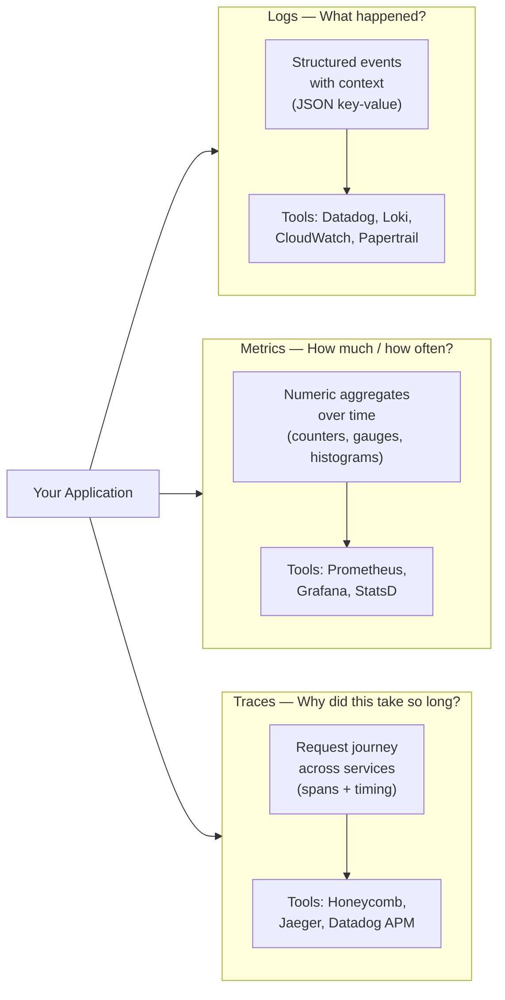
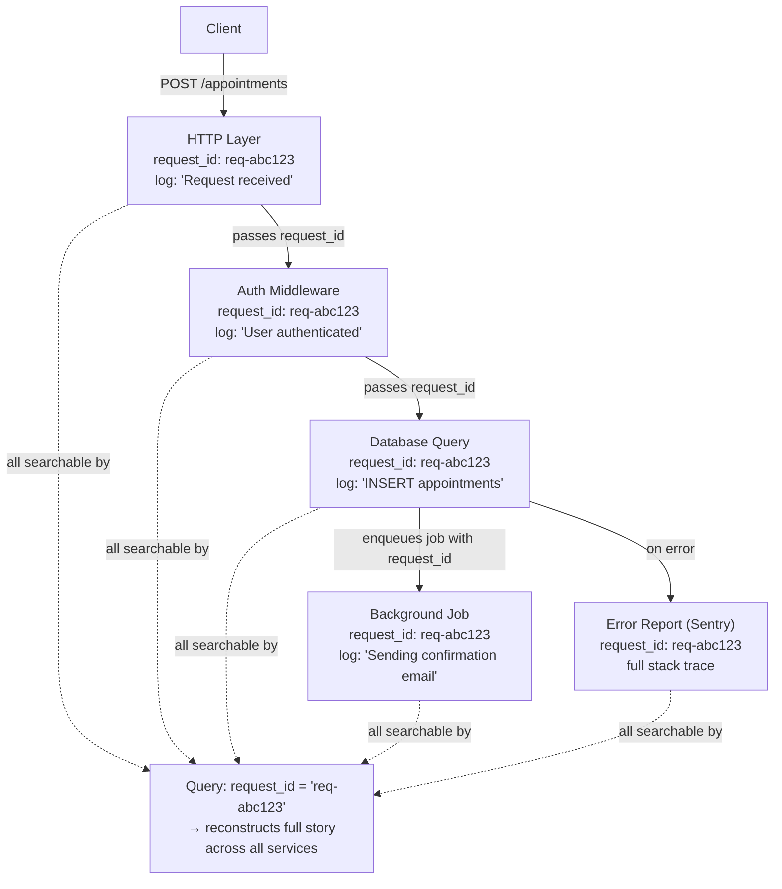
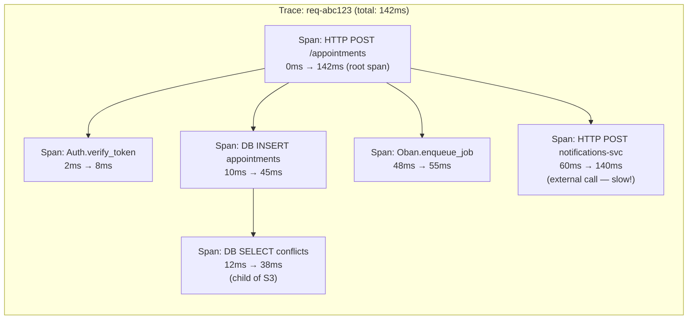
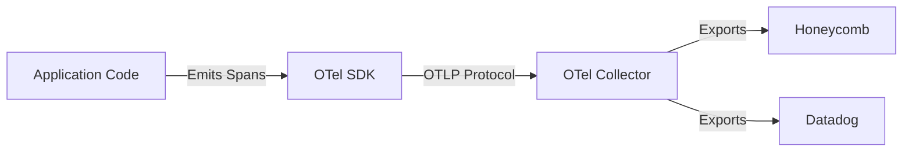
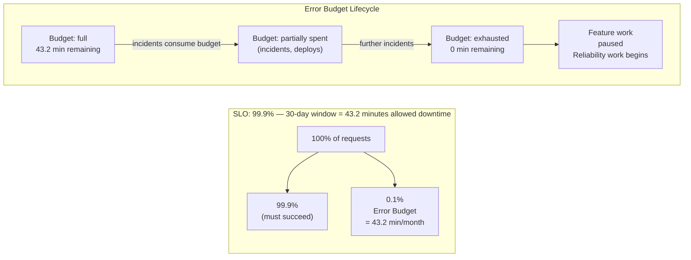
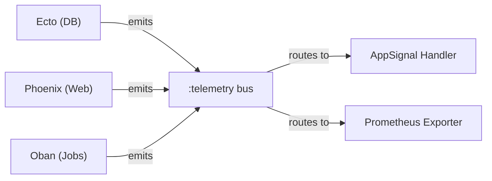

# Observability

> **How to use this guide:** Sections 1–6 cover general observability concepts and tooling that apply regardless of language or framework. Section 7 is an interactive quiz. Section 8 is an appendix covering Elixir-specific patterns and the BEAM's built-in capabilities.

## 1. Core Ideas: The Three Pillars

Observability is the ability to understand what your system is doing from the outside, without modifying it.

> [!TIP]
> **KEY PRINCIPLES**
>
> You cannot debug a system you cannot observe. Observability is not a feature you add later — it is a design decision you make upfront.

The three pillars are complementary. Each answers a different question:



<div class="cols-2">
<div class="col">

**Logs**

_What happened?_
Structured log entries with context.

**Metrics**

_How much / how often?_
Request rate, error rate, latency percentiles.

</div>
<div class="col">

**Traces**

_Why did this request take so long?_
Distributed trace of a request across services.

</div>
</div>

> A system with all three is observable. A system with only one is partially blind.

## 2. Logs

### 2.1 Structured Logging

Plain text logs are hard to query and analyze at scale. Structured logging emits log entries as machine-readable key-value pairs (usually JSON).

```json
{
  "level": "info",
  "message": "Appointment created",
  "patient_id": "abc-123",
  "duration_ms": 42,
  "request_id": "req-789",
  "timestamp": "2026-03-19T10:00:00Z"
}
```

> [!NOTE]
> **SENIOR IMPLICATION**
>
> A structured log entry is a queryable event, not a message for humans to read. Log aggregation tools (Datadog, Loki, CloudWatch) can filter and query on any field, making queries like "Show me all errors for patient abc-123" trivial. Unstructured logs require brittle regex parsing.

### 2.2 Log Levels

<div class="cols-2">
<div class="col">

**`debug`**

Detailed information useful during development; never in production by default.

**`info`**

Normal significant events (request received, job completed).

</div>
<div class="col">

**`warning`**

Something unexpected happened but the system recovered.

**`error`**

Something failed and requires attention.

</div>
</div>

> [!WARNING]
> **FAILURE SCENARIO**
>
> Over-logging at `error` creates alert fatigue; under-logging creates blind spots. Log at `info` for significant business events, not every function call. Log at `error` only for things that actually require action.

### 2.3 Correlation IDs / Request IDs

A unique ID attached to every request and propagated through all log entries, background jobs, and downstream calls for that request.



This lets you reconstruct the full story of a single request across many log lines and services.

## 3. Metrics

### 3.1 What Metrics Are

Metrics are numeric measurements aggregated over time. They answer questions about system health at a high level.

**The Four Golden Signals (Google SRE):**

1. **Latency:** How long requests take (distinguish successful vs failed)
2. **Traffic:** How much demand is on the system
3. **Errors:** Rate of failed requests
4. **Saturation:** How full the system is (CPU, memory, queue depth)

### 3.2 Prometheus & Grafana

**Prometheus** is the standard open-source metrics system. It scrapes metrics from your application on a schedule and stores them as time-series data.
**Grafana** is the standard dashboard and visualization layer. It connects to Prometheus and renders graphs and alerts.

<div class="cols-2">
<div class="col">

**Counter**

Counts that only go up (requests served, errors).

**Gauge**

Values that go up and down (active connections, queue depth).

</div>
<div class="col">

**Histogram**

Distribution of values (request duration, response size).

</div>
</div>

## 4. Distributed Tracing

### 4.1 What a Trace Is

A trace is the complete record of a request's journey through your system — across processes, services, and time. A trace is made of **spans** — individual units of work with a start time, end time, and metadata.



> A trace is a flame graph of your request. It shows you exactly where time was spent and where failures occurred. In this example, the external notifications service at 80ms is the bottleneck.

### 4.2 OpenTelemetry (OTel)

OpenTelemetry is the CNCF-standard vendor-neutral framework for distributed tracing, metrics, and logs instrumentation.



> [!TIP]
> OTel is the USB standard for observability. Instrument once, plug into any backend. Before OTel, every observability vendor had its own SDK.

### 4.3 Honeycomb

Honeycomb is a trace-first observability platform built around high-cardinality event data.

<div class="cols-2">
<div class="col">

**Traditional Metrics**

Pre-aggregate data (e.g., "average latency"). You must decide what to aggregate upfront.

</div>
<div class="col">

**Honeycomb (High Cardinality)**

Stores raw events. You can query by any combination of attributes after the fact (e.g., "Show me p99 latency for requests from user X in clinic Y").

</div>
</div>

## 5. Error Monitoring

Error monitoring is distinct from tracing and metrics. It captures the full context of an unhandled exception and alerts you immediately.

<div class="cols-2">
<div class="col">

**Sentry**

The most widely used error monitoring platform. Captures exception message, stack trace, and breadcrumbs. Groups similar errors automatically.

**Datadog**

Full observability platform (logs, metrics, traces, APM). High cost and operational complexity.

</div>
<div class="col">

**AppSignal**

All-in-one APM with strong Elixir/Phoenix support. Single tool for errors, performance, and infrastructure with lower operational overhead.

</div>
</div>

## 6. Alerting and SLOs

### 6.1 What to Alert On

> [!WARNING]
> **FAILURE SCENARIO**
>
> **Alerting on Causes instead of Symptoms**
> Cause-based alerts generate noise. Symptom-based alerts tell you something users are actually experiencing.

<div class="cols-2">
<div class="col">

**Bad Alerts (Causes)**

- CPU > 80%
- Disk usage > 70%
- Specific function failed

</div>
<div class="col">

**Better Alerts (Symptoms)**

- p99 latency > 500ms
- Error rate > 1% over 5 minutes
- No successful requests in 60 seconds

</div>
</div>

### 6.2 Service Level Objectives (SLOs)

An SLO is a target for a service's reliability.
_Example:_ `99.9% of requests respond in < 200ms over a 30-day window.`

**Error Budget:** The gap between 100% and the SLO is the error budget — the amount of unreliability you are allowed before violating the SLO.



> [!TIP]
> **SENIOR IMPLICATION**
>
> An SLO turns reliability into a concrete, measurable goal. An error budget makes the trade-off between feature velocity and reliability explicit. When the budget is spent, feature work stops and reliability work begins.

## 7. Test your Knowledge

<details>
<summary>Explain the three pillars of observability and what question each answers</summary>

**Logs** answer "What happened?" (structured events). **Metrics** answer "How much / how often?" (aggregations over time). **Traces** answer "Why did this request take so long?" (flame graphs across services).

</details>

<details>
<summary>Explain what structured logging is and why it matters over plain text logs</summary>

Structured logging emits logs as machine-readable key-value pairs (like JSON). It matters because log aggregation tools can instantly filter, query, and aggregate on any field (e.g., `patient_id`), whereas plain text requires brittle regex parsing.

</details>

<details>
<summary>Explain distributed tracing and what a span is</summary>

A distributed trace is the complete record of a request's journey across all processes and services. A **span** is a single unit of work within that trace, containing a start time, end time, and metadata.

</details>

<details>
<summary>Explain what OpenTelemetry is and why vendor-neutral instrumentation matters</summary>

OpenTelemetry (OTel) is the open standard for instrumenting code. It matters because it separates instrumentation from the backend. You instrument your code once using OTel APIs, and you can switch vendors (e.g., Datadog to Honeycomb) simply by changing the exporter configuration, without rewriting code.

</details>

<details>
<summary>Explain what Honeycomb does differently from traditional metrics systems</summary>

Traditional metrics systems pre-aggregate data, forcing you to know what questions you want to ask ahead of time. Honeycomb stores raw, high-cardinality events, allowing you to query and slice by any combination of attributes after the fact.

</details>

<details>
<summary>Explain the difference between alerting on symptoms vs causes</summary>

Alerting on causes (e.g., "CPU is at 80%") creates noise because high CPU might not actually affect users. Alerting on symptoms (e.g., "Error rate is > 1%" or "Latency > 500ms") ensures you only wake up engineers when users are actively experiencing a degraded system.

</details>

<details>
<summary>Define an SLO and explain what an error budget is</summary>

An **SLO** (Service Level Objective) is a measurable target for reliability (e.g., 99.9% of requests succeed in < 200ms). The **Error Budget** is the remaining 0.1%. It quantifies how much unreliability is acceptable. When the budget is exhausted, teams should halt feature work and focus on reliability.

</details>

---

## 8. Appendix: Ecosystem & Tools

### 8.1 In Elixir: `:telemetry`

`:telemetry` is the standard instrumentation library in the Elixir ecosystem. It provides a lightweight event bus: application code emits named events, and handlers attach and route them.



Phoenix, Ecto, Oban, and most major Elixir libraries emit `:telemetry` events by default. This means AppSignal, Prometheus exporters, and OTel integrations all work by attaching handlers to these standard events — no custom instrumentation required for common operations.

### 8.2 OpenTelemetry in Elixir

The Elixir OTel ecosystem is mature. With these libraries, Phoenix requests, database queries, and background jobs are all automatically traced with minimal configuration.

| Library                  | Purpose                                                   |
| ------------------------ | --------------------------------------------------------- |
| `opentelemetry`          | Core OTel API and SDK                                     |
| `opentelemetry_exporter` | OTLP exporter (sends to Honeycomb, Datadog, Jaeger, etc.) |
| `opentelemetry_phoenix`  | Auto-instrumentation for Phoenix requests                 |
| `opentelemetry_ecto`     | Auto-instrumentation for Ecto queries                     |

### 8.3 Logger — Structured Logging in Elixir

Elixir's built-in `Logger` module supports structured logging via metadata.

```elixir
# Set metadata for the current process (propagates through the request)
Logger.metadata(request_id: request_id, patient_id: patient_id)

# Log with a level
Logger.info("Appointment created", appointment_id: appointment.id)
```

For production structured logging (JSON output), the `logger_json` library formats logs as JSON compatible with Datadog, Loki, and CloudWatch.

### 8.4 BEAM-Level Observability

The BEAM VM exposes runtime information that is useful for diagnosing production issues.

<div class="cols-2">
<div class="col">

**`:os_mon`**

An OTP application that monitors OS-level metrics (CPU, memory, disk). It can trigger alarms when thresholds are exceeded.

**Observer**

The BEAM's built-in visual inspection tool (`:observer.start()`). Shows live process trees, memory usage, and scheduler load.

</div>
<div class="col">

**`:recon`**

An Erlang library for safe runtime introspection of production systems.

```elixir
# top 5 processes by memory
:recon.proc_count(:memory, 5)

# trace 10 calls safely
:recon_trace.calls({Mod, :fun, :_}, 10)
```

</div>
</div>

#### Watchdog patterns

A watchdog in the BEAM context is a process or mechanism that monitors the health of other processes and takes action when they become unresponsive.

- **`:heart`:** BEAM-level heartbeat; restarts the entire VM node if the Erlang node becomes unresponsive.
- **Supervisor restart intensity:** OTP's built-in restart throttling acts as a watchdog against crash loops.

> BEAM observability operates at two levels: the application level (`:telemetry`, OTel, AppSignal) and the VM level (Observer, `:recon`, `:os_mon`). Both are necessary in production.
