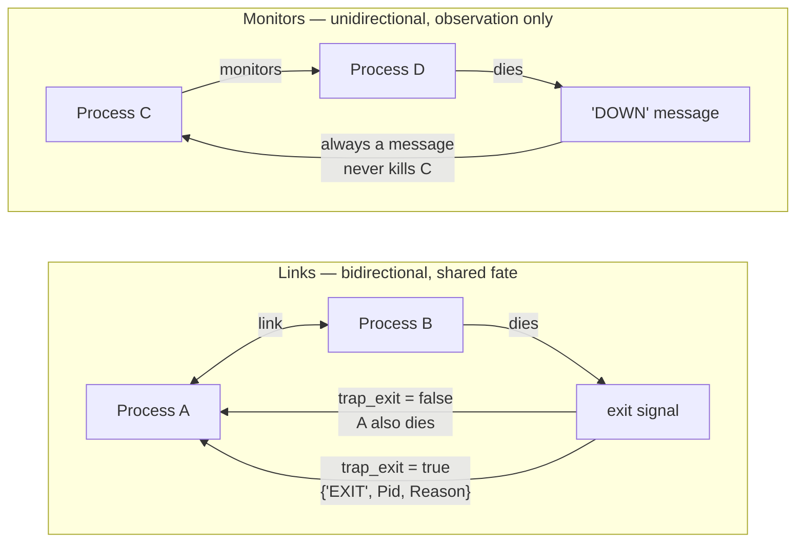
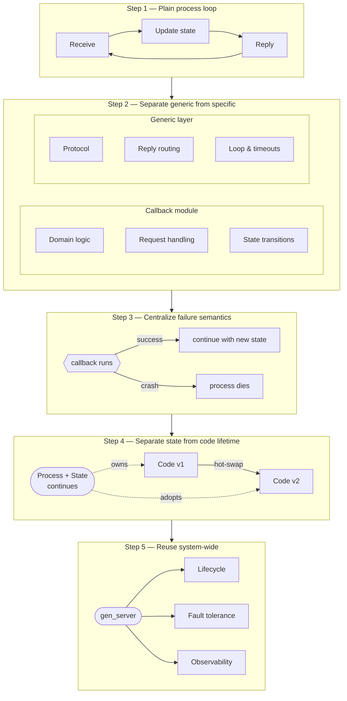
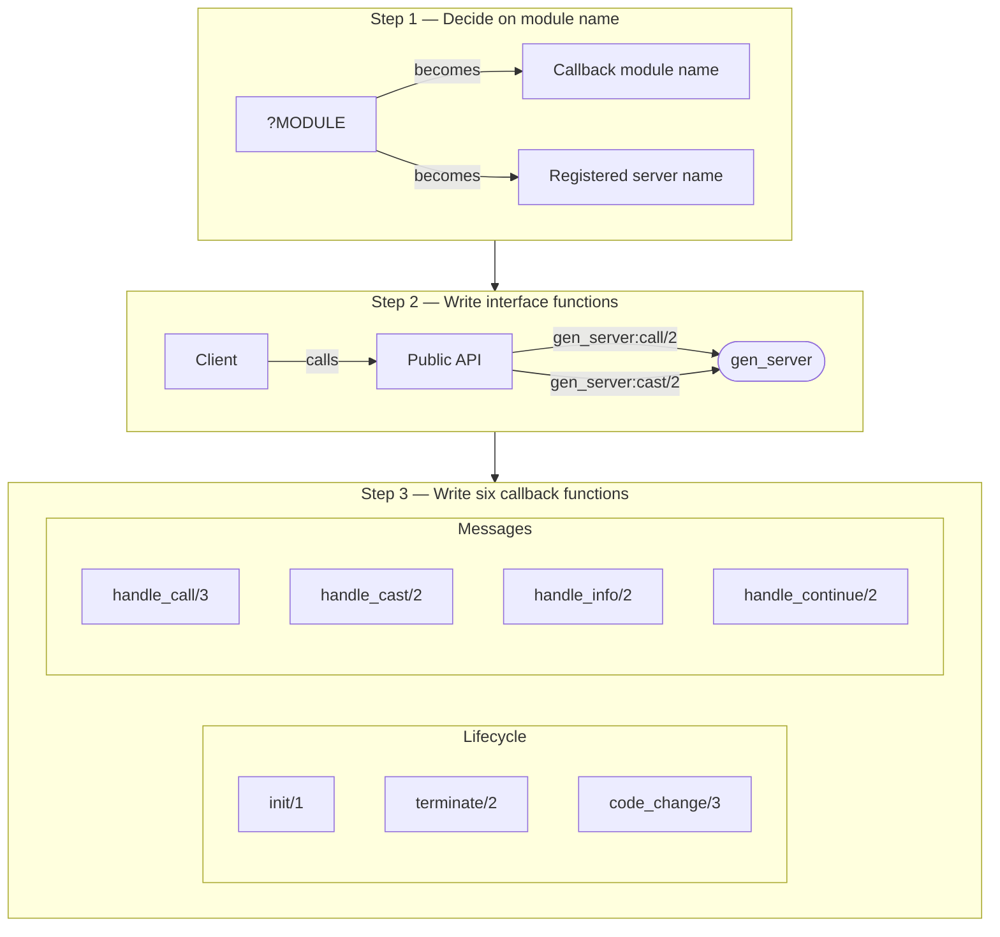
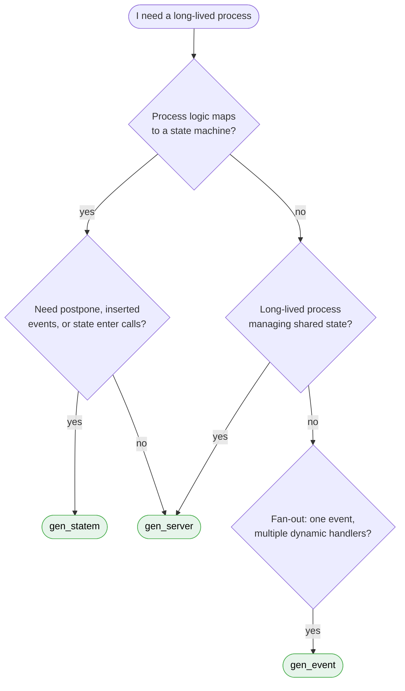
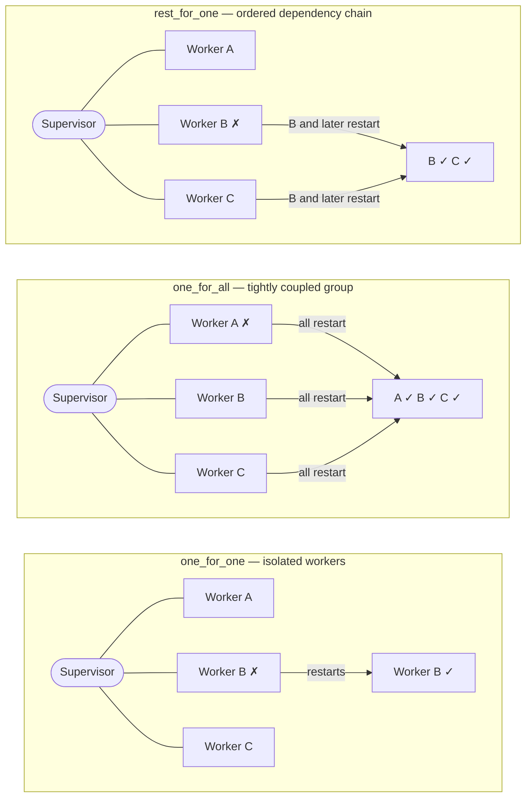
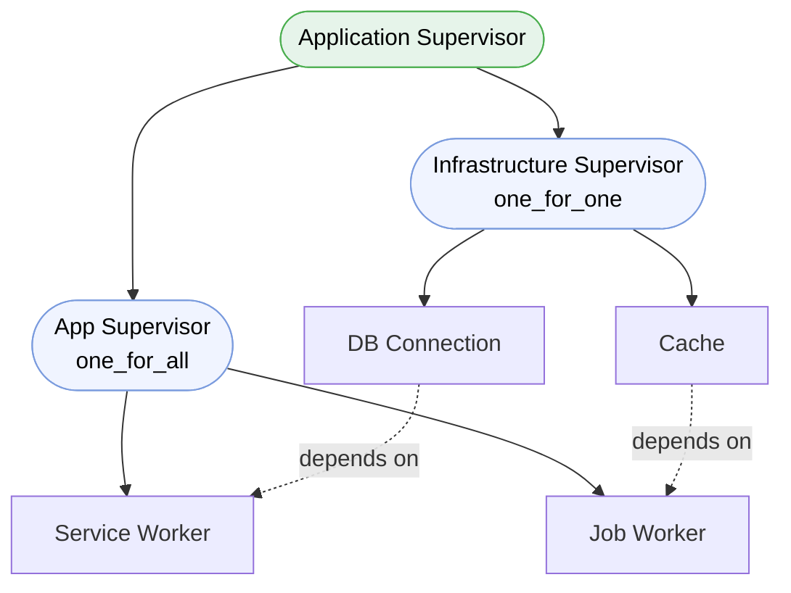
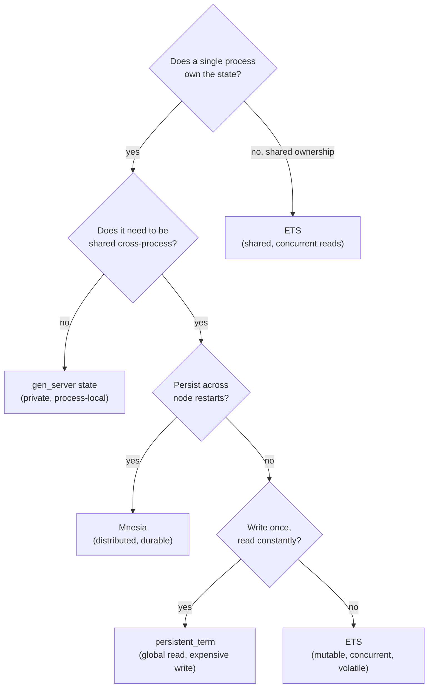
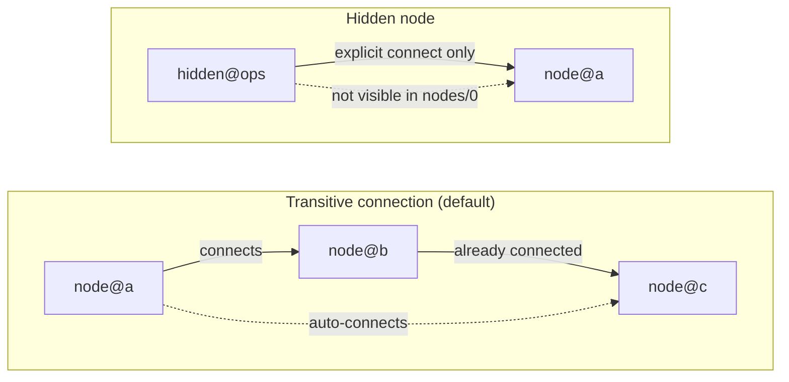
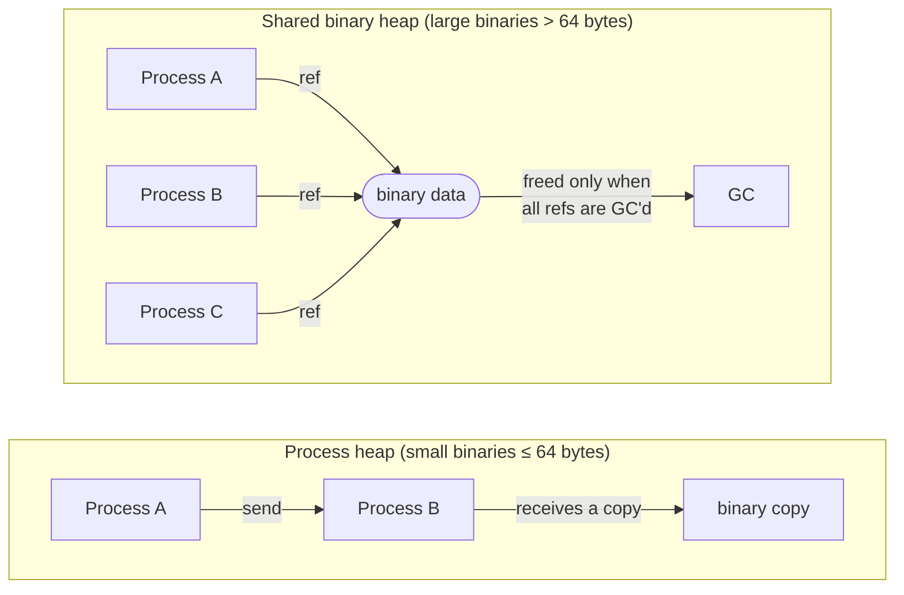
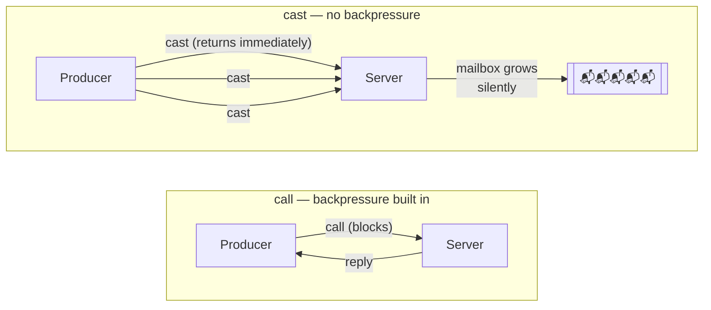

# OTP, Concurrency, and Distributed Systems

## 1. Core Ideas

Erlang is not just a language. It runs on the BEAM, a concurrency-oriented runtime designed for:

`Fault tolerance` | `Concurrency` | `Distribution`

> [!TIP]
> **KEY PRINCIPLES**
>
>
> 1. Processes are isolated
> 2. Communication is asynchronous
> 3. Failure is expected
> 4. Recovery is structured

### 1.1 Processes

<div class="cols-2">
<div class="col">

**Properties**

- Lightweight, independent units
- No shared memory
- Own mailbox and heap
- Cheap to create and destroy

</div>
<div class="col">

**Why it matters**

- Model the system as many small processes
- Avoid locks and shared-state races
- State is never visible to other processes
- Recover by replacing failed processes, not repairing them

</div>
</div>

> [!TIP]
> A BEAM process is not an OS thread or a goroutine. It is a lightweight unit managed entirely by the VM.

### 1.2 Message Passing

<div class="cols-2">
<div class="col">

**Mechanics**

- `!` sends messages asynchronously
- Messages arrive in the recipient mailbox
- `receive` uses pattern matching to select which message to handle

</div>
<div class="col">

**Key Properties**

- Ordering is guaranteed per sender
- There is no global ordering across multiple senders
- Messages are copied between processes

</div>
</div>

> [!NOTE]
> **TRADE-OFFS**
>
>
> **Isolation** — message copying overhead
>
> **Simplicity** — harder coordination
>
> **No locks** — potential mailbox bottlenecks

> [!WARNING]
> **FAILURE SCENARIOS**
>
>
> 1. Slow consumer → mailbox grows indefinitely → memory pressure and latency spikes
> 2. A process receives messages faster than it can handle them

### 1.3 Selective Receive

<div class="cols-2">
<div class="col">

**Mechanics**

- Processes can choose which messages to handle and which to skip for now
- `receive` scans the mailbox for the first matching pattern

</div>
<div class="col">

**Key Properties**

- Matching may scan through older messages to find a later one
- Unmatched messages remain in the mailbox
- Poor message protocol design can create hidden backlog

</div>
</div>

> [!NOTE]
> **TRADE-OFFS**
>
>
> **Flexibility** — mailbox scanning is O(n), a silent performance cost

> [!WARNING]
> **FAILURE SCENARIOS**
>
>
> 1. Pattern never matches → mailbox grows forever

## 2. Concurrency Primitives

### 2.1 Process Creation

- `spawn` creates a new process
- `spawn_link` creates and links in one step
- `spawn_monitor` creates and monitors in one step

> Spawning is cheap, so processes are your primary structuring tool.

#### Links vs Monitors

<div class="cols-2">
<div class="col">

**Links**

- Bidirectional failure relationship
- If linked processes are not trapping exits, failure propagates

</div>
<div class="col">

**Monitors**

- Unidirectional observation
- If the monitored process dies, the monitoring process receives a `'DOWN'` message

</div>
</div>
<div class="cols-2">
<div class="col">

**Use when**

- Processes are tightly coupled
- You want symmetric failure behavior
- Supervision relationships are involved

</div>
<div class="col">

**Use when**

- Client/server interactions
- You want to observe failure without crashing with the other process

</div>
</div>

> [!TIP]
> Links are about failure propagation, not ordinary communication.

> [!NOTE]
> **TRADE-OFFS**
>
>
> **Link** — crash together
>
> **Monitor** — observe only

### 2.2 Exit Signals

- Exit signals propagate automatically through links
- A process can convert exit signals into messages by setting `process_flag(trap_exit, true)`



> [!WARNING]
> **FAILURE SCENARIOS**
>
>
> 1. Unexpected exit propagates across linked processes → cascading crash

## 3. Error Handling Philosophy

### 3.1 Let It Crash

Error handling in OTP is architectural, not just local.

> [!TIP]
>
> Do not defensively handle every internal error
>
> Fail fast and let supervision handle recovery

<div class="cols-2">
<div class="col">

**Why it works**

- Early failure gives better diagnostics
- Corrupted in-process state is discarded
- Business logic stays simpler

</div>
<div class="col">

**When not to crash blindly**

- At external boundaries such as APIs and databases
- In user-facing validation paths
- For known, recoverable conditions

</div>
</div>

> [!NOTE]
> **TRADE-OFFS**
>
> **Simpler code** — requires strong supervision design
>
> **Predictable recovery** — needs discipline

### 3.2 What Actually Rolls Back

<div class="cols-2">
<div class="col">

**When a process crashes, this is lost**

- Internal process state
- Mailbox
- Local heap

</div>
<div class="col">

**What does not automatically roll back**

- Messages already sent
- ETS writes already performed
- External I/O
- Database writes

</div>
</div>

> [!TIP]
> A process crash discards process-local state, not every side effect in the world. OTP protects the server's state transition, but not arbitrary side effects performed before a crash.

## 4. OTP Abstractions

### 4.1 What OTP Is

OTP is not just a convenience layer for avoiding handwritten process loops.

<div class="cols-2">
<div class="col">

**What OTP adds**

- Reusable behaviours
- Structured supervision
- Application lifecycle management
- Consistent operational patterns
- Support for upgrades and introspection

</div>
<div class="col">

**Without OTP, you define it yourself**

- Process roles
- Failure handling rules
- Startup and shutdown flow
- Message protocol conventions
- Operational tooling expectations

</div>
</div>

> [!TIP]
> OTP turns Erlang's process primitives into a disciplined system architecture. It gives you a shared model for how processes behave, fail, recover, start, stop, and evolve in production.

### 4.2 The road to the generic server

> A process that transforms `(Request, State)` into `(Reply, NewState)`.

#### The Abstraction

One of the best ways to understand `gen_server` is to see it as the result of a sequence of abstractions.

##### Step 1: Start from a plain process loop

At the beginning, a server is just a process receiving messages, updating state, and replying.

That basic loop already contains several concerns mixed together:

- Message reception
- State transitions
- Reply handling
- Looping and lifecycle

##### Step 2: Separate generic mechanics from business logic

Once you notice that many servers share the same loop structure, you can move the repetitive mechanics into a generic layer.

<div class="cols-2">
<div class="col">

**Callback module keeps**

- Domain rules
- Request handling
- State transition logic

</div>
<div class="col">

**Generic layer keeps**

- Message protocol
- Reply routing
- Loop structure
- Timeout and system-message handling

</div>
</div>

##### Step 3: Control failure semantics centrally

Once the loop is generic, failure behavior can be standardized. Instead of every process deciding ad hoc what happens when a request handler crashes, the abstraction gives a consistent model:

- Successful callback → continue with new state
- Crashing callback → process dies, state is not advanced

##### Step 4: Separate state lifetime from code lifetime

Once behavior is abstracted, the runtime can support code replacement while the process and its state continue to live:

- The process remains alive
- The state remains owned by the process
- The code handling future messages can change

##### Step 5: Reuse the abstraction system-wide

At this point, `gen_server` is no longer just "a loop helper." It becomes a standard process model with common lifecycle, failure, operational, and debugging semantics.

> `gen_server` is what you get when a plain process loop is turned into a reusable, observable, failure-aware system abstraction.



### 4.3 The `gen_server` Behaviour

Now that we understand why `gen_server` exists, here is how to use it.

A good `gen_server` often owns state and orchestration, not the full duration of the work itself.

> [!TIP]
> Protect state in the server. Push expensive work out to workers, tasks, or other processes. Design explicit backpressure rather than letting the mailbox grow silently.

A `gen_server` handles one message at a time.

<div class="cols-2">
<div class="col">

**That gives you**

- Serialized access to state
- Simple reasoning about mutation

</div>
<div class="col">

**But it also means**

- One busy server can become a bottleneck
- Slow work blocks unrelated requests behind it
- Mailbox growth signals overload or poor design

</div>
</div>

#### 3-Step plan to write a `gen_server` callback module



| Callback            | Purpose                                                |
| ------------------- | ------------------------------------------------------ |
| `init/1`            | Initialize server state                                |
| `handle_call/3`     | Handle synchronous requests                            |
| `handle_cast/2`     | Handle asynchronous requests                           |
| `handle_info/2`     | Handle all other messages                              |
| `handle_continue/2` | Continue work after init or another callback (OTP 21+) |
| `terminate/2`       | Cleanup on shutdown                                    |
| `code_change/3`     | Transform state during upgrade                         |

> [!NOTE]
> The callback module is pure sequential code. Concurrency, fault tolerance, and lifecycle are handled by the generic layer — not by you.

> [!TIP]
> A callback does more than return a value — it tells the runtime what happens next: reply and continue, continue without replying, stop, or set a timeout.

##### `call` vs `cast`

<div class="cols-2">
<div class="col">

**`call`**

- Synchronous request-response
- Caller waits for a reply or timeout
- Use when the caller needs a result or confirmation

</div>
<div class="col">

**`cast`**

- Asynchronous fire-and-forget
- Caller does not wait for a reply
- Use when acknowledgment is unnecessary

</div>
</div>

> [!NOTE]
> **TRADE-OFFS**
>
> **`call`** — explicit coordination, but blocking with timeout and deadlock risk
>
> **`cast`** — decoupling, but lost visibility and mailbox growth risk

> [!TIP]
> Use `call` when correctness depends on knowing the outcome now. Do not use `cast` to hide overload or avoid thinking about backpressure.

#### Design mistakes

- Calling the same `gen_server` synchronously from inside itself
- Circular `call` chains between servers
- Doing blocking I/O in a highly contended server
- Treating one `gen_server` as a global mutable singleton
- Ignoring mailbox growth
- Using `cast` where correctness requires acknowledgment

> [!TIP]
> **SUMMARY**
>
> `gen_server` is the result of separating the nonfunctional parts of a server (concurrency, fault tolerance, lifecycle, hot code upgrade) from the functional parts (your domain logic). The behavior solves the nonfunctional parts once; the callback module solves the functional parts for every problem. Once you understand this split, you can understand — and build — any OTP behavior.

### 4.4 Other Generic behaviors

#### The `gen_statem` Behaviour

<div class="cols-2">
<div class="col">

**The model**

`gen_statem` models an **Event-Driven Mealy machine** — outputs (actions) depend on both the current state and the incoming event:

```
State(S) x Event(E)
   → Actions(A), State(S')
```

If we are in state `S` and event `E` occurs, perform actions `A` and transition to `S'`. `S'` can equal `S` (no state change), and `A` can be empty.

`gen_statem` distinguishes a **state transition** (any callback execution) from a **state change** (`S' =/= S`). More things happen on a state change — state enter calls fire, postponed events are retried.

</div>
<div class="col">

**When to use it over `gen_server`**

Use when your process logic naturally maps to a state machine **and** you need any of:

- **Co-located callbacks per state**: `call`, `cast`, and `info` all handled in the same state function
- **Postponing events**: defer an event to be retried in a later state (replaces selective receive)
- **Inserted events**: the state machine sends events to itself for purely internal transitions
- **State enter calls**: a callback fires on every state entry, co-located with that state's logic
- **Named time-outs**: State, Event, and Generic (named) Time-Outs

For simple state machines that don't need these, `gen_server` works fine (~2 µs vs ~3.3 µs round-trip).

</div>
</div>

> [!NOTE]
> Alongside the state name, `gen_statem` keeps a separate **server data** term. In `gen_server`, state is just data. In `gen_statem`, the state name is a first-class concept, each state is a function, and illegal transitions become pattern-match errors rather than silent conditional bugs.

#### The `gen_event` Behaviour

<div class="cols-2">
<div class="col">

**The model**

An **event manager** is a named process to which events can be sent — errors, alarms, log entries, or any notification. It maintains a list of `{Module, State}` pairs — each `Module` is a handler callback module with its own private state:

```
Event → [Handler1|...|HandlerN]
        {Mod, S1} ... {Mod, SN}
```

When an event arrives, every installed handler processes it in sequence, all in the same process. Handlers can be added or removed at runtime without restarting the manager.

</div>
<div class="col">

**When to use it**

- You need to fan-out a single event to multiple independent handlers
- Handlers need to be added or removed dynamically at runtime
- You are integrating with existing Erlang/OTP infrastructure already using `gen_event`

**Trade-off to know**

All handlers run in the same process with no isolation between them. A crashing handler takes down the manager and every other handler with it.

</div>
</div>

> [!TIP]
> `gen_event` trades isolation for simplicity. A crashing handler can take down the entire manager and all other handlers with it.

#### Choosing the right behaviour



## 5. Supervision

A supervisor is responsible for starting, stopping, and monitoring its child processes. The basic idea of a supervisor is that it is to keep its child processes alive by restarting them when necessary.

Which child processes to start and monitor is specified by a list of child specifications. The child processes are started in the order specified by this list, and terminated in the reversed order.

> A supervision tree defines failure domains.

> [!TIP]
> Tree structure is not cosmetic
>
> It determines which failures stay local and which failures cascade
>
> Good supervision design is part of system correctness

### 5.1 Restart Strategies

| Strategy       | Behavior                                                                    |
| -------------- | --------------------------------------------------------------------------- |
| `one_for_one`  | Restart only the failed child — for isolated workers                        |
| `one_for_all`  | Restart all children — for tightly coupled groups                           |
| `rest_for_one` | Restart the failed child and later siblings — for ordered dependency chains |



> [!WARNING]
> **FAILURE SCENARIOS**
>
>
> 1. Wrong restart strategy → cascading restarts
> 2. Restart storm → system thrashing

### 5.2 Restart Intensity

- If restart intensity is exceeded, the supervisor terminates
- That failure can propagate upward to higher supervisors
- A bad child can therefore take out an entire subtree

> Supervision is controlled recovery, not infinite retry.

> [!NOTE]
> Repeated failure is a system-design signal
>
> If a child instantly crashes after every restart, the right answer is usually redesign, not "restart harder"

### 5.3 Child Specs and Restart Types

Choosing the wrong child type or restart type causes subtle production failures.

<div class="cols-2">
<div class="col">

**A child spec defines**

- How to start the child
- Whether it is a `worker` or `supervisor`
- Shutdown behavior
- Restart behavior

</div>
<div class="col">

**Restart types**

- `permanent` — always restart
- `transient` — restart only on abnormal exit
- `temporary` — never restart

</div>
</div>

### 5.4 Shutdown Semantics

Supervision is not only about restart. It is also about controlled shutdown.

<div class="cols-2">
<div class="col">

**Important concerns**

- In what order children stop
- How long they are allowed to clean up
- Whether they are terminated gracefully or killed

</div>
<div class="col">

**Practical implication**

- A child doing important cleanup should not be treated the same as an expendable worker
- Shutdown choices affect data consistency, handoff behavior, and deployment safety

</div>
</div>

> Recovery and shutdown are two sides of lifecycle management.

### 5.5 Tree Design and Dependency Ordering

The tree should reflect dependency direction. Children start left-to-right and shut down right-to-left — so dependencies must be declared before the processes that need them.



<div class="cols-2">
<div class="col">

**Questions to ask**

- Which process depends on which other process?
- Which failures should stay isolated?
- Which group must restart together to regain consistency?
- Which child must start before another can function?

</div>
<div class="col">

**Design intuition**

- Put shared infrastructure under stable supervisors
- Group tightly coupled children together
- Avoid making unrelated workers siblings if they should not restart together
- Use `rest_for_one` when startup ordering implies restart ordering

</div>
</div>

> [!TIP]
> Supervision trees are architectural diagrams for failure behavior.

### 5.6 Common Supervision Mistakes

- One top-level supervisor with too many unrelated children
- Restarting large parts of the system for isolated failures
- Using `one_for_one` where dependent children really need coordinated restart
- Using `one_for_all` where failures should remain isolated
- Ignoring restart storms
- Putting business logic into supervisors

> [!NOTE]
> Supervisors should decide recovery, not perform application work.

### 5.7 Practical Design Rule

When designing a supervision tree, think in this order:

1. What state or resource is being owned?
2. What can fail independently?
3. What must restart together to become consistent again?
4. What should never be blocked behind unrelated recovery?

If you cannot answer those questions clearly, the tree design is probably still too implicit.

## 6. Built-in Storage in Erlang

### 6.1 Process State

The default. State lives inside the process, updated through immutable transitions, and owned by exactly one process.

<div class="cols-2">
<div class="col">

**Strengths**

- Clear ownership, no concurrent writers
- Easy to reason about invariants
- No external coordination needed

</div>
<div class="col">

**Limits**

- All reads go through the owning process
- Owner becomes a bottleneck under high read load
- State disappears when the process dies

</div>
</div>

> Process state is the safest default when one process truly owns the data.

### 6.2 ETS

**What it is:** ETS (Erlang Term Storage) is the BEAM runtime's built-in in-memory key-value store. Tables live in the runtime, not inside any process heap, which means any process can read from them directly without message passing.

**How it works:** Each table is a collection of tuples. One element is designated the key. The runtime indexes on that key and supports O(1) lookups for `set`/`bag` types and O(log n) for `ordered_set`. Every table has an owner process — if the owner dies, the table is deleted unless ownership is transferred.

<div class="cols-2">
<div class="col">

**Pros**

- Fast concurrent reads with no process hop
- Shared access across the entire node
- Four table types cover most lookup shapes
- Removes read bottlenecks from a single `gen_server`

</div>
<div class="col">

**Access modes**

- `private` — only owner reads and writes
- `protected` — others can read, only owner writes
- `public` — anyone reads and writes

</div>
</div>

#### Table types

| Type            | Key uniqueness                              | Use when                                              |
| --------------- | ------------------------------------------- | ----------------------------------------------------- |
| `set`           | One value per key                           | General-purpose key-value lookup                      |
| `ordered_set`   | One value per key, sorted                   | You need ordered traversal or range queries           |
| `bag`           | Multiple values per key, duplicates removed | One key maps to several distinct values               |
| `duplicate_bag` | Multiple values per key, duplicates allowed | One key maps to many values, including identical ones |

`set` is the right default. `ordered_set` enables ordered iteration at the cost of a tree structure internally. `bag` and `duplicate_bag` are niche — choose them only when multi-value semantics are explicitly needed.

> [!WARNING]
> Choosing the wrong table type is a silent correctness bug. Inserting into a `set` silently replaces the existing value for that key. The right question is not "is ETS faster?" but "who owns correctness?"

### 6.3 Mnesia

**What it is:** Mnesia is Erlang's built-in distributed database. It stores data in tables that can be in-memory, on disk, or both — replicated across nodes — and supports transactions across that distributed state.

**What it was built for:** Telecom systems needed replicated, highly available state across nodes with fast in-memory access and ACID transactions — without leaving the Erlang runtime or managing an external database. Mnesia was built to be that database.

Tables are Erlang records stored in the runtime. Mnesia handles replication, transactions, and schema management. You query it with Erlang pattern matching or QLC (Query List Comprehension). It integrates natively with OTP supervision.

<div class="cols-2">
<div class="col">

**Pros**

- Tight OTP integration — no external process or driver
- In-memory speed with optional disk persistence
- Transactions spanning multiple tables and nodes
- Schema and data replicated automatically across nodes

</div>
<div class="col">

**When to hesitate**

- Operational complexity grows quickly in larger clusters
- Tight coupling to distributed Erlang node assumptions
- Network partitions require careful handling
- An external database is often a better fit for general persistence

</div>
</div>

> Mnesia is not just "storage." It is a distributed system design choice. Use it when its distribution model and trade-offs match the system — not just because it is built in.

### 6.4 `persistent_term`

`persistent_term` is an Erlang/OTP storage mechanism optimized for data that is written rarely and read extremely frequently.

#### How it differs from ETS

| Property   | ETS                             | `persistent_term`                        |
| ---------- | ------------------------------- | ---------------------------------------- |
| Read cost  | Fast lookup, some overhead      | Near-zero, no copying                    |
| Write cost | Cheap                           | Expensive — triggers GC on all processes |
| Use case   | Frequently changing shared data | Rarely changing global data              |

#### Why reads are so fast

Values stored in `persistent_term` are stored in a global area that all processes can access without copying the term into their heap. Normal ETS lookups copy the term into the caller's process heap. `persistent_term` skips that copy entirely.

#### The write cost

Every write to `persistent_term` triggers a global garbage collection pass across all processes. This is intentional — the runtime must invalidate cached references to the old value. This makes `persistent_term` unsuitable for data that changes under load.

> [!TIP]
> **GOOD USE CASES**
>
>
> 1. Application configuration loaded at startup
> 2. Compiled regular expressions or parsed schemas
> 3. Feature flags that change rarely
> 4. Large shared data structures that many processes read but almost never change

> [!WARNING]
> **FAILURE SCENARIO**
>
> Using `persistent_term` for data that updates frequently → GC storms across all scheduler threads.

> `persistent_term` is not a faster ETS. It is a different contract: almost-free reads in exchange for very expensive writes.

### 6.5 Choosing the Right Storage

Answer these in order — the right storage option usually follows:

1. Who owns it?
2. Who reads it?
3. Who writes it?
4. What happens if the owner dies?
5. What happens if the node dies?



> State design is really ownership design.

> [!WARNING]
> **COMMON MISTAKES**
>
>
> - Using ETS with unclear ownership rules
> - Treating cache state as authoritative durable state
> - Ignoring rebuild strategy after process or node failure
> - Storing too much mutable coordination state in many places

## 7. Distribution

### 7.1 Distributed Erlang

A distributed Erlang system is a set of Erlang runtime nodes. Spawning, messaging, links, and monitors all work across nodes using pids — the same model as within a single node. Registered names are local to each node, so cross-node communication must include the node name.

> Distribution extends the process model across machines, but it does not remove network failure.

#### Nodes and connectivity

A node becomes distributed when started with `-name` (long names) or `-sname` (short names). Node names take the form `name@host`. Long-name and short-name nodes cannot talk to each other — naming strategy is a cluster-level decision.

Connections are triggered lazily on first use (e.g. `spawn(Node, ...)`, `net_adm:ping(Node)`) and are **transitive by default**: if A connects to B and B is already connected to C, A will also connect to C. Disable with `-connect_all false`.



**`epmd`** (Erlang Port Mapper Daemon) helps nodes find each other during connection setup. **Hidden nodes** connect to the cluster but don't appear in `nodes/0` — useful for operational tooling and diagnostics that shouldn't fully participate in cluster topology. Hidden connections are not transitive and must be established explicitly.

#### Process registration across nodes

<div class="cols-2">
<div class="col">

**`:global`**

- Registers a name cluster-wide with uniqueness guaranteed
- Uses a distributed lock — write cost is globally serialized
- Local lookup after registration
- On netsplit: both partitions can register the same name independently → conflict requires a resolution callback on reconnect

Use when you need exactly one registered process cluster-wide.

</div>
<div class="col">

**`pg` — process groups** (OTP 23+)

- Processes join named groups; any node can query group members
- No uniqueness constraint — many processes per group
- Designed for pub/sub, broadcast, and fan-out patterns

Use when membership changes frequently or you need to find all processes handling a role or topic.

</div>
</div>

> Naming is architecture. `:global` and `pg` solve different problems and should not be used interchangeably.

#### Security

Nodes authenticate with a shared **cookie**. Cookie mismatch = no connection. A distributed node should never be exposed to untrusted networks — the trust model assumes a controlled environment. For secure node-to-node traffic use TLS distribution via `-proto_dist inet_tls`.

#### Key runtime functions

- `node()` — current node name
- `nodes()` — connected visible nodes
- `nodes(hidden)` / `nodes(connected)` — full connection state
- `monitor_node/2` — observe node up/down events
- `erlang:disconnect_node(Node)` — force disconnection

> [!WARNING]
> **FAILURE SCENARIOS**
>
>
> - Netsplit → nodes disconnect, remote processes appear dead
> - Partial failure → node alive but unreachable
> - Cookie or name mismatch → nodes never connect
> - Short-vs-long name mismatch → nodes never connect
> - Transitive auto-connect → unexpected cluster links appear

### 7.2 Socket-based Distribution

When distributed Erlang's trust model or transparency isn't appropriate, communication is built explicitly over sockets or a custom application protocol. You own serialization, retries, failure handling, and protocol boundaries.

<div class="cols-2">
<div class="col">

**When to choose it**

- Internet-facing or cross-organization communication
- Interoperability with non-Erlang systems
- Tighter security boundaries than a shared cookie allows
- You need explicit control over what crosses the wire

</div>
<div class="col">

**Trade-offs**

- More application code — no free process semantics
- You design the failure model explicitly
- Serialization and versioning are your responsibility

</div>
</div>

> Distributed Erlang gives transparency. Socket-based distribution gives control.

## 8. Performance

### 8.1 Scheduler and Memory Model

BEAM runs processes on VM schedulers using **reduction-based preemption** — each process gets a time slice measured in reductions (units of work), then yields. This gives fairness across many processes, but fairness does not eliminate bottlenecks caused by poor design.

**Binaries use two storage areas:**

- **Process heap** — binaries ≤ 64 bytes live here, copied on send like any term
- **Shared binary heap** — binaries > 64 bytes live outside any process heap; processes hold ref-counted references, not copies



When a large binary is sent between processes, only a reference is copied — efficient for large payloads, but the binary stays alive until all refs are GC'd. If a high-throughput process accumulates refs faster than GC runs, the shared heap grows unbounded. **Memory pressure appears as latency spikes before any obvious crash.**

> [!WARNING]
> **FAILURE SCENARIOS**
>
>
> - Blocking NIF or CPU-saturating work → latency spikes across unrelated processes
> - High-throughput process accumulating large binary refs → shared heap grows, GC never reclaims

### 8.2 Bottlenecks and Backpressure

<div class="cols-2">
<div class="col">

**Common bottlenecks**

- A single process serializing too much work
- One mailbox becoming the central queue
- ETS tables or ports under contention
- CPU-heavy work in too few processes

</div>
<div class="col">

**Throughput vs latency**

- Batching improves throughput, hurts latency
- Serialization preserves correctness, hurts concurrency
- More parallelism increases throughput but also contention

</div>
</div>

**Backpressure** is how the system communicates "slow down" before collapse. If producers outpace consumers, mailboxes grow, latency grows, and retries make it worse. Replacing `call` with `cast` doesn't fix overload — it just hides the queue in the mailbox.



> Throughput without backpressure is delayed failure.

### 8.3 Debugging Checklist

When a BEAM system is slow, reason in this order:

1. Is work queueing in a mailbox?
2. Is one process acting as a bottleneck?
3. Is the scheduler overloaded — CPU-heavy work or long NIFs?
4. Is memory pressure increasing GC cost — large state, large binaries?
5. Is a slow external dependency the real cause?

> Performance debugging in OTP is bottleneck analysis, not micro-optimization.

## 9. Testing and Debugging

> You are testing behavior under concurrency and failure, not just function correctness.

### 9.1 Testing by Behaviour

Extract pure logic out of process callbacks and test it separately. Keep process-level tests focused on the OTP contract — what the behaviour guarantees — not on internal state.

#### `gen_server`

- `init/1` returns expected state
- `handle_call/3` replies correctly and mutates state as expected
- `handle_cast/2` produces expected state change without reply
- `handle_info/2` survives unexpected messages without crashing
- Deferred replies — process accepts request, does work, replies correctly later
- After crash and restart — state is rebuilt from scratch, no partial state leaks

> [!WARNING]
> Testing only internal state and ignoring mailbox, reply, and restart behavior is the most common `gen_server` test gap.

#### `gen_statem`

- Each state accepts only the events it should — illegal events produce the right result
- State transitions fire the correct actions
- State enter calls fire on state change, not on self-transitions
- Postponed events are retried in the correct state
- Named time-outs fire and clear as expected

#### Supervisors

- The right child restarts on failure — not siblings that shouldn't
- Failures stay isolated within the intended failure domain
- Restart intensity: rapid repeated failures exhaust the threshold and the supervisor exits
- `rest_for_one` restarts dependents in the correct order

#### Failure injection patterns

- `Process.exit(pid, :kill)` / `erlang:exit(Pid, kill)` to force crash
- Force repeated crashes to trigger restart intensity
- Delay or drop replies to test timeout paths
- Message bursts to test mailbox backpressure behavior

#### Property tests

Reach for property testing when the system behaves like a state machine. Good targets: state transition invariants, protocol legality, ordering guarantees, idempotency.

### 9.2 Tracing and Live Debugging

OTP gives you structured introspection without stopping the system.

#### `sys` module — OTP-level inspection

```erlang
sys:get_state(Pid)          % current state of any OTP process
sys:get_status(Pid)         % full status including behaviour metadata
sys:trace(Pid, true)        % print all OTP events to stdout
sys:statistics(Pid, true)   % enable message and timing stats
sys:suspend(Pid)            % pause the process
sys:resume(Pid)             % resume
```

`sys:trace/2` shows every `handle_call`, `handle_cast`, `handle_info`, state change, and reply — very useful for understanding what a live process is doing without adding print statements.

#### `erlang:trace/3` — low-level BEAM tracing

Traces function calls, message sends/receives, process events at the VM level. Powerful but verbose — use targeted patterns.

```erlang
erlang:trace(Pid, true, [send, 'receive', call])
erlang:trace_pattern({Mod, Fun, Arity}, true, [local])
```

> [!WARNING]
> Broad tracing on a busy system adds overhead. Always scope by pid or module, and set a time bound.

#### `:recon_trace` — production-safe tracing

[`recon`](https://github.com/ferd/recon) is the standard library for production-safe introspection. It rate-limits output and auto-disables to prevent overload.

```erlang
recon_trace:calls({Mod, Fun, '_'}, 10)   % trace up to 10 calls
recon_trace:stop()                        % always clean up
```

#### Observer

`observer:start()` opens a GUI for live inspection — process list, mailbox sizes, memory per process, supervision tree, ETS tables, scheduler load. First stop for "something is wrong and I don't know where."

#### Diagnostic sequence

1. `observer:start()` — find processes with large mailboxes or high memory
2. `sys:get_state(Pid)` — inspect state of a specific OTP process
3. `sys:trace(Pid, true)` — watch what it's receiving and how it responds
4. `recon_trace:calls(...)` — trace specific functions in production if needed

## 10. Test your Knowledge

<details>
<summary>Design a supervision tree from scratch</summary>

Start by identifying failure domains: which processes are independent and which are coupled. Place tightly coupled processes under the same supervisor. Use `one_for_one` for isolated workers, `one_for_all` for groups that must restart together, and `rest_for_one` when startup ordering implies restart ordering. Put shared infrastructure under stable supervisors higher in the tree so it outlives the workers that depend on it.

</details>

<details>
<summary>Choose between links and monitors</summary>

Use **links** when two processes should share fate — if one dies, the other should too. Links are bidirectional. Use **monitors** when one process wants to observe another without being affected by its death. Monitors are unidirectional and produce a `'DOWN'` message rather than propagating an exit signal. A supervisor uses monitors internally; a worker that depends on a sibling should use a monitor.

</details>

<details>
<summary>Explain <code>'EXIT'</code> vs <code>'DOWN'</code></summary>

`'EXIT'` is a signal sent along a link when a linked process dies. If the receiving process is not trapping exits, the signal kills it too. If it is trapping exits (`process_flag(trap_exit, true)`), it receives `{'EXIT', Pid, Reason}` as a message. `'DOWN'` is a message sent to a monitoring process when the monitored process dies — it always arrives as a message regardless of trap_exit, and never kills the receiver.

</details>

<details>
<summary>Explain when to use registered names, direct pids, or dynamic lookup</summary>

Use **registered names** for singleton processes that exist for the lifetime of the application and are always reachable by a stable identity. Use **direct pids** when you have a short-lived reference and the process won't be restarted under a new pid. Use **dynamic lookup** (via a registry or `pg`) when processes are created and destroyed at runtime — hard-coding a pid that can change after a restart is a common bug.

</details>

<details>
<summary>Predict mailbox behavior under load</summary>

Each process has an unbounded mailbox. If a process receives messages faster than it handles them, the mailbox grows — consuming memory and increasing latency for every subsequent message. A `call` provides natural backpressure because the caller blocks. A `cast` does not — the sender never waits, so the mailbox can grow silently. Under load, monitor mailbox sizes; a growing mailbox is always a design signal, not just a resource concern.

</details>

<details>
<summary>Explain <code>call</code> vs <code>cast</code> and the cost of each</summary>

`call` is synchronous — the caller blocks until the server replies or times out. It provides backpressure and guarantees the server received and processed the message. `cast` is fire-and-forget — the caller never waits. `cast` decouples the caller but hides overload: if the server is slow, the mailbox grows silently. Use `call` when correctness depends on knowing the outcome. Switching from `call` to `cast` to "improve performance" usually just moves the problem into the mailbox.

</details>

<details>
<summary>Explain when a <code>gen_server</code> becomes a bottleneck</summary>

A `gen_server` handles one message at a time. Any work done inside a callback — including slow I/O, complex computation, or waiting on another process — blocks every subsequent message in the queue. A single `gen_server` under high read load becomes a bottleneck because all reads serialize through its mailbox. Solutions: push expensive work out to worker processes, use ETS for read-heavy shared state, or shard the server into multiple instances.

</details>

<details>
<summary>Explain deferred replies and why they exist</summary>

A `handle_call` callback can return `{noreply, State}` instead of replying immediately, and later call `gen_server:reply(From, Reply)` from anywhere — including a different process that completed the work. This prevents long-running operations from blocking the server's mailbox while the work is in progress. The server remains a coordinator: it accepts requests and delegates work, rather than doing the work itself and blocking all other callers.

</details>

<details>
<summary>Explain <code>handle_continue/2</code> and the race condition it solves</summary>

If `init/1` needs to do work after returning — such as sending a message to itself to trigger initialization — there is a window between `init/1` returning and the server entering its receive loop where an external message could arrive first. `handle_continue/2` closes that window: returning `{ok, State, {continue, Term}}` from `init/1` (or any callback) schedules a `handle_continue/2` call that runs before any mailbox message is processed. It is deferred work with guaranteed ordering.

</details>

<details>
<summary>Reason about callback crashes and side effects</summary>

If a `gen_server` callback crashes, the process dies and its state is discarded. Any side effects that happened before the crash — ETS writes, messages sent, external calls — are not rolled back. The supervisor will restart the process with a fresh `init/1`, but the side effects remain. This means callback code must be designed with this in mind: either make side effects idempotent, or ensure they only happen after the state transition succeeds.

</details>

<details>
<summary>Choose between process state, ETS, <code>persistent_term</code>, and durable storage</summary>

- **Process state** — one process owns the data, reads and writes go through it. Safest default for encapsulated mutable state.
- **ETS** — shared in-memory store, fast concurrent reads without message passing. Use when many processes need low-latency read access and a single owning process is a bottleneck.
- **`persistent_term`** — near-zero read cost, very expensive writes (triggers global GC). Use for configuration or compiled data that is set at startup and almost never changes.
- **Durable storage** — data must survive process or node death. Use a database or disk-backed store.

</details>

<details>
<summary>Explain ETS ownership, access-mode, and table-type trade-offs</summary>

Every ETS table has an owner process — if it dies, the table is deleted. Access modes: `private` (owner only), `protected` (others can read, owner writes), `public` (anyone reads and writes). Table types: `set` (one value per key, default), `ordered_set` (sorted, O(log n)), `bag` (multiple values per key, no duplicates), `duplicate_bag` (multiple values including duplicates). Choosing the wrong type is a silent bug — inserting into a `set` silently replaces the existing value.

</details>

<details>
<summary>Explain when <code>persistent_term</code> is the right choice and what its write cost is</summary>

`persistent_term` is right when data is written once (or very rarely) and read extremely frequently by many processes — configuration, compiled regexes, feature flags. Its read cost is near-zero because values are stored in a global area and read without copying into the process heap. Its write cost is very high: every write triggers a global GC pass across all processes to invalidate cached references. Using it for data that changes under load causes GC storms.

</details>

<details>
<summary>Explain when Mnesia is or is not a good fit</summary>

Mnesia is a good fit when you need replicated in-memory or disk-backed state across Erlang nodes with OTP-native transactions, and when the operational complexity is acceptable. It was built for telecom: fast, distributed, transactional. It is not a good fit for general persistence, internet-facing systems, large datasets, or teams that don't want to own the operational overhead of a distributed database embedded in the runtime.

</details>

<details>
<summary>Explain restart strategies and restart types</summary>

Restart strategies (supervisor level): `one_for_one` restarts only the failed child; `one_for_all` restarts all children; `rest_for_one` restarts the failed child and all children started after it. Restart types (child level): `permanent` always restarts; `transient` restarts only on abnormal exit; `temporary` never restarts. Wrong combinations cause either under-recovery (dependent processes left in a bad state) or over-recovery (unrelated processes restarted unnecessarily).

</details>

<details>
<summary>Explain restart intensity and restart storms</summary>

A supervisor has a restart intensity limit: a maximum number of restarts allowed within a time window (`max_restarts` in `max_seconds`). If a child crashes and restarts too frequently, the supervisor itself exits — propagating failure up the tree. This is intentional: repeated failure is a signal that the problem is not transient. A restart storm happens when a bad child causes its supervisor to exit, which causes its parent supervisor to restart the whole subtree, which causes the bad child to crash again.

</details>

<details>
<summary>Explain <code>gen_statem</code> callback modes and when to prefer it over <code>gen_server</code></summary>

`gen_statem` has two callback modes. `state_functions`: each state is its own function, named after the state — illegal transitions become function-clause errors, states are self-documenting. `handle_event_function`: a single function handles all states and events — more flexible for sharing logic, harder to read as the machine grows. Prefer `gen_statem` over `gen_server` when the process logic naturally maps to a state machine and you need any of: co-located callbacks per state, postponed events, inserted events, state enter calls, or named time-outs.

</details>

<details>
<summary>Explain why <code>gen_event</code> is rarely the right choice and what to use instead</summary>

`gen_event` delivers events to a dynamic list of handler modules, all running in the same process with no isolation. A crashing handler takes down the manager and all other handlers. For instrumentation use `:telemetry`; for broadcast use `Phoenix.PubSub` or `pg`; for isolated handlers use supervised processes. `gen_event` is reasonable only when maintaining existing Erlang infrastructure that already uses it, or when you explicitly need the fan-out-to-dynamic-handlers model and accept the lack of isolation.

</details>

<details>
<summary>Reason about distributed failure</summary>

Distribution does not remove failure — it adds more kinds of it. A netsplit makes remote processes appear dead even if the remote node is alive. Monitors fire, links propagate exits, and ownership assumptions break. Design for: partial connectivity (some nodes reachable, others not), message delay (stale state), and split-brain (both partitions believe they are authoritative). The safe assumption is that anything across a node boundary can fail independently and silently.

</details>

<details>
<summary>Explain distributed Erlang vs socket-based distribution</summary>

Distributed Erlang gives you transparent process semantics across nodes — spawn, send, link, and monitor work the same as within a single node. It assumes a trusted, controlled network. Socket-based distribution means building communication explicitly over TCP or another protocol — you own serialization, retries, and failure handling, but you get explicit control over security boundaries and interoperability. Use distributed Erlang inside a trusted cluster; use sockets when crossing trust boundaries or talking to non-Erlang systems.

</details>

<details>
<summary>Explain <code>:global</code> vs <code>pg</code> for distributed process registration</summary>

`:global` registers a unique name cluster-wide using a distributed lock. Any node can look up the process by name. Write cost is high (globally serialized); on netsplit, both partitions can register the same name independently and conflict on reconnect. `pg` provides group membership — processes join named groups, any node can query all members of a group, no uniqueness constraint. Use `:global` for cluster-wide singletons; use `pg` for pub/sub, broadcast, or finding all processes in a role.

</details>

<details>
<summary>Reason about backpressure, bottlenecks, and latency under load</summary>

Backpressure is the mechanism by which a slow consumer signals a fast producer to slow down. Without it, mailboxes grow, memory grows, and retries amplify the problem. `call` provides implicit backpressure because the caller blocks. `cast` removes it. Bottlenecks appear where work serializes: a single `gen_server`, a hot ETS table, a CPU-saturated scheduler. Latency under load is usually a queueing problem — find where work is accumulating, not where the code is slow.

</details>

<details>
<summary>Debug a live OTP system</summary>

Start with `observer:start()` to find processes with large mailboxes or high memory. Use `sys:get_state(Pid)` to inspect the current state of any OTP process. Use `sys:trace(Pid, true)` to watch what it receives and how it responds. Use `recon_trace:calls(...)` for production-safe function tracing with rate limiting. Use `monitor_node/2` or check `nodes()` for distribution issues. Think in terms of: where is work accumulating, who owns the bottleneck, and what changed.

</details>

<details>
<summary>Explain what runtime signals you would inspect first</summary>

1. Mailbox sizes — large mailboxes indicate a process can't keep up with its input
2. Process memory — high memory suggests large state or retained binaries
3. Scheduler utilization — saturation points to CPU-heavy work or long-running NIFs
4. Supervisor restart counts — repeated restarts signal an unstable child
5. Shared binary heap size — unexpected memory growth that doesn't show in process heaps

</details>

<details>
<summary>Explain how you would test supervision, failure, and recovery semantics</summary>

Test that the right child restarts on failure and that unrelated siblings don't. Verify restart intensity: force repeated crashes and confirm the supervisor itself exits when the threshold is exceeded. Test that failure stays within the intended domain — a child crash should not propagate outside its supervisor. Inject failures with `Process.exit(pid, :kill)`, force repeated crashes, and simulate overload with message bursts. A supervision test is a failure-domain test, not a happy-path test.

</details>
