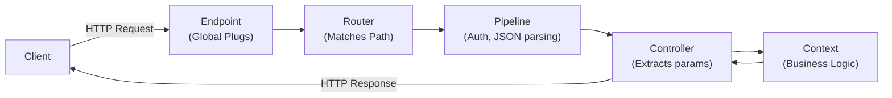
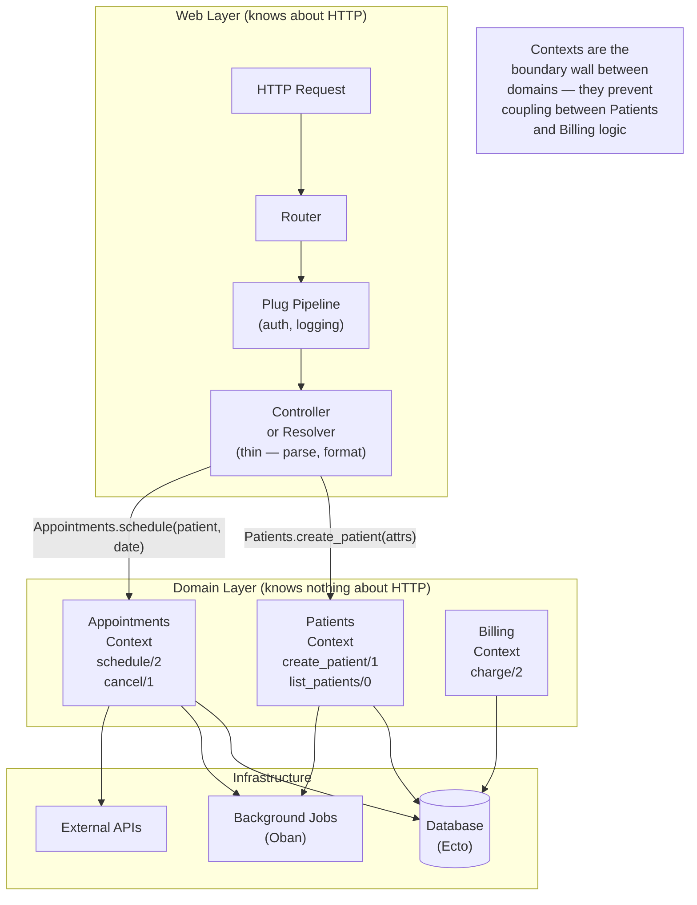
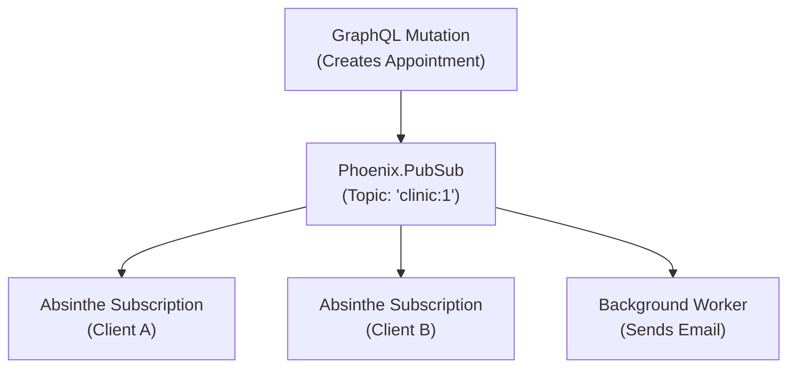
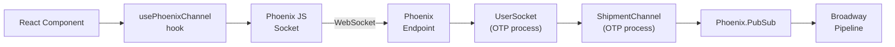
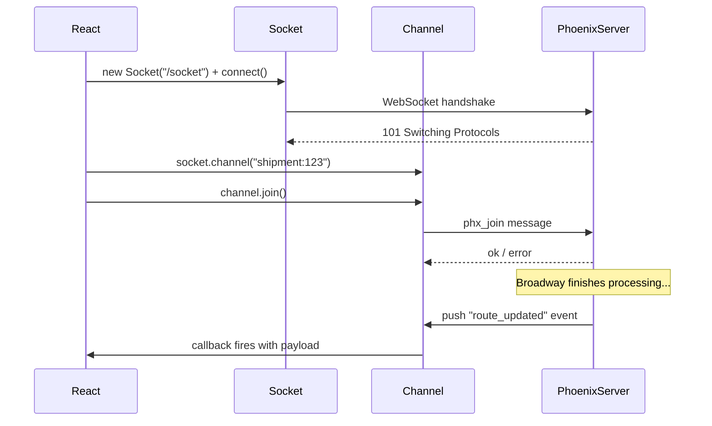
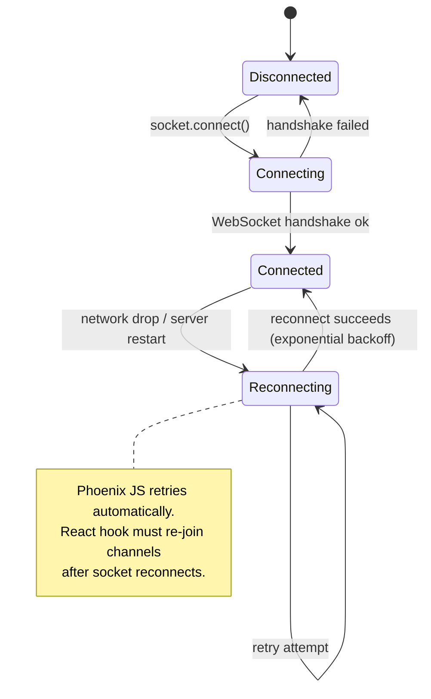
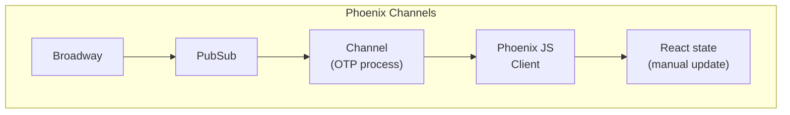
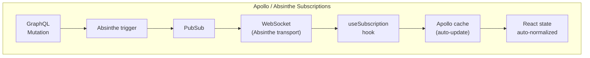

# Phoenix Framework

> **How to use this guide:** Phoenix is the standard web framework for Elixir. It sits on top of OTP and provides the web layer: routing, request handling, WebSockets, and application lifecycle. This guide assumes familiarity with OTP concepts.

## 1. Core Ideas: The Mental Model

Phoenix is not magic. It is a set of well-structured conventions built on top of two things you already know:

1. **OTP** — Phoenix applications are supervised OTP applications; every request is handled by a process.
2. **Plug** — Phoenix is a pipeline of composable functions that transform a connection.

> [!TIP]
> **THE PHOENIX PHILOSOPHY**
>
> Phoenix takes the OTP process model and applies it to HTTP and real-time communication. It provides a structured way to turn a web request into an Erlang message, process it, and return a response.

### 1.1 The Request Lifecycle



## 2. Plug — The Foundation

> [!NOTE]
> **FOR ERLANG DEVELOPERS**
>
> If you are coming from Erlang, you likely know **Cowboy**. Phoenix runs on Cowboy.
> **Plug** is simply an abstraction layer over Cowboy. Instead of dealing with Cowboy's `Req` object and state, Plug passes an immutable `%Plug.Conn{}` struct through a series of pure functions.

### 2.1 What a Plug Is

A Plug is a specification for composable modules between web applications. It comes in two flavors: Function Plugs and Module Plugs.

**Function Plug:**
A simple function that takes a `%Plug.Conn{}` and returns a `%Plug.Conn{}`.

```elixir
def my_plug(conn, _opts) do
  Plug.Conn.put_resp_header(conn, "x-request-id", UUID.generate())
end
```

### 2.2 Module Plugs: Compile-Time vs Run-Time

A classic advanced topic is understanding the lifecycle of a Module Plug. It requires two functions: `init/1` and `call/2`.

```elixir
defmodule MyApp.AuthPlug do
  @behaviour Plug

  def init(opts) do
    # ⚠️ RUNS AT COMPILE TIME (or when the pipeline is built)
    # Do heavy lifting here: parse options, read configs, compile regexes.
    Keyword.fetch!(opts, :role)
  end

  def call(conn, role) do
    # ⚡ RUNS AT RUN TIME (for every single HTTP request)
    # The 'role' argument is the exact return value of init/1.
    if conn.assigns.user.role == role do
      conn
    else
      conn |> Plug.Conn.send_resp(403, "Forbidden") |> Plug.Conn.halt()
    end
  end
end
```

### 2.3 The `%Plug.Conn{}` State Machine

Because Elixir data structures are immutable, `conn` is constantly reassigned. However, the struct tracks the underlying HTTP state. You must understand this lifecycle:

1. **Unsent:** Headers and body can be modified.
2. **Set:** Response is ready but not sent (e.g., waiting for the pipeline to finish).
3. **Sent:** Cowboy has sent the data over the TCP socket. Any attempt to call `put_resp_header` or `send_resp` now will raise an exception.

### 2.4 Plug Pipelines

Pipelines group plugs that apply to a category of requests.

```elixir
pipeline :api do
  plug :accepts, ["json"]
  plug :fetch_session
  plug MyApp.Auth.VerifyToken
end
```

> [!NOTE]
> **ADVANCED CONCEPT**
>
> Authentication, content-type negotiation, CSRF protection, and rate limiting all live in pipelines. Pipelines are the right place for cross-cutting concerns, not individual controllers.

## 3. Architecture & Contexts

### 3.1 Controllers vs Contexts

Phoenix encourages organizing business logic into **Context modules** — plain Elixir modules that group related functionality.

<div class="cols-2">
<div class="col">

**Controllers (Web Layer)**
Receives `conn` and `params`. Calls the Context. Renders the response. _Should contain zero business logic._

</div>
<div class="col">

**Contexts (Domain Layer)**
The public API of your application. Handles validation, database calls (Ecto), and background jobs. _Should know nothing about HTTP or Plugs._

</div>
</div>



```
lib/my_app/
  patients/         ← Context
    patient.ex      ← Schema
    patients.ex     ← Public API (CRUD + business logic)
  appointments/
```

## 4. Authentication Flow

### 4.1 Auth as a Plug

Authentication in Phoenix is typically a Plug in the pipeline, not a framework feature.

```elixir
defmodule MyApp.Auth.VerifyToken do
  import Plug.Conn

  def init(opts), do: opts

  def call(conn, _opts) do
    with ["Bearer " <> token] <- get_req_header(conn, "authorization"),
         {:ok, claims} <- MyApp.Token.verify(token) do
      assign(conn, :current_user, claims)
    else
      _ -> conn |> send_resp(401, "Unauthorized") |> halt()
    end
  end
end
```

> [!WARNING]
> **HALTING THE PIPELINE**
>
> Calling `halt(conn)` prevents any further plugs from running. Always halt after sending an unauthorized response, otherwise the request continues through the pipeline to the controller.

### 4.2 Auth and Absinthe (GraphQL)

The authenticated user must flow from the Phoenix pipeline into the Absinthe resolver context.

```elixir
# In the router or a plug, after authentication:
conn
|> Absinthe.Plug.put_options(context: %{current_user: conn.assigns[:current_user]})
```

## 5. Real-Time: Channels & PubSub

### 5.1 Phoenix Channels

Channels provide stateful, bidirectional real-time communication over WebSockets. **Each channel connection is an OTP process.**

```elixir
defmodule MyAppWeb.NotificationChannel do
  use MyAppWeb, :channel

  def join("notifications:" <> user_id, _payload, socket) do
    {:ok, assign(socket, :user_id, user_id)}
  end

  def handle_in("ping", _payload, socket) do
    {:reply, {:ok, %{status: "pong"}}, socket}
  end
end
```

### 5.2 Phoenix.PubSub

`Phoenix.PubSub` lets processes broadcast messages to subscribers across the application — or across a distributed cluster of nodes.



> [!TIP]
> **WHY THIS MATTERS FOR GRAPHQL**
>
> Absinthe's subscription system uses `Phoenix.PubSub` internally. When a mutation fires a trigger, Absinthe broadcasts through PubSub to all connected WebSocket clients subscribed to that topic.

## 6. Background Jobs (Oban)

Oban is the standard background job library for Elixir. It uses PostgreSQL as the job queue backend, giving you durable jobs with ACID guarantees.

### 6.1 The Transactional Outbox Pattern

Using the same database as your application means jobs can be enqueued inside the same transaction as the business logic that triggers them.

```elixir
Ecto.Multi.new()
|> Ecto.Multi.insert(:appointment, changeset)
|> Oban.insert(:email_job, SendReminderEmail.new(%{id: appt_id}))
|> Repo.transaction()
```

If the transaction rolls back, the job is never enqueued. There is no separate queue infrastructure (like Redis) to operate or keep in sync.

## 7. Configuration & Deployment

### 7.1 `runtime.exs` vs `prod.exs`

<div class="cols-2">
<div class="col">

**`prod.exs` (Compile Time)**
Compiled into the release. Used for static configuration that does not change between environments.

</div>
<div class="col">

**`runtime.exs` (Run Time)**
Evaluated at startup. This is where you read environment variables (`System.get_env`).

</div>
</div>

> [!WARNING]
> **SECRETS**
>
> Never put sensitive config (API keys, DB passwords) in `prod.exs` with hardcoded values. Use `runtime.exs` and environment variables.

## 8. Testing in Phoenix (ExUnit)

ExUnit is Elixir's built-in test framework.

### 8.1 `async: true`

Marks a test module as safe to run concurrently with other async modules. Use it for tests that do not touch shared global state. Because Ecto uses a SQL Sandbox, database tests in Phoenix can safely run asynchronously.

### 8.2 Testing Levels

| Level       | What to test                       | Tools                       |
| ----------- | ---------------------------------- | --------------------------- |
| Unit        | Context functions, changeset logic | ExUnit, no DB or minimal DB |
| Integration | Controller → context → DB flow     | `ConnTest`, Ecto Sandbox    |
| Channel     | WebSocket message handling         | `ChannelTest`               |
| GraphQL     | Schema + resolver behavior         | `Absinthe.run/3` in tests   |

## 9. Phoenix Channels from TypeScript

The Elixir side of a Phoenix Channel is covered in Section 5. This section covers the TypeScript client — how a React frontend connects to a Channel, listens for events pushed by Broadway, and handles reconnection.

### 9.1 The Full Stack



Data flows right to left: Broadway processes a shipment event, broadcasts via PubSub, the Channel pushes it over the WebSocket, the Phoenix JS client fires a callback, and React state updates.

### 9.2 Installing and Connecting

```bash
npm install phoenix
npm install --save-dev @types/phoenix  # if not bundled
```

The Phoenix JS package ships its own TypeScript types since Phoenix 1.7. No separate `@types/phoenix` package is needed for recent versions.

```typescript
import { Socket, Channel } from "phoenix";

const socket = new Socket("/socket", {
  params: { token: userToken },
});

socket.connect();
```

**Joining a channel and listening for events:**

```typescript
const channel: Channel = socket.channel("shipment:123", {});

channel.on("route_updated", (payload) => {
  console.log("Route updated:", payload);
});

channel
  .join()
  .receive("ok", () => console.log("Joined successfully"))
  .receive("error", (err) => console.error("Failed to join", err))
  .receive("timeout", () => console.warn("Join timed out"));
```

**Socket and channel lifecycle:**



### 9.3 Typing Elixir Payloads in TypeScript

Elixir maps serialize to JSON objects. Define TypeScript interfaces for each event type your channel can receive.

```typescript
// Types for events pushed by the Broadway pipeline via Phoenix Channel

interface RouteUpdatedPayload {
  shipment_id: string;
  recommended_route: string;
  estimated_minutes: number;
  confidence: number;
}

interface ShipmentStatusPayload {
  shipment_id: string;
  status: "in_transit" | "delayed" | "delivered";
  updated_at: string;
}

// Discriminated union for all events on a shipment channel
type ShipmentChannelEvent =
  | { event: "route_updated"; payload: RouteUpdatedPayload }
  | { event: "status_changed"; payload: ShipmentStatusPayload };
```

Using the discriminated union to handle multiple event types safely:

```typescript
function handleChannelEvent(event: string, payload: unknown) {
  const typed = { event, payload } as ShipmentChannelEvent;

  switch (typed.event) {
    case "route_updated":
      // typed.payload is RouteUpdatedPayload here
      updateRouteDisplay(typed.payload.recommended_route);
      break;
    case "status_changed":
      // typed.payload is ShipmentStatusPayload here
      updateStatusBadge(typed.payload.status);
      break;
  }
}

channel.on("route_updated", (payload) =>
  handleChannelEvent("route_updated", payload),
);
channel.on("status_changed", (payload) =>
  handleChannelEvent("status_changed", payload),
);
```

> [!TIP]
> Elixir atom keys (`:shipment_id`) serialize to string keys in JSON (`"shipment_id"`). Elixir string keys stay as-is. Define your TypeScript interfaces against the JSON output, not the Elixir struct field names.

### 9.4 Integrating with React

A custom hook encapsulates the socket lifecycle — setup on mount, cleanup on unmount.

```typescript
import { useEffect, useRef, useState } from "react";
import { Socket, Channel } from "phoenix";

interface UsePhoenixChannelOptions<T> {
  socketUrl: string;
  token: string;
  topic: string;
  events: Record<string, (payload: T) => void>;
}

function usePhoenixChannel<T>({
  socketUrl,
  token,
  topic,
  events,
}: UsePhoenixChannelOptions<T>) {
  const [isConnected, setIsConnected] = useState(false);
  const socketRef = useRef<Socket | null>(null);
  const channelRef = useRef<Channel | null>(null);

  useEffect(() => {
    const socket = new Socket(socketUrl, { params: { token } });
    socket.connect();
    socketRef.current = socket;

    const channel = socket.channel(topic, {});
    channelRef.current = channel;

    Object.entries(events).forEach(([event, handler]) => {
      channel.on(event, handler);
    });

    channel
      .join()
      .receive("ok", () => setIsConnected(true))
      .receive("error", () => setIsConnected(false));

    return () => {
      channel.leave();
      socket.disconnect();
    };
  }, [socketUrl, token, topic]);

  return { isConnected };
}
```

Using the hook in a component:

```typescript
function ShipmentTracker({ shipmentId }: { shipmentId: string }) {
  const [route, setRoute] = useState<RouteUpdatedPayload | null>(null)

  const { isConnected } = usePhoenixChannel<RouteUpdatedPayload>({
    socketUrl: "/socket",
    token: useAuthToken(),
    topic: `shipment:${shipmentId}`,
    events: {
      route_updated: (payload) => setRoute(payload),
    },
  })

  return (
    <div>
      {isConnected ? "Live" : "Connecting..."}
      {route && <RouteDisplay route={route} />}
    </div>
  )
}
```

> [!WARNING]
> **Always clean up on unmount.** Forgetting to call `channel.leave()` and `socket.disconnect()` in the `useEffect` cleanup leaves the WebSocket connection open after the component unmounts. Across page navigations this creates a growing number of ghost connections on the server, each holding an OTP process, consuming memory until the node is restarted. The `return () => { channel.leave(); socket.disconnect() }` block in the effect is non-negotiable.

### 9.5 Error Handling and Reconnection

The Phoenix JS client handles reconnection automatically — you do not need to write retry logic.



<div class="cols-2">
<div class="col">

**Socket-level errors**

- Network drop → Phoenix JS reconnects automatically with exponential backoff
- Server restart → same reconnect path
- Listen with `socket.onError()` and `socket.onClose()` for UI feedback

```typescript
socket.onError(() => setIsConnected(false));
socket.onOpen(() => setIsConnected(true));
```

</div>
<div class="col">

**Channel-level errors**

- Channel `join` rejected by server (auth failure) → `receive("error")` callback
- Channel kicked by server → `channel.onClose()` fires
- After socket reconnects, channels must be re-joined — Phoenix JS does this automatically if you used `channel.join()` before the disconnect

```typescript
channel.onClose(() => {
  console.warn("Channel closed — will rejoin on reconnect");
});
```

</div>
</div>

> [!NOTE]
> **After a reconnect**, Phoenix JS automatically attempts to rejoin any channels that were previously joined. Your `channel.on("route_updated", handler)` callbacks are preserved. You do not need to re-register event handlers — but do verify this in staging by simulating a server restart.

### 9.6 Phoenix Channels vs GraphQL Subscriptions





|                    | Phoenix Channels                       | GraphQL Subscriptions (Apollo + Absinthe)   |
| ------------------ | -------------------------------------- | ------------------------------------------- |
| Setup complexity   | Low — one JS client, one hook          | Higher — Apollo Client, Absinthe schema     |
| Cache integration  | Manual React state                     | Automatic — Apollo normalizes into cache    |
| Payload shape      | Arbitrary JSON (flexible)              | Typed GraphQL response (rigid but safe)     |
| Use case           | Binary, custom protocols, fine control | Already using GraphQL for queries/mutations |
| Overhead per event | Very low                               | Higher (GraphQL parsing per message)        |

> [!NOTE]
> **TRADE-OFFS**
>
> **Phoenix Channels** win when: you are not using GraphQL, you need low overhead for high-frequency events (GPS pings, live telemetry), or you need full control over the payload shape.
>
> **Apollo Subscriptions** win when: your app is already GraphQL-first and you want real-time updates to flow directly into the Apollo normalized cache — which automatically re-renders all components that query the updated entity, without any manual state management.

## 10. Test your Knowledge

<details>
<summary>What is a Plug in Phoenix?</summary>

A Plug is a function or module that takes a `%Plug.Conn{}` struct, transforms it, and returns a modified `%Plug.Conn{}`. The entire Phoenix request lifecycle is just a pipeline of Plugs.

</details>

<details>
<summary>What is the difference between `init/1` and `call/2` in a Module Plug?</summary>

`init/1` runs at **compile time** (or when the supervisor starts the pipeline). It is used to parse options and do heavy lifting once. Its return value is passed as the second argument to `call/2`, which runs at **run time** for every single HTTP request.

</details>

<details>
<summary>What happens if you try to add a header to a `conn` after `send_resp` has been called?</summary>

It will raise a `Plug.Conn.AlreadySentError`. The `%Plug.Conn{}` struct acts as a state machine. Once it transitions to the "Sent" state, Cowboy has already transmitted the HTTP response over the TCP socket, so headers can no longer be modified.

</details>

<details>
<summary>What happens if you forget to call `halt(conn)` after sending a 401 Unauthorized response in an auth Plug?</summary>

The request will continue flowing through the rest of the pipeline and eventually hit the controller, potentially executing unauthorized business logic or crashing because the user data isn't present.

</details>

<details>
<summary>Why is it recommended to use Oban (PostgreSQL) instead of a Redis-backed queue like Exq?</summary>

Because Oban uses the primary database, you can enqueue jobs inside the exact same database transaction as your business logic. If the transaction rolls back, the job is never queued, guaranteeing absolute consistency without needing a two-phase commit.

</details>

<details>
<summary>What is the difference between a Controller and a Context?</summary>

A Controller is part of the web layer; it parses HTTP requests and formats HTTP responses. A Context is a plain Elixir module that contains the actual business logic and database interactions. Controllers should be thin and delegate work to Contexts.

</details>

<details>
<summary>Why is `runtime.exs` important for deployment?</summary>

`prod.exs` is evaluated at compile time and baked into the release artifact. `runtime.exs` is evaluated every time the application starts, allowing you to read environment variables (like database URLs or API keys) dynamically without recompiling the code.

</details>

<details>
<summary>What happens if you forget to call `channel.leave()` and `socket.disconnect()` when a React component unmounts?</summary>

The WebSocket connection remains open on both the client and server after the component is gone. On the server, each connected socket holds a dedicated OTP process for the UserSocket and one per joined Channel. If users navigate around the app without cleanup, the number of open connections grows with each mount/unmount cycle. Eventually the server accumulates hundreds of stale processes consuming memory, degrading node performance until a restart. The fix is a `return () => { channel.leave(); socket.disconnect() }` cleanup function inside the `useEffect` that sets up the socket.

</details>

<details>
<summary>How does the Phoenix JS client handle WebSocket reconnection, and what does the React hook need to account for?</summary>

The Phoenix JS client reconnects automatically using exponential backoff — it does not require custom retry logic. After the socket reconnects, it automatically re-joins all channels that were previously joined, and re-fires their existing event handlers. The React hook does not need to re-register `channel.on(...)` handlers after a reconnect. However, the hook should update UI state to reflect the disconnected period (e.g., `isConnected: false` during reconnection) and optionally refetch any data that may have changed while the socket was down, since pushed events during the outage were not received.

</details>

<details>
<summary>When should you use Phoenix Channels instead of GraphQL subscriptions (Apollo + Absinthe) for real-time updates?</summary>

Use Phoenix Channels when: the app does not use GraphQL (adding a full GraphQL schema just for subscriptions is too much overhead), the events are high-frequency and low-latency (GPS pings, live telemetry — GraphQL parsing overhead per message adds up), or you need full control over the payload shape and channel topology. Use Apollo subscriptions when: the app is already GraphQL-first — they integrate directly with the Apollo normalized cache, automatically re-rendering all components that query the updated entity without any manual state management. The key trade-off is flexibility (Channels) vs. cache integration (Apollo subscriptions).

</details>
