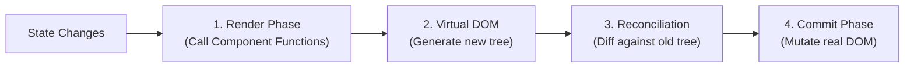

# React & TypeScript

> **How to use this guide:** Sections 1–7 cover the core mental models, architecture, and design patterns of React and TypeScript. Section 8 is an interactive quiz. Section 9 is an appendix covering the standard ecosystem tools (Router, Forms, Styling, Testing).

## 1. Core Ideas: The React Mental Model

React is a UI library built around one fundamental idea:

> [!TIP]
> **THE CORE EQUATION**
>
> **UI = f(state)**. When state changes, React re-renders the affected parts of the tree.

That single idea explains most of React's design decisions, performance characteristics, and failure modes.

### 1.1 The Rendering Cycle

React does not update the DOM directly. It maintains a virtual representation of the UI and reconciles it with the real DOM.



**Why this matters:**
- Rendering is not the same as DOM painting — calling the function is usually cheap.
- What hurts performance is rendering *too often* or rendering *too much* of the tree.
- Understanding reconciliation helps you know when and where to optimize.

### 1.2 Props vs State

<div class="cols-2">
<div class="col">

**Props (Arguments)**
Data passed into a component from its parent. They are strictly read-only inside the component.

</div>
<div class="col">

**State (Memory)**
Data owned and managed by the component itself. Updating state is what triggers re-renders.

</div>
</div>

### 1.3 Controlled vs Uncontrolled Components

<div class="cols-2">
<div class="col">

**Controlled**
React state holds the value. Use when you need to validate, transform, or react to input in real time.

</div>
<div class="col">

**Uncontrolled**
The DOM holds the value (accessed via `ref`). Use for simple cases, file inputs, or integrating with non-React libraries.

</div>
</div>

> [!WARNING]
> **COMMON MISTAKE**
>
> Mixing controlled and uncontrolled for the same input field (e.g., passing `value` but no `onChange`). React will warn you, and behavior becomes unpredictable.

---

## 2. Hooks Architecture

Hooks let you attach behavior and state to a component in a composable, reusable way.

### 2.1 `useState`

Declares a piece of state local to the component.

> [!WARNING]
> **ASYNC UPDATES**
>
> Setting state schedules a re-render; it does not mutate immediately. If you read state immediately after calling `setState`, you will get the old value. Always use the updater function `setCount(prev => prev + 1)` when the new state depends on the old state.

### 2.2 `useEffect`

Runs side effects after the component renders.

> [!TIP]
> **SYNCHRONIZATION, NOT LIFECYCLE**
>
> `useEffect` synchronizes your component with something outside of React (network, DOM, subscriptions). Do not use it to transform data or compute derived state.

**Dependency Array Rules:**
- Omitted: Runs after every render.
- `[]`: Runs once after mount.
- `[a, b]`: Runs when `a` or `b` changes.

### 2.3 `useCallback` and `useMemo`

Both are memoization hooks. They prevent recomputation or re-creation on every render.

- **`useCallback`**: Memoizes a function reference.
- **`useMemo`**: Memoizes a computed value.

> [!WARNING]
> **PREMATURE OPTIMIZATION**
>
> Wrapping everything in `useCallback` / `useMemo` by default adds memory overhead and complexity without benefit. Only use them when passing props to `React.memo` components or preventing expensive recalculations.

### 2.4 `useRef`

Holds a mutable value that **does not trigger a re-render** when changed. It is a box that React does not watch. Use it for accessing DOM nodes directly or storing persistent values (timers, previous values).

### 2.5 Custom Hooks

A custom hook is a function whose name starts with `use` and that calls other hooks. It is a way to name and reuse *behavior*, not just a value.

---

## 3. Component Design Patterns

### 3.1 Composition over Inheritance

React favors composition. Components accept other components as children or props rather than inheriting behavior.

- **Children prop:** Slot arbitrary UI inside a component.
- **Render props:** Pass a function that returns UI, giving the parent control over what is rendered inside.

### 3.2 Advanced Patterns: Compound Components

When multiple components need to work together implicitly (like a `<select>` and `<option>`), use the Compound Component pattern.

```tsx
// Instead of passing massive configuration objects:
<Dropdown options={[{label: "Edit", action: edit}]} />

// Use Compound Components with Context to share state implicitly:
<Dropdown>
  <Dropdown.Toggle>Options</Dropdown.Toggle>
  <Dropdown.Menu>
    <Dropdown.Item onClick={edit}>Edit</Dropdown.Item>
  </Dropdown.Menu>
</Dropdown>
```

### 3.3 Error Boundaries

A JavaScript error in a part of the UI shouldn't break the whole app. Error boundaries catch errors anywhere in their child component tree and display a fallback UI.

> [!NOTE]
> **SENIOR SIGNAL**
>
> Currently, Error Boundaries must be written as Class Components. A senior engineer knows to place them strategically (e.g., around route transitions or complex widgets) so that a failure in a minor widget doesn't crash the entire page to a white screen.

### 3.4 Lifting State Up

When two components need to share state, move the state to their closest common ancestor and pass it down as props.

**Trade-off:** Lifting state too high makes the tree unnecessarily coupled and causes wide re-renders. Keeping state too local prevents necessary coordination.

### 3.5 Component Boundaries and Code Splitting

Large applications should split code so users do not download everything upfront (`React.lazy` + `Suspense`).

**Senior Signal:** Route-level code splitting is the highest-value, lowest-effort splitting strategy. Component-level splitting is only worth it for rarely-used heavy widgets (rich text editors, charts).

---

## 4. State Management

### 4.1 When Local State Is Enough

Not every state needs a global solution. State should live as close to where it is used as possible. Use local state for UI state that belongs to one component (open/closed, active tab) or transient form state.

### 4.2 Server State vs Client State

The most important architectural distinction in modern React is separating Server State from Client State.

<div class="cols-2">
<div class="col">

**Server State**
Data fetched from an API (e.g., User profile, search results).
*Key concerns:* Staleness, loading states, error handling, background refetching.

</div>
<div class="col">

**Client State**
UI state that only exists in the browser (e.g., Modal open, selected tab, form draft).
*Key concerns:* Synchronization with UI events, fast updates.

</div>
</div>

> [!TIP]
> **THE MODERN APPROACH**
>
> Do not put Server State in a global Redux/Zustand store. Use a dedicated Server State library (like React Query, Apollo, or SWR) to handle caching and fetching, and keep Client State lightweight.

---

## 5. TypeScript Fundamentals

TypeScript adds a static layer that catches impossible states and invalid assumptions before they become runtime errors.

### 5.1 Types vs Interfaces

<div class="cols-2">
<div class="col">

**`type`**
Supports unions, intersections, and primitives.
*Use for:* Unions, mapped types, component props.

</div>
<div class="col">

**`interface`**
Supports declaration merging and `extends`.
*Use for:* Object shapes that represent strict data contracts (API responses).

</div>
</div>

### 5.2 Discriminated Unions

A pattern for modeling state that has mutually exclusive variants.

```typescript
type RequestState<T> =
  | { status: "idle" }
  | { status: "loading" }
  | { status: "success"; data: T }
  | { status: "error"; error: Error };
```

**Why this matters:** It eliminates impossible states (e.g., being `loading` and having an `error` at the same time) and makes exhaustive handling natural with `switch` statements.

### 5.3 Generics

A generic is a type variable. It makes a function or type work for any type while letting TypeScript track what that type actually is.

```typescript
function useFetch<T>(url: string): { data: T | null; loading: boolean } { ... }
```

### 5.4 Advanced Types: Mapped Types & `keyof`

A senior engineer uses TypeScript to prevent repeating themselves. If you have a `User` type, you can derive new types from it automatically.

```typescript
type User = { id: string; name: string; email: string };

// keyof extracts the keys as a union: "id" | "name" | "email"
type UserKeys = keyof User; 

// Mapped types iterate over keys to create a new shape
type UserFormErrors = {
  [K in keyof User]?: string; 
};
```

### 5.5 Type Guards (Custom Narrowing)

Sometimes TypeScript isn't smart enough to know what type a variable is, especially when dealing with API responses or complex logic. You can write a function that returns a type predicate (`value is Type`).

```typescript
function isUser(data: any): data is User {
  return data && typeof data.name === "string" && typeof data.email === "string";
}

if (isUser(response)) {
  console.log(response.email); // TS knows this is safe
}
```

---

## 6. Performance, Concurrency, & Optimization

React is fast by default. Optimize when you have measured a problem, not preemptively.

### 6.1 Concurrent React (`useTransition` & `useDeferredValue`)

React 18 introduced Concurrent Rendering. It allows React to interrupt a heavy render to handle high-priority user input (like typing).

- **`useTransition`**: Tells React that a state update is low priority.
  ```typescript
  const [isPending, startTransition] = useTransition();
  // Typing in a search box is high priority, but rendering the 1000 search results is low priority
  startTransition(() => {
    setSearchQuery(input); 
  });
  ```
- **`useDeferredValue`**: Returns a lagging version of a value that updates only after high-priority renders finish.

### 6.2 Common Sources of Unnecessary Re-renders

- Passing new object or array literals as props on every render.
- Unstabilized callback references passed to memoized children.
- Context values that change on every render.

### 6.3 The React Profiler

Use the React DevTools Profiler to find bottlenecks. Look for:
- Unexpected renders of stable components.
- Components rendering with no prop changes (suggests a reference identity problem).
- Render cascades through the tree.

---

## 7. React Server Components (RSC)

The biggest paradigm shift in modern React (React 18/19, Next.js App Router).

<div class="cols-2">
<div class="col">

**Server Components (Default)**
Run *only* on the server. They have zero impact on bundle size. They can directly access databases or internal APIs (`await db.query()`). They cannot use state (`useState`) or effects (`useEffect`).

</div>
<div class="col">

**Client Components (`"use client"`)**
Run on the server (for SSR) *and* in the browser. They have access to browser APIs, state, and effects. They add to the JavaScript bundle size.

</div>
</div>

> [!TIP]
> **THE RSC MENTAL MODEL**
>
> Think of Server Components as the skeleton of your app, fetching data and passing it down. Think of Client Components as the interactive muscles attached to that skeleton. Pass Server Components as `children` into Client Components to interleave them without making everything a Client Component.

---

## 8. Testing Philosophy

> [!TIP]
> **THE GOLDEN RULE**
>
> Test behavior from the user's perspective, not implementation details.

Prefer:
- Finding elements the way a user would (by role, label, text).
- Asserting on what is visible or accessible.
- Testing interactions (click, type, submit) rather than internal state (like checking if `useState` was called).

---

## 9. Test your Knowledge

<details>
<summary>What is the difference between a Server Component and a Client Component?</summary>

Server Components run only on the server, have zero impact on the JavaScript bundle, and can directly access backend resources (like a database). Client Components run in the browser, can use state (`useState`) and effects (`useEffect`), and add to the bundle size.
</details>

<details>
<summary>What is the difference between rendering and painting in React?</summary>

Rendering is React calling your component functions to figure out what the UI *should* look like (generating the Virtual DOM). Painting is the browser actually updating the pixels on the screen. React optimizes performance by rendering often but only updating the real DOM (painting) when necessary.
</details>

<details>
<summary>Why should you not use `useEffect` to compute derived state?</summary>

If you use `useEffect` to update state based on a prop change, React has to render the component twice: once with the old state, the effect fires, updates the state, and triggers a second render. Instead, compute the derived value directly during the render cycle.
</details>

<details>
<summary>When should you use `useCallback`?</summary>

Only when passing a function down as a prop to a child component that is wrapped in `React.memo`, or when the function is used as a dependency in another hook (like `useEffect`). Otherwise, recreating functions on every render is extremely cheap and memoizing them adds unnecessary overhead.
</details>

<details>
<summary>What is the difference between Server State and Client State?</summary>

Server State is data owned by the backend (e.g., user profiles, lists of items) and should be managed by caching libraries like React Query or Apollo. UI State is ephemeral browser state (e.g., modal visibility, dark mode) and should be managed by local state tools like Zustand or Context.
</details>

<details>
<summary>What is a Discriminated Union in TypeScript and why is it useful?</summary>

It is a union type where each variant shares a common literal property (the discriminant, like `status: "loading" | "success"`). It is useful because it allows TypeScript to narrow the type safely and prevents impossible states (like having both `data` and an `error` simultaneously).
</details>

---

## 10. Appendix: Ecosystem & Tools

While the core concepts above apply to any React application, modern React development relies heavily on a standard ecosystem of tools.

### 10.1 Routing (React Router)

React Router is the standard routing library. Modern versions (v6.4+) support data loading co-located with routes, moving data fetching out of components.

```typescript
{
  path: 'patients/:id',
  element: <PatientDetail />,
  loader: async ({ params }) => fetch(`/api/patients/${params.id}`),
}
```

### 10.2 Forms (React Hook Form + Zod)

Forms involve capturing input, validation, and submission. Doing this manually with `useState` causes excessive re-renders and boilerplate.

- **React Hook Form (RHF):** Manages form state outside the render cycle using uncontrolled inputs. Only validation and submission trigger re-renders.
- **Zod:** A TypeScript-first schema validation library. Define the schema once, infer TS types from it, and pass it to RHF for automatic validation.

### 10.3 Styling (Tailwind CSS)

Tailwind is a utility-first CSS framework. It is the dominant choice in modern React and Phoenix applications.
- **Pros:** No naming CSS classes, styles are co-located with markup, consistent design tokens, and unused styles are purged in production.
- **Cons:** Verbose JSX. (Mitigate this by extracting repeated patterns into reusable React components).

### 10.4 Testing Tools (Jest, RTL, MSW)

- **React Testing Library (RTL):** Renders components into a real DOM environment and provides queries that simulate user interaction (`getByRole`, `getByLabelText`).
- **Mock Service Worker (MSW):** Intercepts network requests at the service worker level. MSW mocks the network, not your code, making API mocking realistic without modifying application code.