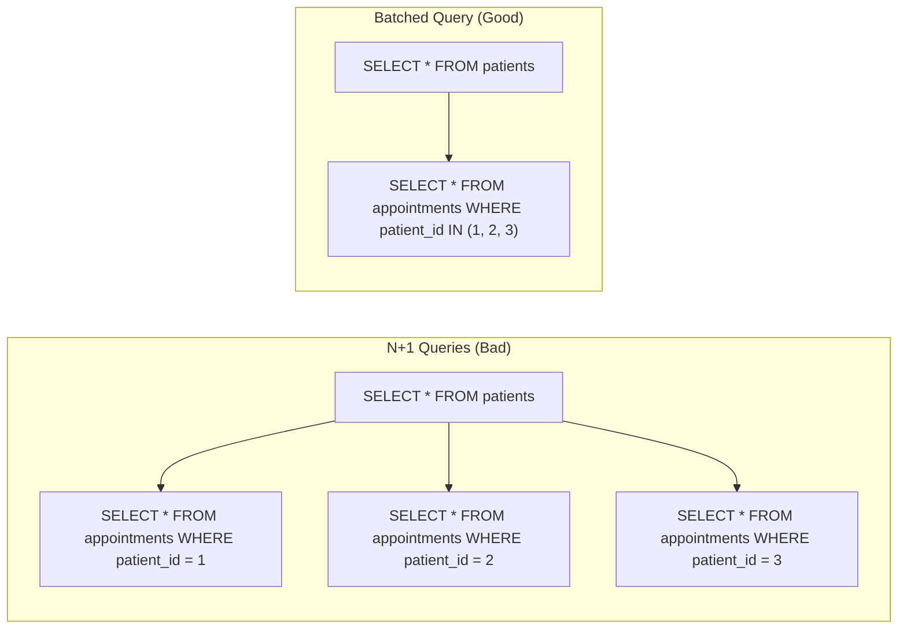
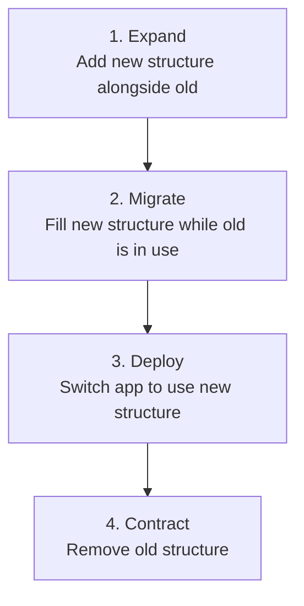

# Relational Databases

## 1. Core Ideas

A relational database stores data in tables with rows and columns, and enforces relationships between tables using foreign keys.

> [!TIP]
> **KEY PRINCIPLES**
>
>
> 1. **ACID transactions** — operations are atomic, consistent, isolated, and durable
> 2. **Referential integrity** — the database enforces that related records exist
> 3. **Flexible querying** — SQL lets you ask arbitrary questions without pre-designing every access pattern
> 4. **Mature tooling** — decades of optimization, monitoring, and operational knowledge

> A relational database is not just storage. It is a system that enforces invariants about your data at the storage layer.

The schema, constraints, and transactions are not overhead — they are the database doing its job.

## 2. ACID Properties

<div class="cols-2">
<div class="col">

**Atomicity**

A transaction either fully succeeds or fully rolls back — no partial writes.

**Consistency**

Transactions move the database from one valid state to another.

</div>
<div class="col">

**Isolation**

Concurrent transactions do not see each other's intermediate state.

**Durability**

Committed transactions survive crashes.

</div>
</div>

> [!NOTE]
> **SENIOR IMPLICATION**
>
> ACID is not free — stronger isolation guarantees come with higher locking costs and lower concurrency. Most bugs in concurrent-write systems come from incorrect assumptions about isolation.

## 3. Keys, Relationships, and Constraints

### 3.1 Keys

- **Primary key** — uniquely identifies each row; usually an auto-incrementing integer or UUID
- **Foreign key** — references a primary key in another table; enforces referential integrity
- **Composite key** — a primary key made of multiple columns; common for join tables

#### UUID vs Sequential ID

<div class="cols-2">
<div class="col">

**Sequential integer**

Simple, compact, sortable.
_Cost:_ Predictable (reveals record counts), requires central generation.

</div>
<div class="col">

**UUID v4 / v7**

Random, globally unique, generated anywhere. v7 is time-ordered.
_Cost:_ Larger, unordered (v4 can hurt index performance).

</div>
</div>

> [!TIP]
> UUIDs are common in distributed and multi-tenant SaaS systems because they can be generated without a database round trip and do not expose business-sensitive counts.

### 3.2 Relationships

- **One-to-one:** Foreign key on either table (e.g., User → Profile)
- **One-to-many:** Foreign key on the "many" table (e.g., Owner → Patients)
- **Many-to-many:** Join table with two foreign keys (e.g., Patients ↔ Diagnoses)

#### Referential integrity options

When a parent record is deleted, the database can:

- `RESTRICT` — prevent deletion if children exist
- `CASCADE` — delete children automatically
- `SET NULL` — set the foreign key to null
- `NO ACTION` — defer the check (Postgres default)

> [!WARNING]
> **FAILURE SCENARIO**
>
> Choosing the wrong referential integrity option is a common source of silent data corruption or unexpected cascading deletes.

## 4. Indexes

An index is a data structure that speeds up lookups at the cost of write overhead and storage.

- Every primary key is automatically indexed
- Foreign key columns should almost always be indexed (joins and lookups)
- Columns used frequently in `WHERE`, `ORDER BY`, or `JOIN` clauses are candidates

> [!WARNING]
> **FAILURE SCENARIO**
>
> Adding an index on every column "just in case" → write performance degrades, storage grows, and the query planner may make worse choices.

### 4.1 Index Types (PostgreSQL)

<div class="cols-2">
<div class="col">

**B-tree (default)**

Equality and range queries on most types.

**GIN**

Full-text search, array containment, JSONB.

</div>
<div class="col">

**GiST**

Geometric types, proximity search.

**Partial index**

Index a subset of rows (e.g., `WHERE deleted_at IS NULL`).

</div>
</div>

### 4.2 Composite Indexes & The Left-Prefix Rule

A composite index spans multiple columns (e.g., `CREATE INDEX ON users (last_name, first_name)`).

> [!TIP]
> **THE LEFT-PREFIX RULE**
>
> A composite index can only be used if the query filters on the columns from left to right.
>
> - `WHERE last_name = 'Smith'` → Uses index
> - `WHERE last_name = 'Smith' AND first_name = 'John'` → Uses index
> - `WHERE first_name = 'John'` → **Cannot use index** (requires a sequential scan)

### 4.3 Covering Indexes (Index-Only Scans)

If a query only requests columns that are present in the index, the database can return the result directly from the index data structure without ever reading the actual table row from disk.

```sql
-- If we have an index on (email, id)
SELECT id FROM users WHERE email = 'test@example.com';
```

This triggers an **Index-Only Scan**, which is significantly faster than a standard index scan.

## 5. Transactions and Isolation

### 5.1 Transactions

A transaction groups multiple operations so they either all succeed or all fail.

```sql
BEGIN;
  INSERT INTO appointments (patient_id, date) VALUES (1, '2026-04-01');
  UPDATE patients SET last_visit = '2026-04-01' WHERE id = 1;
COMMIT;
```

> A transaction is the boundary where "all of this succeeds or none of it does."

### 5.2 Isolation Levels

Different isolation levels trade off consistency against concurrency.

<div class="cols-2">
<div class="col">

**Read Committed (Postgres Default)**

Prevents dirty reads (reading uncommitted data).

**Repeatable Read (MySQL Default)**

Prevents dirty reads and non-repeatable reads (reading the same row twice and getting different values).

</div>
<div class="col">

**Serializable**

Prevents all anomalies, including phantom reads (running the same query twice and getting different sets of rows).

</div>
</div>

> [!WARNING]
> **FAILURE SCENARIO**
>
> **Lost Update**
>
> Two concurrent transactions both read a counter, both increment it, both write → final value is incremented by 1 instead of 2.
> _Fix:_ use `SELECT FOR UPDATE` to lock the row, or use an atomic increment.

### 5.3 MVCC (Multi-Version Concurrency Control)

How do databases provide isolation without locking the entire table and destroying concurrency? **MVCC**.

Instead of overwriting data in place, the database creates a _new version_ of the row.

- **Readers don't block writers, and writers don't block readers.**
- A reader sees a snapshot of the database as it existed when their transaction started.
- _Cost:_ Old versions of rows ("dead tuples") accumulate and must be cleaned up periodically (e.g., `VACUUM` in Postgres) to prevent database bloat.

### 5.4 Locking Strategies

When you must prevent concurrent modifications, you have two choices:

<div class="cols-2">
<div class="col">

**Pessimistic Locking**

Locks the row in the database. Other transactions must wait.
_How:_ `SELECT FOR UPDATE`
_Best for:_ High-contention workflows (e.g., financial ledgers).

</div>
<div class="col">

**Optimistic Locking**

No database locks. Uses a `version` column.
_How:_ `UPDATE ... WHERE id = 1 AND version = 2`. If 0 rows update, someone else changed it first.
_Best for:_ High-read, low-write workflows (e.g., editing a wiki page).

</div>
</div>

### 5.5 Deadlocks

A deadlock occurs when two transactions hold locks the other needs, causing them to wait for each other forever.

- **Transaction A:** Locks Row 1, wants Row 2.
- **Transaction B:** Locks Row 2, wants Row 1.

The database will detect this and abort one of the transactions.
_Fix:_ Always acquire locks in the exact same deterministic order (e.g., always lock rows in ascending ID order).

## 6. Schema Design

### 6.1 Normalization vs Denormalization

<div class="cols-2">
<div class="col">

**Normalized**

No data duplication, easier to maintain consistency.
_Cost:_ More joins needed.

</div>
<div class="col">

**Denormalized**

Fewer joins, faster reads for specific access patterns.
_Cost:_ Data duplication, harder to keep consistent.

</div>
</div>

> [!TIP]
> Start normalized. Denormalize specific hot paths only when profiling shows a real need. Premature denormalization creates consistency bugs.

### 6.2 Handling Dynamic Data: JSONB vs EAV

When you need to store user-defined fields or dynamic attributes, you have two choices:

<div class="cols-2">
<div class="col">

**The EAV Anti-Pattern**

Entity-Attribute-Value tables (`entity_id`, `attribute_name`, `value`).
_Cost:_ Requires massive, complex `JOIN`s to reconstruct a single record. Destroys query performance.

</div>
<div class="col">

**JSONB Column (The Modern Way)**

Store dynamic data in a `JSONB` column.
_Benefit:_ Postgres can index JSONB keys (using GIN indexes), allowing fast queries without joins.

</div>
</div>

### 6.3 Soft Deletes

Instead of deleting rows, mark them as deleted with a timestamp or boolean.

```sql
ALTER TABLE patients ADD COLUMN deleted_at TIMESTAMP;
CREATE INDEX patients_active ON patients (id) WHERE deleted_at IS NULL;
```

> [!NOTE]
> **TRADE-OFFS**
>
> **Preserves history and audit trail** — but every query must filter out deleted rows
>
> **Enables undo and recovery** — but soft-deleted rows accumulate over time
>
> **Foreign keys remain valid** — but it's easy to accidentally include deleted records in aggregates

### 6.4 Pagination Patterns

<div class="cols-2">
<div class="col">

**Offset/limit**

Skip N rows, return M. Simple to implement.
_Cost:_ Degrades at large offsets.

</div>
<div class="col">

**Cursor-based**

Use a stable value (id, timestamp) as a pointer.
_Benefit:_ Consistent results under concurrent inserts; scales well.

</div>
</div>

> [!WARNING]
> **FAILURE SCENARIO**
>
> Using offset pagination on a frequently-updated table → rows shift as records are inserted or deleted, causing rows to appear twice or be skipped.

## 7. Query Performance

### 7.1 The Query Planner

The database does not always execute queries the way you wrote them. It uses statistics about table sizes and index selectivity to choose an execution plan.

- `EXPLAIN` — shows the planned execution path and estimated costs
- `EXPLAIN ANALYZE` — runs the query and shows actual execution times and row counts

**Common causes of slow queries:**

- Missing index on a frequently filtered or joined column
- Query planner choosing a sequential scan because the filter is not selective enough
- Returning far more columns than needed (avoid `SELECT *` in production code)
- Implicit type coercions preventing index use (e.g., comparing a text column to an integer)

### 7.2 The N+1 Query Problem

Executing one query per row of a parent result set instead of fetching all related data in one query.



> N+1 is not a database problem. It is an application design problem that shows up as a database problem.

## 8. Scaling Relational Databases

When a single database node can no longer handle the load, you must scale.

### 8.1 Connection Pooling

PostgreSQL forks a new OS process for every connection, which consumes significant RAM (usually ~10MB per connection). If you have 50 application servers each opening 20 connections, the database will collapse under memory pressure before hitting CPU limits.

**The Fix:** Use a connection pooler like **PgBouncer**. It multiplexes thousands of application connections down to a small pool of actual database connections.

### 8.2 Read Replicas & Replication Lag

To scale read-heavy workloads, you add Read Replicas. The Primary node handles all writes and streams the changes to the Replicas.

> [!WARNING]
> **FAILURE SCENARIO**
>
> **Replication Lag:** A user updates their profile (written to Primary) and is redirected to their profile page (read from Replica). Because replication is asynchronous, the Replica hasn't received the update yet, and the user sees their old data.
> _Fix:_ Pin the user's session to the Primary database for a few seconds after a write.

### 8.3 Partitioning vs. Sharding

When a table gets too large (e.g., billions of rows), indexes no longer fit in RAM, and queries slow down.

<div class="cols-2">
<div class="col">

**Partitioning (Same Machine)**

Splitting one massive table into smaller physical tables on the _same_ database server (e.g., partitioning logs by month).
_Benefit:_ Dropping old data is instant (`DROP TABLE logs_jan`), and queries hitting a single partition are fast.

</div>
<div class="col">

**Sharding (Multiple Machines)**

Splitting data across _multiple_ physical database servers (e.g., Users A-M on DB1, N-Z on DB2).
_Cost:_ Massive operational complexity. Cross-shard joins are impossible. You must choose a "Shard Key" carefully to avoid "hot shards" (one node getting all the traffic).

</div>
</div>

## 9. Safe Schema Changes in Production

### 9.1 Locking Risk by Operation

Some schema changes are safe to run on a live database. Others cause table locks that block reads and writes.

| Operation                                | Risk                                             |
| ---------------------------------------- | ------------------------------------------------ |
| Adding a nullable column                 | Safe (Postgres 11+)                              |
| Adding a non-null column without default | Locks table — rewrites all rows                  |
| Removing a column                        | Requires app to stop using it first              |
| Renaming a column                        | Breaking change — requires two-phase deploy      |
| Adding an index                          | Can lock table; use `CONCURRENTLY` in PostgreSQL |
| Adding a NOT NULL constraint             | Locks table while validating existing rows       |

### 9.2 The Expand-Contract Pattern

The safe way to make breaking schema changes without downtime.



> [!WARNING]
> Never remove something the current application depends on in the same deploy that changes the schema.

## 10. Multi-Tenancy

Multi-tenancy is the pattern where a single instance of the application serves multiple isolated customers (tenants). It is a core architectural concern in SaaS products.

### 10.1 The Three Models

<div class="cols-2">
<div class="col">

**Row-level isolation**

All tenants share tables. Every row has a `tenant_id`. Every query must filter by `tenant_id`.
_Best for:_ Many tenants, small data per tenant.

**Schema-per-tenant**

Each tenant gets their own PostgreSQL schema (namespace). Tables are identical.
_Best for:_ Strong isolation, compliance requirements.

</div>
<div class="col">

**Database-per-tenant**

Each tenant has a completely separate database.
_Best for:_ Few very large tenants, strict data residency.

</div>
</div>

> [!TIP]
> Most SaaS products start with row-level isolation. It is the simplest to operate and sufficient for most use cases when properly enforced.

> [!NOTE]
> **MULTI-TENANCY VS. SHARDING**
>
> These sound similar but solve different problems:
>
> - **Multi-Tenancy** is a _product/business_ requirement for **logical isolation** (keeping Customer A's data secure from Customer B).
> - **Sharding** is a _performance_ requirement for **physical scaling** (distributing CPU/Disk load across multiple machines).
>
> They overlap in the "Database-per-tenant" model (which achieves both), but you can have multi-tenancy on a single machine, or you can shard a massive single-tenant B2C app (like Twitter).

### 10.2 Enforcing Row-Level Isolation

<div class="cols-2">
<div class="col">

**Application-level enforcement**

Every query includes a `WHERE tenant_id = current_tenant()`.
_Risk:_ A missed clause causes a data leak.

</div>
<div class="col">

**PostgreSQL Row-Level Security (RLS)**

Enforces isolation at the database level.

```sql
CREATE POLICY tenant_isolation ON patients
  USING (tenant_id = current_setting('app.tenant_id')::uuid);
```

</div>
</div>

> Row-Level Security moves the enforcement boundary from "every query" to "the database itself." It is harder to misconfigure than application-level filtering.

### 10.3 Multi-Tenancy and Indexes

In row-level isolation, indexes on tenant-scoped queries should include `tenant_id` as the leading column:

```sql
CREATE INDEX ON patients (tenant_id, name);
```

Without this, a query filtered by `tenant_id` cannot use a single-column `name` index efficiently.

## 11. Other Database Types

Relational databases are the right default for most SaaS products, but other database types exist for specific access patterns.

<div class="cols-2">
<div class="col">

**Document Stores (MongoDB, Firestore)**

Store data as JSON/BSON.
_Good fit:_ Highly variable document structures, rapid iteration.
_Bad fit:_ Complex relationships, multi-document ACID.

**Key-Value Stores (Redis, DynamoDB)**

Fastest reads and writes. No query language.
_Good fit:_ Caching, sessions, rate limiting.
_Bad fit:_ Complex queries, unknown data structures.

**Time-Series (TimescaleDB, InfluxDB)**

Optimized for time-indexed sequences.
_Good fit:_ Metrics, IoT, financial ticks.

</div>
<div class="col">

**Search Engines (Elasticsearch, Typesense)**

Optimized for full-text and faceted search.
_Good fit:_ Search, autocomplete, logs.
_Note:_ Never use as primary store.

**Graph Databases (Neo4j)**

Nodes and edges.
_Good fit:_ Social graphs, recommendation engines.
_Bad fit:_ Simple, well-defined relationships.

**NewSQL (CockroachDB, Spanner)**

SQL semantics with horizontal scalability.
_Good fit:_ Global deployments outgrowing a single Postgres node.

</div>
</div>

> [!NOTE]
> **SENIOR IMPLICATION**
>
> Most SaaS products run fine on PostgreSQL + Redis for their entire lifecycle. Reaching for a specialized database is a trade-off: you gain query performance for one pattern and pay with operational complexity and a new consistency model.

## 12. Test your Knowledge

<details>
<summary>Explain ACID and what each property protects</summary>

**Atomicity:** All or nothing (no partial writes). **Consistency:** Moves DB from one valid state to another. **Isolation:** Concurrent transactions don't see each other's intermediate states. **Durability:** Committed data survives crashes.

</details>

<details>
<summary>Choose appropriate primary key types and explain trade-offs</summary>

**Sequential Integers** are fast and compact but predictable (leaking business metrics). **UUID v4** is random and globally unique but can fragment indexes. **UUID v7** is globally unique and time-ordered, offering the best of both worlds.

</details>

<details>
<summary>Explain what indexes do, when to add them, and what they cost</summary>

Indexes speed up read operations (like `WHERE`, `JOIN`, `ORDER BY`) by creating a specialized data structure (like a B-Tree). The cost is that they slow down writes (`INSERT`, `UPDATE`, `DELETE`) and consume disk space. Don't index everything.

</details>

<details>
<summary>Identify and fix an N+1 query problem</summary>

N+1 occurs when you fetch a list of N parent records, then run a separate query to fetch the children for _each_ parent (1 + N queries). The fix is to fetch all parents, collect their IDs, and fetch all children in a single batched query using an `IN (...)` clause.

</details>

<details>
<summary>Explain isolation levels and the anomalies each prevents</summary>

**Read Uncommitted:** Prevents nothing. **Read Committed:** Prevents dirty reads. **Repeatable Read:** Prevents dirty and non-repeatable reads. **Serializable:** Prevents all anomalies, including phantom reads. Stronger isolation reduces concurrency.

</details>

<details>
<summary>Apply the expand-contract pattern for zero-downtime schema changes</summary>

1. **Expand:** Add the new column/table. 2. **Migrate:** Dual-write to both old and new, and backfill old data. 3. **Deploy:** Switch app to read from the new structure. 4. **Contract:** Drop the old column/table.
</details>

<details>
<summary>Evaluate whether a schema change is safe to run on a live database</summary>

Adding a nullable column is safe. Adding an index safely requires `CONCURRENTLY` in Postgres. Adding a non-null column without a default, or adding a constraint to a large table, will lock the table and cause downtime.

</details>

<details>
<summary>Choose between normalized and denormalized design based on access patterns</summary>

Start **normalized** (no duplicated data, uses joins) to guarantee consistency. **Denormalize** (duplicate data to avoid joins) only when read performance becomes a proven bottleneck, accepting the cost of keeping the duplicated data in sync.

</details>

<details>
<summary>Explain soft deletes and their operational trade-offs</summary>

Soft deletes use a `deleted_at` timestamp instead of actually removing the row. It preserves history and prevents cascading deletes, but forces every query to include `WHERE deleted_at IS NULL`, which is easy to forget and can complicate unique constraints.

</details>

<details>
<summary>Explain why cursor-based pagination is preferred over offset</summary>

Offset pagination (`LIMIT 10 OFFSET 20`) gets slow at large offsets and skips/duplicates items if rows are inserted or deleted while the user is paginating. Cursor pagination (`WHERE id > last_seen_id`) is fast and immune to concurrent data changes.

</details>

<details>
<summary>Explain the three multi-tenancy models and when to choose each</summary>

**Row-level:** All tenants in one table, filtered by `tenant_id` (best for many small tenants). **Schema-per-tenant:** Each tenant gets a separate namespace (best for medium tenants needing strong isolation). **Database-per-tenant:** Separate physical DBs (best for enterprise data residency).

</details>

<details>
<summary>Explain the difference between application-level filtering and PostgreSQL Row-Level Security</summary>

Application-level filtering relies on developers remembering to add `WHERE tenant_id = ?` to every query. Row-Level Security (RLS) enforces the rule inside the database itself, ensuring data cannot leak even if the application query is flawed.

</details>

<details>
<summary>Explain the difference between Partitioning and Sharding</summary>

**Partitioning** splits a massive table into smaller physical tables on the _same_ database server (e.g., by month) to keep indexes small and allow fast data deletion. **Sharding** splits data across _multiple_ physical database servers (e.g., Users A-M on DB1, N-Z on DB2) to scale CPU and storage, but introduces massive operational complexity and makes cross-shard joins impossible.

</details>

<details>
<summary>How does MVCC (Multi-Version Concurrency Control) work?</summary>

Instead of overwriting data in place, MVCC creates a new version of the row. This ensures that "readers don't block writers, and writers don't block readers." A transaction sees a snapshot of the database as it existed when the transaction started. The database must periodically clean up old versions ("dead tuples") to prevent bloat.

</details>

<details>
<summary>Explain the Left-Prefix Rule for Composite Indexes</summary>

If you create an index on `(A, B, C)`, the database can use it to filter on `A`, or `A and B`, or `A, B, and C`. It _cannot_ use the index to filter only on `B` or `C`. The columns must be queried from left to right.

</details>

<details>
<summary>Explain the difference between Optimistic and Pessimistic Locking</summary>

**Pessimistic Locking** (`SELECT FOR UPDATE`) locks the row in the database, forcing other transactions to wait. Best for high-contention. **Optimistic Locking** uses a `version` column and checks if the version changed during the update (`UPDATE ... WHERE version = 2`). It doesn't lock the database, making it better for high-read/low-write scenarios.

</details>

---

## 13. Appendix: Ecosystem & Tools

### 13.1 In Elixir: Ecto

> Ecto is the standard database library for Elixir. It is not a traditional ORM — it does not hide the database. It gives you composable tools that make the database explicit.

#### Core Components

| Component   | Role                                                      |
| ----------- | --------------------------------------------------------- |
| `Repo`      | The interface to the database — all queries go through it |
| `Schema`    | Maps a database table to an Elixir struct                 |
| `Changeset` | Validates and transforms data before writing              |
| `Query`     | Composable, type-checked query builder                    |
| `Migration` | Version-controlled schema changes                         |

#### Changesets — Validation Before the Database

A changeset is a pipeline that decides whether data is valid before touching the database.

```elixir
def changeset(patient, attrs) do
  patient
  |> cast(attrs, [:name, :species, :date_of_birth])
  |> validate_required([:name, :species])
  |> validate_length(:name, min: 1, max: 100)
  |> unique_constraint(:name)
end
```

- `cast/3` filters untrusted external input (protection against mass assignment).
- `validate_*` functions check business rules in Elixir before hitting the database.
- `unique_constraint` translates database errors into structured changeset errors.

> A changeset is not a database operation. It is a description of intended changes and the rules they must satisfy.

#### Query Composition

Ecto queries are composable data structures — not executed until passed to the Repo.

```elixir
Patient
|> where([p], p.species == "dog")
|> order_by([p], p.name)
|> limit(10)
|> Repo.all()
```

#### Associations and Preloading

Ecto does not load associations automatically. You must explicitly preload them to avoid N+1 queries.

```elixir
# N+1 risk
patients = Repo.all(Patient)

# Fixed
patients = Patient |> Repo.all() |> Repo.preload(:appointments)
```

#### `Ecto.Multi` — Structured Transactions

`Ecto.Multi` is the preferred tool for multi-step transactions. Each step is named and the result tells you exactly which step failed.

```elixir
Multi.new()
|> Multi.insert(:patient, patient_changeset)
|> Multi.insert(:appointment, fn %{patient: patient} ->
  appointment_changeset(patient)
end)
|> Repo.transaction()
```

> `Ecto.Multi` makes a transaction a named, composable data structure rather than imperative code inside a callback.

#### Migrations in Ecto

```elixir
defmodule MyApp.Repo.Migrations.CreatePatients do
  use Ecto.Migration

  def change do
    create table(:patients) do
      add :name, :string, null: false
      add :owner_id, references(:owners, on_delete: :restrict)
      timestamps()
    end

    create index(:patients, [:owner_id])
  end
end
```

For index safety in production:

```elixir
create index(:patients, [:name], concurrently: true)
```

#### Testing with Ecto

Ecto's `SQL.Sandbox` wraps each test in a transaction that rolls back after the test, keeping tests isolated and fast. Changesets can be tested without a database at all:

```elixir
test "requires name" do
  changeset = Patient.changeset(%Patient{}, %{species: "dog"})
  assert "can't be blank" in errors_on(changeset).name
end
```
