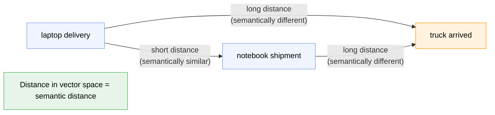
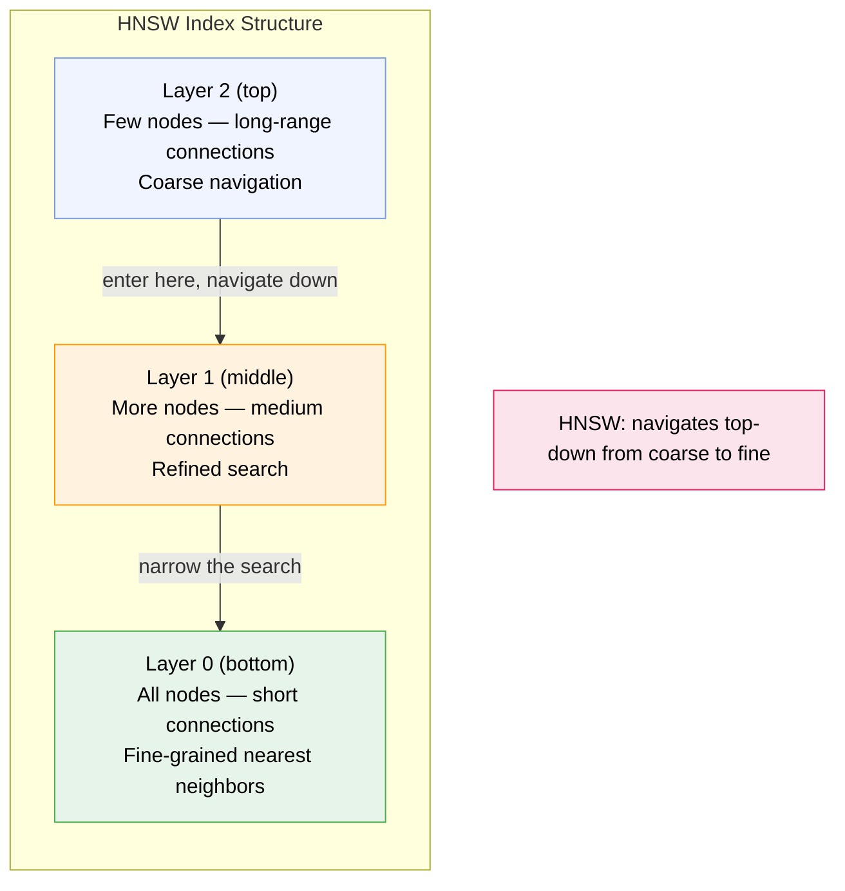
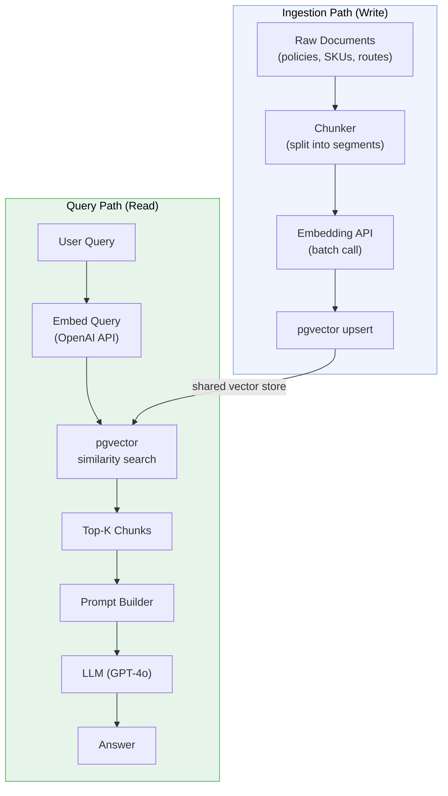
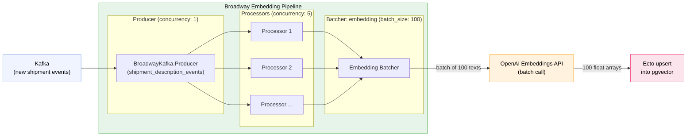
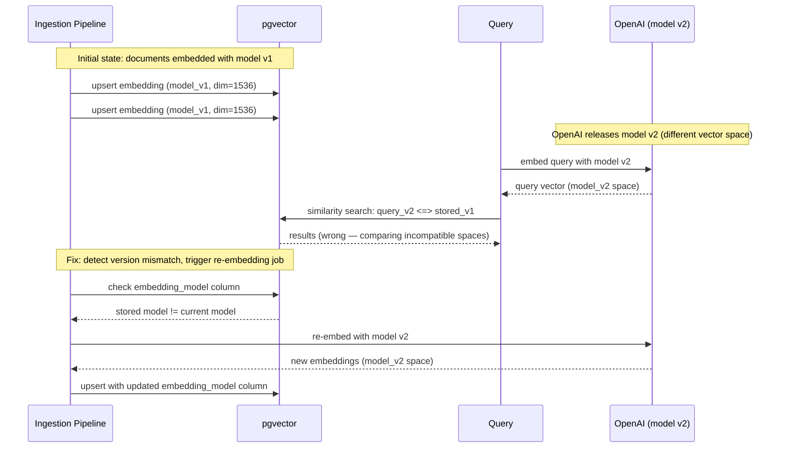

# Semantic Search & Vector Databases

> **How to use this guide:** This document covers semantic search, vector embeddings, and retrieval-augmented generation (RAG) in the context of a production AI system. It focuses on pgvector as the default vector store, HNSW and IVFFlat indexing, and embedding pipelines built on Broadway. For the Broadway and GenStage fundamentals, refer to the [GenStage, Broadway & AI document](genstage-broadway-ai.md). For the Phoenix real-time layer, refer to the [Phoenix document](phoenix.md).

## 1. The Core Idea — From Keywords to Meaning

### 1.1 Why Keyword Search Fails for Logistics

SQL `LIKE` and full-text search match tokens. They cannot match intent, synonyms, or semantic meaning.

<div class="cols-2">
<div class="col">

**What keyword search can answer**

- "Find all shipments containing the word 'fragile'"
- "Find SKUs with 'laptop' in the description"
- Exact or partial string matches

</div>
<div class="col">

**What keyword search cannot answer**

- "Find routes similar to this one"
- "Find SKUs that mean the same thing as 'notebook PC'"
- "Find shipment descriptions semantically close to this free-text query"

</div>
</div>

Logistics-specific examples where keyword search fails:

- **SKU matching** — a customer writes "MacBook Pro 16 inch" but the catalog has "Apple laptop 16\" M3". A `LIKE` query returns nothing.
- **Route similarity** — two delivery routes may serve the same geography with different waypoint labels. No token overlap, but semantically identical.
- **Shipment description search** — an operator queries "refrigerated pharmaceutical cargo" but the descriptions say "cold-chain medical supplies". Same meaning, zero token match.

Semantic search solves this by representing meaning as geometry: similar meanings live close together in vector space.

### 1.2 What Embeddings Are

An **embedding** is a list of floating-point numbers — a vector — that represents the meaning of a piece of text in high-dimensional space. Texts with similar meaning produce vectors that are geometrically close to each other.

The embedding model is an encoder neural network (transformer-based). It:
1. Tokenizes the input text
2. Passes tokens through attention layers
3. Outputs a fixed-size float array (the embedding vector)

Common dimensions:
- `text-embedding-3-small` (OpenAI) → 1536 dimensions
- `text-embedding-3-large` (OpenAI) → 3072 dimensions
- `textembedding-gecko` (Vertex AI) → 768 dimensions

The dimension count determines the vector's expressive capacity — higher dimensions capture more nuance but cost more storage and compute.



> [!TIP]
> The embedding model doesn't understand language the way humans do — it learns that certain words co-occur in similar contexts across billions of documents, and encodes those statistical relationships as geometry. The result is that semantic meaning becomes measurable distance.

### 1.3 Cosine Similarity vs Euclidean Distance

<div class="cols-2">
<div class="col">

**Cosine similarity**

Measures the *angle* between two vectors, ignoring their magnitude. Value ranges from -1 (opposite) to 1 (identical direction).

- Most common for text embeddings
- Robust when vectors have different magnitudes (e.g., short vs. long documents)
- Used by pgvector's `<=>` operator (cosine *distance* = 1 - cosine similarity)

</div>
<div class="col">

**Euclidean (L2) distance**

Measures the straight-line *distance* between two points in vector space.

- Sensitive to vector magnitude — longer texts can produce larger-magnitude vectors
- Used by pgvector's `<->` operator
- Better when magnitude carries meaning (e.g., frequency-weighted vectors)

</div>
</div>

**Rule of thumb:** Use cosine similarity (`<=>`) for text embeddings from OpenAI or Vertex AI. These models normalize their output vectors, making cosine and L2 equivalent — but cosine is the convention.

## 2. pgvector — Semantic Search Inside PostgreSQL

### 2.1 What pgvector Is

pgvector is a PostgreSQL extension that adds:
- A `vector(n)` column type for storing embedding arrays
- Similarity search operators (`<=>`, `<->`, `<#>`)
- HNSW and IVFFlat indexes for approximate nearest-neighbor search

The key value proposition: you can do semantic search without introducing a separate vector database. If you already run PostgreSQL, pgvector adds vector capabilities in the same ACID-compliant store as your relational data.

### 2.2 Schema Design

```sql
CREATE EXTENSION vector;

CREATE TABLE shipment_descriptions (
  id UUID PRIMARY KEY,
  description TEXT,
  embedding vector(1536),
  embedding_model TEXT NOT NULL DEFAULT 'text-embedding-3-small',
  content_hash TEXT,
  created_at TIMESTAMPTZ DEFAULT now()
);
```

The `embedding_model` and `content_hash` columns are production necessities — they enable stale-embedding detection (Section 4.4).

### 2.3 Inserting Embeddings

Generating an embedding means calling the OpenAI embeddings API with the source text and receiving a float array in return. In Elixir, you insert the vector via Ecto.

```elixir
defmodule MyApp.Embeddings do
  alias MyApp.Repo
  alias MyApp.ShipmentDescription

  @model "text-embedding-3-small"

  def embed_and_store(shipment_id, description) do
    content_hash = :crypto.hash(:sha256, description) |> Base.encode16()

    with {:ok, embedding} <- OpenAIClient.embed(description, model: @model) do
      Repo.insert!(
        %ShipmentDescription{
          id: shipment_id,
          description: description,
          embedding: embedding,
          embedding_model: @model,
          content_hash: content_hash
        },
        on_conflict: [set: [
          embedding: embedding,
          embedding_model: @model,
          content_hash: content_hash
        ]],
        conflict_target: :id
      )
    end
  end
end
```

### 2.4 Querying for Similar Items

```sql
SELECT id, description
FROM shipment_descriptions
ORDER BY embedding <=> '[0.1, 0.2, ...]'::vector
LIMIT 10;
```

The three pgvector distance operators:

| Operator | Distance type | Use case |
| --- | --- | --- |
| `<=>` | Cosine distance | Text embeddings (most common) |
| `<->` | L2 (Euclidean) distance | Magnitude-sensitive comparisons |
| `<#>` | Negative inner product | When vectors are pre-normalized |

In Elixir via Ecto with the `pgvector` hex package:

```elixir
def find_similar(query_embedding, limit \\ 10) do
  from(s in ShipmentDescription,
    order_by: fragment("embedding <=> ?", ^query_embedding),
    limit: ^limit,
    select: {s.id, s.description}
  )
  |> Repo.all()
end
```

### 2.5 Indexing with HNSW and IVFFlat

A sequential scan compares the query vector against every row — O(n). At 1M rows, this takes seconds. Vector indexes enable approximate nearest-neighbor (ANN) search, trading a small accuracy loss for orders-of-magnitude speed gains.



> [!NOTE]
> **IVFFlat** clusters vectors into buckets (Voronoi cells) during index build time. At query time, it identifies the nearest cluster and searches only that bucket — much faster than a full scan, but only as good as the clustering. Requires specifying `lists` (number of clusters) and `probes` (clusters to search at query time).
>
> **HNSW** builds a hierarchical graph. Navigation starts at the top layer (few nodes, long-range links for coarse orientation) and descends to lower layers (more nodes, short-range links for precise neighbors). Better recall than IVFFlat with no need to pre-specify clusters.

```sql
-- HNSW index (recommended default for production)
CREATE INDEX ON shipment_descriptions
  USING hnsw (embedding vector_cosine_ops)
  WITH (m = 16, ef_construction = 64);

-- IVFFlat index (better for > 1M rows when memory is constrained)
CREATE INDEX ON shipment_descriptions
  USING ivfflat (embedding vector_cosine_ops)
  WITH (lists = 100);
```

When to use each:

| | HNSW | IVFFlat |
| --- | --- | --- |
| Recall | Higher (better accuracy) | Lower (approximate clustering) |
| Memory | Higher (graph in RAM) | Lower |
| Build time | Slower | Faster |
| Good for | Production default, < 10M vectors | > 1M vectors, memory-constrained |
| Index build on existing data | Can build after insert | Requires data to exist first |

> [!TIP]
> For most logistics applications (hundreds of thousands to low millions of vectors), start with HNSW and no index first. Add the index when query latency exceeds your SLA. Brute-force is surprisingly fast up to ~100K rows.

### 2.6 pgvector vs Dedicated Vector Databases

<div class="cols-2">
<div class="col">

| | pgvector | Pinecone / Weaviate |
| --- | --- | --- |
| Setup | PostgreSQL extension, already in your stack | Separate managed service |
| Scale | Good to ~10M vectors | Billions of vectors |
| Cost | No additional cost | Adds infrastructure cost |
| Consistency | ACID with your relational data | Eventual, separate data store |
| Operational overhead | None if you run Postgres | New service to operate |
| Filtering | Full SQL — join on any column | Limited metadata filters |
| Hybrid search | Combine vector + SQL predicates | Depends on the product |

</div>
<div class="col">

**When to migrate away from pgvector**

- Your HNSW index no longer fits comfortably in RAM (rough signal: queries start hitting disk)
- You need billions of vectors — pgvector's practical ceiling is ~50–100M vectors with HNSW
- You need multi-tenant isolation at the vector layer
- Your query patterns require dedicated ANN infrastructure (sub-millisecond at 1B+ scale)

</div>
</div>

> [!NOTE]
> **TRADE-OFFS**
>
> **pgvector** — zero new infrastructure, ACID consistency with your relational data, full SQL filtering. Limited to ~10M vectors before you need to tune aggressively.
>
> **Pinecone / Weaviate** — purpose-built for vector search at massive scale. Adds a new service to operate, a new data synchronization concern, and eventual consistency between your primary store and the vector index.

**Rule of thumb:** Start with pgvector. Migrate to a dedicated solution when pgvector's HNSW index no longer fits comfortably in RAM.

## 3. RAG — Retrieval-Augmented Generation

### 3.1 The Problem RAG Solves

LLMs are trained on static, public data. They do not know:
- Your internal routing policies
- Your SKU catalog and pricing
- Your customer-specific SLAs and contracts
- Events that happened after the training cutoff

Two options for grounding LLM responses in private knowledge:

<div class="cols-2">
<div class="col">

**Fine-tuning**

Retrain the model (or adapter layers) on your private data.

- Expensive: compute costs + engineering time
- Slow to update: must retrain when policies change
- Better for style/format adaptation
- Higher hallucination risk ("remembers" facts that may be stale)

</div>
<div class="col">

**RAG — Retrieval-Augmented Generation**

Retrieve the relevant context at inference time and inject it into the prompt.

- Free to update: change the vector store, prompt changes automatically
- Real-time: new documents are searchable immediately after embedding
- Lower hallucination risk: model reasons over retrieved ground truth
- Per-query cost: retrieval + inference on a longer prompt

</div>
</div>

RAG is the right default for logistics applications where policies, routes, and catalogs change frequently.

### 3.2 The RAG Pipeline



Both paths share the same pgvector table. The ingestion path populates it; the query path reads from it.

### 3.3 Context Stuffing vs. Fine-Tuning Trade-offs

| | RAG | Fine-tuning |
| --- | --- | --- |
| Update frequency | Real-time (update vector store) | Requires retraining |
| Cost | Per-query retrieval + inference | High upfront, lower per-query |
| Accuracy on domain | Good with quality retrieval | Better for style/format |
| Hallucination risk | Lower (grounded in retrieved docs) | Higher (model "remembers" facts) |
| Latency | Extra retrieval round-trip | No retrieval overhead |
| Interpretability | Retrieved chunks are auditable | Model internals are opaque |

> [!NOTE]
> **TRADE-OFFS**
>
> **RAG** wins when your knowledge changes frequently, when you need auditability ("show me the source"), and when you want to avoid retraining costs.
>
> **Fine-tuning** wins when you need to change the model's tone, output format, or reasoning style — not just inject facts. For logistics, RAG is almost always the right first choice.

### 3.4 Chunking Strategy

Documents must be split into chunks before embedding. The embedding model has a token limit (e.g., 8191 tokens for `text-embedding-3-small`), but more importantly, large chunks produce noisier embeddings — the vector averages over too much content to be specific.

<div class="cols-2">
<div class="col">

**Chunk size trade-offs**

- **Small chunks** (100–200 tokens) — precise retrieval, may lack surrounding context for the LLM to reason over
- **Large chunks** (500–1000 tokens) — richer context, but similarity search becomes less precise
- **Overlap** (10–20% overlap between adjacent chunks) — prevents cutting important context at arbitrary boundaries

</div>
<div class="col">

**Chunking strategies**

- **Fixed-size** — split at N tokens, simple and predictable
- **Sentence-level** — split at sentence boundaries, more natural units
- **Paragraph-level** — split at double newlines, preserves document structure
- **Semantic chunking** — split when embedding similarity drops below a threshold (most sophisticated, highest cost)

</div>
</div>

For logistics documents (shipping policies, SLAs, route descriptions): paragraph-level chunking with 10% overlap is a reliable default.

### 3.5 RAG in a Broadway Pipeline

A Broadway stage handles the ingestion path: incoming shipment descriptions are embedded and upserted into pgvector as part of the processing pipeline.

```elixir
defmodule MyApp.EmbeddingPipeline do
  use Broadway

  alias Broadway.Message

  def start_link(_opts) do
    Broadway.start_link(__MODULE__,
      name: __MODULE__,
      producer: [
        module: {BroadwayKafka.Producer, [
          hosts: [localhost: 9092],
          group_id: "embedding_consumers",
          topics: ["shipment_description_events"]
        ]},
        concurrency: 1
      ],
      processors: [
        default: [concurrency: 5]
      ],
      batchers: [
        embedding: [concurrency: 2, batch_size: 100, batch_timeout: 2_000]
      ]
    )
  end

  @impl true
  def handle_message(_processor, message, _context) do
    message
    |> Message.update_data(&decode_shipment/1)
    |> Message.put_batcher(:embedding)
  end

  @impl true
  def handle_batch(:embedding, messages, _batch_info, _context) do
    texts = Enum.map(messages, & &1.data.description)

    case OpenAIClient.embed_batch(texts, model: "text-embedding-3-small") do
      {:ok, embeddings} ->
        messages
        |> Enum.zip(embeddings)
        |> Enum.each(fn {msg, embedding} ->
          upsert_embedding(msg.data.id, msg.data.description, embedding)
        end)
        messages

      {:error, reason} ->
        Enum.map(messages, &Message.failed(&1, "embedding_error: #{reason}"))
    end
  end

  defp upsert_embedding(id, description, embedding) do
    content_hash = :crypto.hash(:sha256, description) |> Base.encode16()

    MyApp.Repo.insert!(
      %MyApp.ShipmentDescription{
        id: id,
        description: description,
        embedding: embedding,
        content_hash: content_hash
      },
      on_conflict: [set: [embedding: embedding, content_hash: content_hash]],
      conflict_target: :id
    )
  end
end
```

At **query time**, the user's query is embedded and used to retrieve the top-K most similar shipment descriptions before building the LLM prompt:

```elixir
defmodule MyApp.SemanticSearch do
  alias MyApp.Repo
  alias MyApp.ShipmentDescription
  import Ecto.Query

  def retrieve_context(query_text, top_k \\ 5) do
    {:ok, query_embedding} = OpenAIClient.embed(query_text, model: "text-embedding-3-small")

    from(s in ShipmentDescription,
      order_by: fragment("embedding <=> ?", ^query_embedding),
      limit: ^top_k,
      select: s.description
    )
    |> Repo.all()
  end

  def answer_with_rag(user_query) do
    context_chunks = retrieve_context(user_query)

    prompt = """
    You are a logistics assistant. Use only the context below to answer the question.

    Context:
    #{Enum.join(context_chunks, "\n---\n")}

    Question: #{user_query}
    """

    OpenAIClient.chat(prompt, model: "gpt-4o")
  end
end
```

## 4. Embedding Pipelines in Production

### 4.1 Generating Embeddings

<div class="cols-2">
<div class="col">

**OpenAI text-embedding-3-small**

- Input: text string or array of strings
- Output: float array (1536 dimensions)
- Batch size: up to 2048 inputs per API call
- Cost: ~$0.02 per 1M tokens
- Latency: ~200ms for single calls, scales sub-linearly with batch size

</div>
<div class="col">

**Vertex AI text-embedding-gecko**

- Google Cloud's embedding model
- 768-dimensional output
- Better cost for high-volume workloads on GCP
- Integrates with Vertex AI Vector Search for at-scale ANN

</div>
</div>

Always batch embedding requests. Sending 100 texts in one call is ~50x cheaper in overhead than 100 individual calls. The OpenAI API supports batching natively — pass an array of strings and receive an array of embeddings in response.

### 4.2 The Embedding Broadway Stage

A dedicated Broadway batcher collects N new shipment descriptions, calls the embeddings API in one batch, and upserts the results into pgvector.



Cost at scale: `text-embedding-3-small` costs ~$0.02 per 1M tokens. A typical shipment description is ~50 tokens. Processing 1M descriptions costs ~$1.00 in embedding API fees.

### 4.3 Keeping Embeddings Fresh

When a source document changes, its embedding must be regenerated — the vector encodes the old content and will no longer match the right queries.

```elixir
def maybe_re_embed(shipment_id, new_description) do
  content_hash = :crypto.hash(:sha256, new_description) |> Base.encode16()

  existing = Repo.get(ShipmentDescription, shipment_id)

  if existing && existing.content_hash == content_hash do
    {:ok, :unchanged}
  else
    embed_and_store(shipment_id, new_description)
  end
end
```

**Upsert semantics for embedding updates:**

```sql
INSERT INTO shipment_descriptions (id, description, embedding, content_hash)
VALUES ($1, $2, $3, $4)
ON CONFLICT (id) DO UPDATE SET
  description = excluded.description,
  embedding = excluded.embedding,
  content_hash = excluded.content_hash;
```

The `content_hash` check avoids re-embedding unchanged documents — critical during backfill jobs that reprocess the full catalog.

### 4.4 Failure Modes

> [!WARNING]
> **FAILURE SCENARIO: Embedding API throttling**
>
> During high-volume ingestion (e.g., backfilling 10M shipment descriptions), the OpenAI embeddings API will rate-limit requests. Without a circuit breaker and retry with exponential backoff, all 10 Broadway batcher processes will pile up on rate-limit errors, exhausting the connection pool. Implement a circuit breaker (`:fuse`) on the embeddings client. On a 429 response, melt the fuse and wait before retrying.

> [!WARNING]
> **FAILURE SCENARIO: Stale embeddings from a model version change**
>
> OpenAI periodically deprecates embedding models. When you migrate from `text-embedding-ada-002` to `text-embedding-3-small`, the two models occupy different vector spaces — vectors from different models are not comparable. A query embedded with the new model compared against stored vectors from the old model will return garbage results silently.



> [!WARNING]
> **FAILURE SCENARIO: Dimension mismatch at ingestion**
>
> If someone changes the embedding model in config without re-embedding the stored vectors, new documents will be stored with a different vector dimension than existing rows. pgvector will reject the insert with a dimension mismatch error. Validate the embedding dimension at ingestion time: `assert length(embedding) == expected_dims`.

Failure mode summary:

| Failure | Detection | Mitigation |
| --- | --- | --- |
| API throttling (429) | HTTP status, fuse melt | Circuit breaker + exponential backoff |
| Model version mismatch | `embedding_model` column drift | Track model in schema, re-embed on version change |
| Dimension mismatch | pgvector insert error | Validate dimension at ingestion, alert on config changes |
| Stale embeddings (silent) | Recall degradation metrics | Periodic spot-check: embed known queries, verify top-K |

## 5. Logistics Use Cases

### 5.1 SKU Catalog Search

The problem: incoming shipment descriptions are free-text written by customers. Your internal SKU catalog uses standardized naming. Matching the two with `LIKE` queries fails constantly.

**The semantic search solution:**

1. Embed every SKU description in the catalog at index time
2. When a new shipment arrives, embed its description
3. Run `ORDER BY embedding <=> $1 LIMIT 5` to find the closest catalog entries
4. Return the top match (or present options for operator review)

Example:
- Customer writes: "laptop computer, 2 units, fragile"
- Catalog has: "notebook PC / portable computer — SKU-4421"
- Cosine similarity: 0.93 → match

> [!TIP]
> Add a confidence threshold. If the top match has cosine distance > 0.15 (similarity < 0.85), route to human review rather than auto-assigning. Low-confidence automatic matches are worse than no match.

### 5.2 Route Similarity

Find historical delivery routes similar to a new request. This powers **RAG for routing**: retrieve the N most similar past routes, include them as examples in the LLM prompt, and let the model reason over concrete precedents rather than abstract constraints.

```elixir
def find_similar_routes(new_route_description, top_k \\ 3) do
  {:ok, query_embedding} = OpenAIClient.embed(new_route_description)

  from(r in HistoricalRoute,
    where: r.outcome == "successful",
    order_by: fragment("embedding <=> ?", ^query_embedding),
    limit: ^top_k
  )
  |> Repo.all()
end

def build_routing_prompt(new_constraints, similar_routes) do
  examples = similar_routes
    |> Enum.map_join("\n", &format_route_example/1)

  """
  Given the following successful past routes:
  #{examples}

  Plan a route for these new constraints:
  #{new_constraints}
  """
end
```

### 5.3 Internal Documentation Search (RAG over Policies)

Embed your internal routing policies, compliance rules, and customer SLAs into pgvector. When an operator asks a natural language question, retrieve the relevant sections before prompting the LLM.

Example operator query: "What's the SLA for temperature-controlled shipments to Tier 1 accounts?"

1. Embed the query
2. Retrieve top-K chunks from the policy documents store
3. Include the retrieved chunks in the prompt
4. LLM answers citing the actual policy text

> [!TIP]
> Include the source document name and section number in the retrieved chunks. The LLM can then cite its sources in the answer, making the response auditable. "According to Section 4.2 of the Tier 1 Customer SLA (retrieved)" is far more trustworthy in a logistics context than a bare answer.

## 6. Test Your Knowledge

<details>
<summary>What does cosine similarity measure, and why is it preferred for text embeddings?</summary>

Cosine similarity measures the *angle* between two vectors — specifically the cosine of that angle — ignoring their magnitude. It ranges from -1 (opposite directions) to 1 (identical direction). It is preferred for text embeddings because embedding models (OpenAI, Vertex AI) normalize their output vectors, making magnitude uninformative. Two short and two long documents about the same topic will have similar cosine similarity scores even though their magnitudes differ. In contrast, Euclidean (L2) distance would penalize magnitude differences, making short and long documents about the same topic appear more distant than they are.
</details>

<details>
<summary>When should you use pgvector vs. a dedicated vector database like Pinecone?</summary>

Start with pgvector. It adds vector search to your existing PostgreSQL instance with no new infrastructure, ACID consistency with your relational data, and full SQL filtering (join, WHERE clauses alongside vector search). It is the right choice for up to ~10M vectors with HNSW indexing. Migrate to a dedicated vector database when: (1) your HNSW index no longer fits in RAM and query latency degrades, (2) you need to scale beyond 50–100M vectors, (3) you need purpose-built multi-tenant isolation at the vector layer, or (4) your query patterns require sub-millisecond ANN search at billion-vector scale.
</details>

<details>
<summary>List the steps of the RAG pipeline in order, for both the ingestion path and the query path.</summary>

**Ingestion path:** (1) Collect raw documents (policies, SKU descriptions, routes). (2) Chunk them into segments (paragraph-level with overlap). (3) Embed each chunk in batches via the embeddings API. (4) Upsert the chunk text + embedding vector into pgvector.

**Query path:** (1) Receive user query as natural language text. (2) Embed the query using the same model used for ingestion. (3) Run a similarity search against pgvector (`ORDER BY embedding <=> $1 LIMIT K`). (4) Retrieve the top-K most similar chunks. (5) Build a prompt that includes the retrieved chunks as context. (6) Send the prompt to the LLM. (7) Return the answer to the user.
</details>

<details>
<summary>Why does chunking strategy matter, and what are the trade-offs between small and large chunks?</summary>

Chunking strategy matters because the embedding vector represents the *average meaning* of the chunk. If a chunk is too large, the vector averages over too many topics and becomes noisy — similarity search becomes imprecise. If a chunk is too small, retrieval is precise but the LLM receives insufficient context to reason over. Small chunks (100–200 tokens): precise retrieval, less context per chunk, may require retrieving more chunks. Large chunks (500–1000 tokens): richer context, but similarity search is less precise. Overlap between chunks (10–20%) prevents important context from being split across a chunk boundary. The right size depends on the document type — short policy clauses warrant small chunks; long route descriptions warrant paragraph-level chunks.
</details>

<details>
<summary>Compare RAG and fine-tuning for grounding LLM responses in private logistics data.</summary>

RAG injects relevant context into the prompt at inference time by retrieving it from a vector store. Fine-tuning modifies the model's weights by training on private data. RAG wins when: knowledge changes frequently (no retraining needed — update the vector store), auditability is required (retrieved chunks are visible), and upfront cost must be low. Fine-tuning wins when: the model's output format, tone, or reasoning style must change (not just factual knowledge), and per-query prompt size is a constraint (fine-tuned knowledge doesn't consume context window). For logistics, RAG is almost always the right first choice because policies, SLAs, and catalogs change continuously.
</details>

<details>
<summary>How do you keep embeddings fresh when source documents change?</summary>

Hash the source text (e.g., SHA-256) and store the hash alongside the embedding in the database. Before re-embedding a document, compare the new content hash against the stored hash. If they match, skip — the embedding is still valid. If they differ, call the embeddings API and upsert the new vector along with the updated hash. This avoids redundant API calls during bulk reprocessing. Additionally, store the `embedding_model` name in the table. When the embedding model changes (e.g., OpenAI deprecates a model version), detect the mismatch at query time and trigger a background re-embedding job. Never compare vectors from different model versions — they occupy incompatible vector spaces.
</details>

<details>
<summary>Describe the HNSW index structure and explain how it enables fast approximate nearest-neighbor search.</summary>

HNSW (Hierarchical Navigable Small World) builds a multi-layer graph over the stored vectors. The top layer has a small number of nodes with long-range connections — it provides coarse navigation across the entire vector space. Lower layers have progressively more nodes with shorter connections, enabling finer-grained search. At query time, the algorithm enters at the top layer, greedily navigates toward the query vector using long-range links, then descends to the next layer and repeats with shorter links until it reaches the bottom layer, where it finds the true approximate nearest neighbors. This top-down coarse-to-fine navigation is O(log n) rather than O(n) for the brute-force scan, at the cost of slightly reduced recall (ANN vs. exact NN). The trade-off is controlled by the `ef_construction` parameter during build and `ef_search` at query time.
</details>

<details>
<summary>What happens when you compare query vectors from model v2 against stored embeddings from model v1, and how do you prevent it?</summary>

Different embedding models occupy different vector spaces — a text embedded with `text-embedding-ada-002` produces a vector in a different geometric space than the same text embedded with `text-embedding-3-small`. Comparing across model versions produces incorrect similarity scores: the nearest neighbors returned are semantically unrelated, but the pipeline fails silently without errors. The fix: store the embedding model name in a column (`embedding_model TEXT`). At ingestion, validate that the model in config matches the model stored for existing rows. When migrating models, run a background job that re-embeds all stored documents with the new model before switching the query path. During the migration window, serve queries from both indexes or block queries until re-embedding is complete.
</details>
