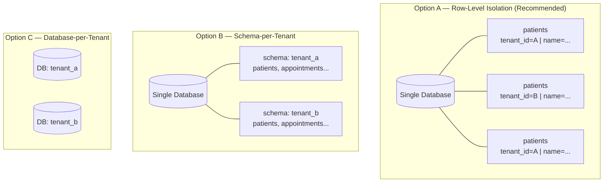
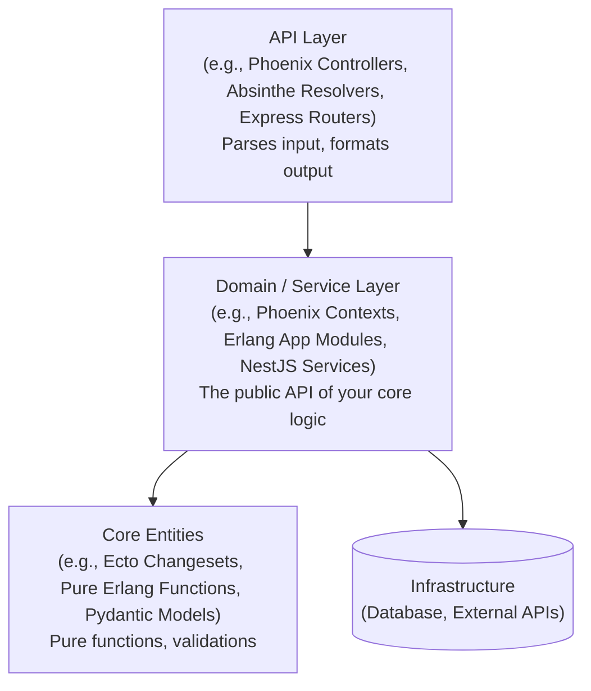
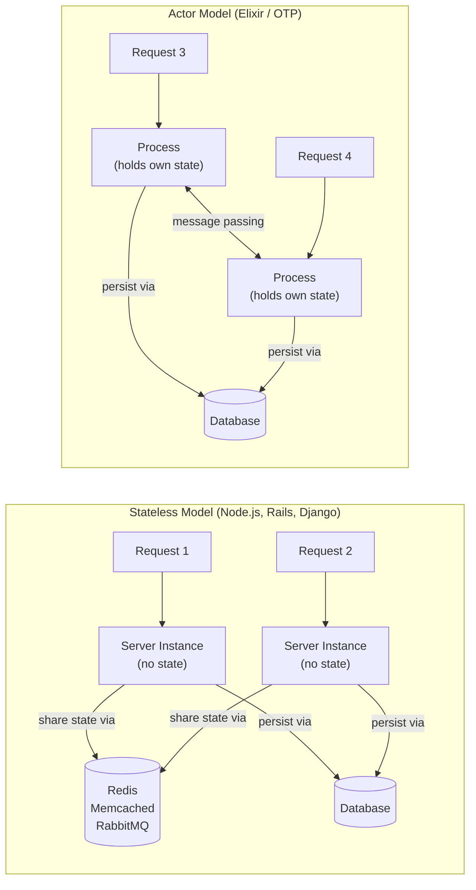
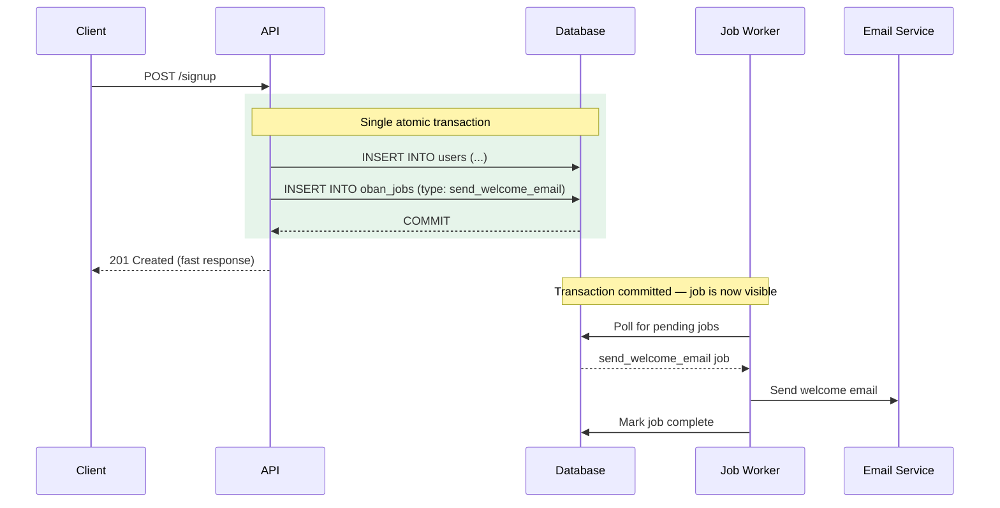
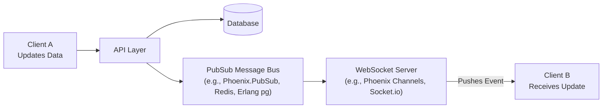
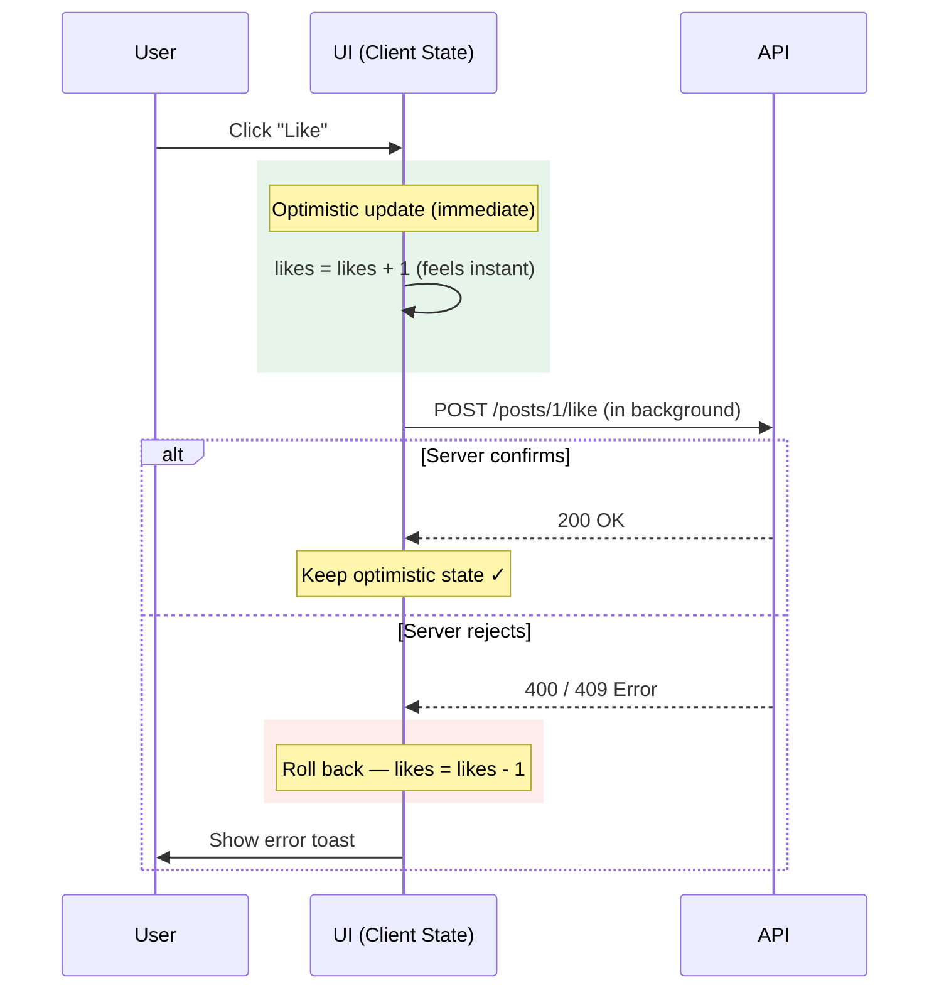

# SaaS Architecture & System Design Guidelines

> **How to use this guide:** This document outlines the core architectural decisions required when building a modern SaaS application. While it focuses on the **underlying design patterns and trade-offs** that apply to any full-stack architecture, it provides concrete examples across various technology stacks (Erlang/Elixir, Node.js, Ruby, React, etc.) to ground the concepts.

## 1. Data Layer (The Foundation)

The database is the hardest part of the system to change later. Getting the data model right on day one is critical.

### 1.1 How do we isolate tenant data?

In a B2B SaaS, users belong to organizations (tenants), and data must never leak across tenants.

**Option A: Row-Level Isolation (Recommended)**
Every table has a `tenant_id` (e.g., `org_id`).
- **Pros:** Simple to query, easy to run migrations, connection pooling is trivial.
- **Cons:** Risk of developer error (forgetting the `WHERE tenant_id = X` clause).

**Option B: Schema/Database-per-Tenant**
Each tenant gets their own isolated schema or physical database.
- **Pros:** Impossible to accidentally query another tenant's data. Highest security.
- **Cons:** Migrations are slow (must run N times), connection pooling is harder, cross-tenant queries are very difficult.

> [!TIP]
> **THE DEFAULT CHOICE**
>
> **Use Row-Level Isolation.** It scales best for 95% of SaaS apps. To mitigate the risk of developer error, use ORM/query builder features to automatically inject the `tenant_id` into every query.
> *(Examples: **Elixir/Ecto's `prepare_query`**, **Ruby on Rails' `default_scope`**, **Node/Prisma client extensions**)*

### 1.2 What type of Primary Keys should we use?

- **Sequential Integers (`id: 1, 2, 3`):** Fast, cache-friendly, but leaks business intelligence (competitors can see how many users you have by creating an account).
- **UUIDs v4 (`id: 550e8400-...`):** Secure, unguessable, allows clients to generate IDs before saving. However, they are larger and can cause index fragmentation.
- **UUIDs v7 / ULIDs:** Time-sorted UUIDs. They combine the unguessability of UUIDs with the database performance of sequential integers.

**Recommendation:** Use **UUIDs (preferably v7/ULIDs)** for all public-facing records. If you need extreme performance on massive internal tables, use sequential integers internally but expose a `public_id` (UUID) to the API. 
*(Examples: **PostgreSQL `uuid` type**, **Elixir `Ecto.UUID`**, **Node `ulid` package**)*

### 1.3 How do we handle deleted data?

- **Hard Deletes:** Data is gone forever. Clean, but bad for auditing and recovering from user mistakes.
- **Soft Deletes (`deleted_at` timestamp):** Data is hidden. Complicates every single query and unique constraint in the database.

**Recommendation:** Do not use soft deletes globally. Instead, use **Hard Deletes** for trivial data, and use an **Audit Log / Event Sourcing** table for critical business entities (e.g., invoices, appointments) so you have an immutable history of what happened.

---

## 2. API Layer (The Contract)

### 2.1 Where does Authorization live?

When a user requests a resource, how do we ensure they are allowed to see it?

1. **In the Controller/Resolver:** Hard to reuse, easy to forget.
2. **In the Domain/Service Layer:** Better, but couples business logic with HTTP/API context.
3. **In API Middleware/Interceptors:** The most robust approach.

**Recommendation:** Use **Middleware**. Whether using REST or GraphQL, attach permission checks declaratively to the routes or schema fields. This ensures they are never bypassed.
*(Examples: **Phoenix Plugs**, **Absinthe Middleware**, **Express.js Middleware**, **Ruby on Rails `before_action`**)*

### 2.2 How do we handle Business Logic Errors?

If a user tries to perform an invalid action (e.g., booking an already taken slot), how does the client know?

> [!WARNING]
> **AVOID TOP-LEVEL HTTP/SYSTEM ERRORS FOR DOMAIN LOGIC**
>
> Do not use generic 500 errors or GraphQL's top-level `errors` array for validation failures. Top-level errors should be reserved for actual system failures (network drops, syntax errors).

**Recommendation:** Use **Typed Mutation Payloads** (in GraphQL) or standard **Problem Details JSON** (in REST). The API should return a 200 OK with a payload containing a `success` boolean, the `result` object, and a `userErrors` array.
*(Examples: **GraphQL union types/interfaces**, **RFC 7807 for REST APIs**)*

### 2.3 How do we solve the N+1 Problem?

Fetching a list of 50 posts, and then fetching the author for each post, results in 51 database queries.

**Recommendation:** Use the **Dataloader Pattern** (batching and caching). Instead of resolving relationships immediately, the API collects all requested IDs, hits the database *once* with a `WHERE id IN (...)` clause, and maps the results back to the original requests.
*(Examples: **Elixir `Absinthe.Dataloader`**, **Node.js `dataloader`**, **Ruby `graphql-batch`**)*

---

## 3. Application Layer (The Brains)

### 3.1 Where does Business Logic live?

**Recommendation:** Keep the API layer dumb. A controller/resolver should only extract arguments and call a Domain function (e.g., `BillingService.process_payment(args)`). The Domain layer orchestrates the database calls, background jobs, and events.

### 3.2 Concurrency and State: Stateless vs. Actor Model

How does your application handle concurrent requests and shared state?

**Stateless Web Servers**
*(e.g., Node.js, Python/Django, Ruby on Rails)*
The application holds no state. Every request is isolated. To share state or coordinate tasks, you *must* use external infrastructure like Redis, Memcached, or RabbitMQ.

**The Actor Model**
*(e.g., Erlang, Elixir, OTP, Akka)*
The application runs millions of lightweight, isolated processes (Actors) that communicate via message passing. State can be safely held in memory.

**Recommendation:** If using a standard stateless stack, rely heavily on your Database and Redis for coordination. If using **Erlang/OTP**, leverage its built-in capabilities: use processes (`GenServer`) for long-lived state, `ETS` for shared memory caching, and supervision trees for fault tolerance, drastically reducing the need for external infrastructure.

### 3.3 How do we handle Background Jobs?

When a user signs up, you need to send a welcome email. Doing this synchronously blocks the API response.

**Recommendation:** Use **Database-backed queues** utilizing the **Transactional Outbox Pattern**. 
By using the primary database for the queue, you can enqueue the job inside the *exact same database transaction* as the user creation. If the transaction rolls back, the email job is never queued, guaranteeing absolute consistency.
*(Examples: **Elixir `Oban`**, **Node.js `Graphile Worker`**, **Ruby `Delayed::Job` or `GoodJob`**)*

---

## 4. Real-Time Layer (The Nervous System)

### 4.1 How do we push state to the client?

Modern SaaS applications require the UI to update instantly when another user makes a change.

**Recommendation:** Standardize your event flow. 
1. The Domain layer updates the Database.
2. The Domain layer broadcasts an event via a PubSub mechanism.
3. The WebSocket/Subscription layer intercepts the broadcast and pushes a payload to subscribed clients.
*(Examples: **Absinthe Subscriptions over Phoenix Channels**, **Apollo Server Subscriptions over Redis PubSub**)*

---

## 5. Client Layer (The Face)

### 5.1 How do we manage UI vs Server State?

Modern frontend applications must distinguish between "UI State" (is this modal open?) and "Server State" (what is the user's email?).

**Server State**
Data that lives on the server. Use specialized caching libraries. These handle caching, background refetching, and deduplication automatically.
*(Examples: **Apollo Client**, **React Query**, **SWR**, **Relay**)*

**UI State**
Ephemeral data that only exists in the browser. Use lightweight tools for things like theme preferences, sidebar toggles, or multi-step form state.
*(Examples: **Zustand**, **Pinia**, **Vuex**, **React Context**)*

> [!NOTE]
> **RULE OF THUMB**
>
> Never copy data from your Server State cache into your local UI State store. Read it directly from the cache using your data-fetching library's hooks.

### 5.2 Optimistic Updates

For actions where success is highly likely (e.g., "liking" a post), update the UI *before* the server responds. If the server request fails, roll back the UI state. This makes the application feel infinitely faster.

*(Examples: **Apollo Client `optimisticResponse`**, **React Query `onMutate`**)*

---

## 6. Test your Knowledge

Why is row-level multi-tenancy generally preferred over schema-per-tenant?

Row-level multi-tenancy (using a `tenant_id` on every table) makes database migrations much faster, simplifies connection pooling, and makes cross-tenant queries (for internal admin dashboards) much easier to write.

What is the Dataloader pattern and what problem does it solve?

It solves the N+1 query problem. Instead of making a database query every time a relationship is resolved, Dataloader batches all requested IDs in a single tick and makes one consolidated database query (e.g., `WHERE id IN (...)`).

What is the advantage of using the Actor Model (Erlang/OTP) over a traditional stateless web server?

The Actor Model allows you to spawn millions of lightweight, concurrent processes that can safely hold state in memory and communicate via message passing. This provides built-in fault tolerance (supervision trees) and reduces the need for external infrastructure like Redis for caching or coordination.

Why should background jobs ideally be backed by the primary database instead of an external queue like Redis?

Using the primary database allows you to utilize the Transactional Outbox pattern. You can enqueue the job inside the same database transaction as your business logic. If the business logic fails and rolls back, the job is never queued, preventing race conditions and inconsistent states.

What is the difference between Server State and UI State on the frontend?

Server State is data owned by the backend (e.g., user profiles, lists of items) and should be managed by caching libraries like React Query or Apollo. UI State is ephemeral browser state (e.g., modal visibility, dark mode) and should be managed by local state tools like Zustand or Context.

